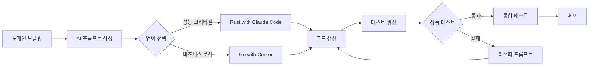

# ORE Backend AI-Native Development Guide

_Rust/Go 마이크로서비스 개발을 위한 AI 활용 실전 가이드_

## Overview

- **목적**: Claude Code와 AI 도구를 활용한 백엔드 효율적 개발
- **독자**: 백엔드 개발자, AI 에이전트, 아키텍트
- **관련 문서**: ore-backend-spec.md, ore-mvp-definition.md, ai-native-team-strategy.md
- **주요 기술**: Rust (성능 크리티컬), Go (비즈니스 로직)
- **주요 AI 도구**: Claude Code (Primary), Cursor (Secondary), Copilot (Support)
- **최종 수정**: 2024-12-20
- **버전**: 1.0

---

## 1. AI-Native 백엔드 개발 철학

### 1.1 핵심 원칙

```yaml
Right Service, Right Language:
  - 성능 크리티컬 → Rust (무조건)
  - 비즈니스 로직 → Go (빠른 개발)
  - 재작성 없는 확장 → 처음부터 제대로
  - 복잡도는 AI로 극복

Event-Driven First:
  - Kafka 중심 아키텍처
  - 모든 상태 변경은 이벤트
  - CQRS 패턴 준수
  - 이벤트 소싱 고려

AI-Assisted Architecture:
  - 복잡한 동시성 → Claude Code
  - 보일러플레이트 → Copilot
  - 빠른 수정 → Cursor
  - 테스트 생성 → AI 100%

Performance by Design:
  - 모든 프롬프트에 성능 목표 명시
  - 벤치마크 코드 포함
  - 프로파일링 훅 내장
  - 메트릭 수집 자동화
```

### 1.2 백엔드 AI 워크플로우



---

## 2. Rust 서비스 구현 프롬프트

### 2.1 Location Service (성능 크리티컬)

````markdown
Create a high-performance Location Service in Rust:

## Service Requirements:

- Framework: Axum + Tokio
- Database: PostgreSQL with PostGIS
- Cache: Redis cluster
- Message Queue: Kafka producer/consumer
- Performance: 100,000 requests/sec

## Core Functionality:

```rust
use axum::{Router, Extension};
use sqlx::PgPool;
use redis::aio::ConnectionManager;
use rdkafka::producer::FutureProducer;
use s2::cellid::CellID;
use std::sync::Arc;
use dashmap::DashMap;

pub struct LocationService {
    // Spatial indexing
    spatial_index: Arc<RwLock<S2CellIndex>>,
    rtree: Arc<RwLock<RTree<LocationEntity>>>,

    // State management
    active_users: Arc<DashMap<UserId, UserLocation>>,

    // External connections
    db_pool: Arc<PgPool>,
    redis: Arc<ConnectionManager>,
    kafka_producer: Arc<FutureProducer>,

    // Anti-cheat
    movement_validator: Arc<MovementValidator>,

    // Metrics
    metrics: Arc<PrometheusMetrics>,
}

impl LocationService {
    // Update user location with validation
    pub async fn update_location(
        &self,
        cmd: UpdateLocationCommand
    ) -> Result<LocationResponse, LocationError> {
        // 1. Validate movement (anti-cheat)
        let is_valid = self.movement_validator
            .validate(&cmd.user_id, &cmd.location, cmd.timestamp)
            .await?;

        if !is_valid {
            self.metrics.invalid_movement.inc();
            return Err(LocationError::InvalidMovement);
        }

        // 2. Update spatial index (lock-free)
        let cell = CellID::from_point(&cmd.location.to_point());
        self.spatial_index
            .insert_or_update(cmd.user_id, cell)
            .await?;

        // 3. Check geofences and triggers
        let triggers = self.check_location_triggers(&cmd.location).await?;

        // 4. Publish event (non-blocking)
        tokio::spawn({
            let producer = self.kafka_producer.clone();
            let event = LocationUpdatedEvent {
                user_id: cmd.user_id,
                location: cmd.location,
                triggers,
                timestamp: Utc::now(),
            };
            async move {
                producer.send_event("location.updated", event).await;
            }
        });

        // 5. Update cache
        self.redis.set_ex(
            &format!("loc:{}", cmd.user_id),
            &cmd.location,
            300 // 5 minutes TTL
        ).await?;

        Ok(LocationResponse {
            success: true,
            triggers,
        })
    }

    // Find nearby entities (fractures, cores, players)
    pub async fn find_nearby(
        &self,
        query: NearbyQuery
    ) -> Result<NearbyResponse, LocationError> {
        // Use S2 cells for coarse filtering
        let center_cell = CellID::from_point(&query.location.to_point());
        let neighbor_cells = self.get_neighbor_cells(center_cell, query.radius);

        // R-tree for precise distance filtering
        let mut results = NearbyResponse::default();

        // Parallel queries with rayon
        use rayon::prelude::*;
        let items: Vec<_> = neighbor_cells
            .par_iter()
            .flat_map(|cell| {
                self.rtree.find_in_cell(*cell)
            })
            .filter(|item| {
                item.distance_to(&query.location) <= query.radius
            })
            .collect();

        // Categorize results
        for item in items {
            match item {
                Entity::Core(core) => results.cores.push(core),
                Entity::Player(player) => results.players.push(player),
                Entity::Ad(ad) => results.ads.push(ad),
            }
        }

        Ok(results)
    }
}
```
````

## Performance Optimizations:

1. Lock-free data structures (DashMap)
2. S2 geometry for spatial indexing
3. R-tree for exact distance queries
4. Connection pooling
5. Async/await throughout
6. Zero-copy where possible

## Testing Requirements:

- Unit tests with mockito
- Integration tests with testcontainers
- Benchmark tests with criterion
- Load tests achieving 100K req/s

## Anti-cheat Measures:

- Speed validation (max 150 km/h)
- Teleportation detection
- Pattern analysis
- GPS spoofing detection

````

### 2.2 Game Service (상태 관리 크리티컬)
```markdown
Create Game Service in Rust with transaction safety:

## Requirements:
- Concurrent transaction handling
- Idempotency guarantees
- Event sourcing ready
- Zero item duplication bugs

## Implementation:
```rust
use tokio::sync::RwLock;
use std::collections::HashMap;
use uuid::Uuid;
use serde::{Serialize, Deserialize};

pub struct GameService {
    // Player state management
    player_states: Arc<DashMap<PlayerId, PlayerState>>,

    // Transaction log for idempotency
    transaction_log: Arc<DashMap<RequestId, TransactionResult>>,

    // Game rules engine
    rules_engine: Arc<RulesEngine>,

    // Loot tables
    drop_tables: Arc<DropTables>,

    // External services
    db: Arc<PgPool>,
    kafka: Arc<FutureProducer>,
    redis: Arc<ConnectionManager>,
}

impl GameService {
    // Mine Core with ACID guarantees
    pub async fn mine_core(
        &self,
        cmd: MineCoreCommand
    ) -> Result<MineCoreResult, GameError> {
        // 1. Idempotency check
        if let Some(cached) = self.transaction_log.get(&cmd.request_id) {
            return Ok(cached.clone());
        }

        // 2. Start distributed transaction
        let mut tx = self.db.begin().await?;

        // 3. Lock player state
        let mut player = self.player_states
            .entry(cmd.player_id)
            .or_insert_with(|| PlayerState::default());

        // 4. Validate mining
        let validation = self.validate_core_mining(
            &player,
            &cmd.core_id,
            &cmd.location
        ).await?;

        if !validation.is_valid {
            return Err(GameError::InvalidCollection(validation.reason));
        }

        // 5. Apply game rules
        let rewards = self.rules_engine.calculate_rewards(
            &player,
            &cmd.core_id,
            player.pickaxe_tier
        )?;

        // 6. Update player state (atomic)
        player.update(|state| {
            state.cores += rewards.cores;
            state.experience += rewards.exp;
            state.level = calculate_level(state.experience);
            state.last_collection = Utc::now();
        });

        // 7. Persist to database
        sqlx::query!(
            r#"
            INSERT INTO core_mining_records
            (id, player_id, core_id, rewards, mined_at)
            VALUES ($1, $2, $3, $4, $5)
            "#,
            Uuid::new_v4(),
            cmd.player_id,
            cmd.core_id,
            serde_json::to_value(&rewards)?,
            Utc::now()
        )
        .execute(&mut tx)
        .await?;

        // 8. Commit transaction
        tx.commit().await?;

        // 9. Publish event
        self.publish_event(CoreMinedEvent {
            player_id: cmd.player_id,
            core_id: cmd.core_id,
            rewards: rewards.clone(),
            timestamp: Utc::now(),
        }).await?;

        // 10. Cache result
        let result = MineCoreResult {
            success: true,
            rewards,
            new_level: player.level,
        };

        self.transaction_log.insert(cmd.request_id, result.clone());

        Ok(result)
    }

    // Process quest completion
    pub async fn complete_quest(
        &self,
        cmd: CompleteQuestCommand
    ) -> Result<QuestResult, GameError> {
        // Similar pattern with transaction safety
        // ...
    }
}
````

## Concurrency Safety:

- DashMap for lock-free concurrent access
- Transaction log prevents double-spending
- Database transactions for consistency
- Event sourcing for audit trail

````

### 2.3 Realtime Engine (WebSocket)
```markdown
Create high-performance WebSocket engine in Rust:

## Requirements:
- 10,000+ concurrent connections
- < 50ms latency
- Binary protocol support
- Room-based broadcasting

## Implementation:
```rust
use axum::{
    extract::ws::{WebSocket, WebSocketUpgrade},
    response::Response,
};
use tokio::sync::broadcast;
use bytes::Bytes;

pub struct RealtimeEngine {
    // Connection management
    connections: Arc<DashMap<ConnectionId, Connection>>,

    // Room management
    rooms: Arc<DashMap<RoomId, Room>>,

    // Message broadcasting
    broadcast_tx: broadcast::Sender<Message>,

    // Metrics
    metrics: Arc<Metrics>,
}

pub struct Connection {
    id: ConnectionId,
    user_id: UserId,
    socket: Arc<Mutex<WebSocket>>,
    rooms: HashSet<RoomId>,
    last_ping: Instant,
}

pub struct Room {
    id: RoomId,
    connections: HashSet<ConnectionId>,
    broadcast: broadcast::Sender<RoomMessage>,
    spatial_index: Option<RTree<ConnectionId>>,
}

impl RealtimeEngine {
    // Handle WebSocket upgrade
    pub async fn handle_websocket(
        &self,
        ws: WebSocketUpgrade,
        user_id: UserId,
    ) -> Response {
        ws.on_upgrade(move |socket| {
            self.handle_connection(socket, user_id)
        })
    }

    // Connection handler
    async fn handle_connection(
        &self,
        socket: WebSocket,
        user_id: UserId,
    ) {
        let conn_id = ConnectionId::new();
        let (tx, mut rx) = socket.split();

        // Register connection
        let conn = Connection {
            id: conn_id,
            user_id,
            socket: Arc::new(Mutex::new(tx)),
            rooms: HashSet::new(),
            last_ping: Instant::now(),
        };

        self.connections.insert(conn_id, conn);
        self.metrics.connections.inc();

        // Message handling loop
        while let Some(msg) = rx.next().await {
            match msg {
                Ok(Message::Binary(data)) => {
                    self.handle_binary_message(conn_id, data).await;
                }
                Ok(Message::Text(text)) => {
                    self.handle_text_message(conn_id, text).await;
                }
                Ok(Message::Ping(_)) => {
                    self.handle_ping(conn_id).await;
                }
                Ok(Message::Close(_)) => break,
                Err(e) => {
                    tracing::error!("WebSocket error: {}", e);
                    break;
                }
            }
        }

        // Cleanup on disconnect
        self.handle_disconnect(conn_id).await;
    }

    // Broadcast to room with spatial filtering
    pub async fn broadcast_spatial(
        &self,
        room_id: RoomId,
        origin: Position,
        radius: f32,
        message: RoomMessage,
    ) -> Result<(), RealtimeError> {
        let room = self.rooms.get(&room_id)
            .ok_or(RealtimeError::RoomNotFound)?;

        // Use spatial index for efficient filtering
        if let Some(ref spatial) = room.spatial_index {
            let nearby = spatial.find_within_radius(origin, radius);

            // Parallel send to nearby connections
            let tasks: Vec<_> = nearby
                .iter()
                .filter_map(|conn_id| {
                    self.connections.get(conn_id)
                })
                .map(|conn| {
                    let msg = message.clone();
                    async move {
                        conn.send_binary(msg.to_bytes()).await
                    }
                })
                .collect();

            futures::future::join_all(tasks).await;
        }

        Ok(())
    }
}
````

## Performance Features:

- Zero-copy message passing
- Spatial indexing for location-based broadcast
- Binary protocol for efficiency
- Connection pooling
- Automatic reconnection handling

````

---

## 3. Go 서비스 구현 프롬프트

### 3.1 Auth Service (비즈니스 로직)
```markdown
Create Auth Service in Go with JWT and OAuth2:

## Requirements:
- Framework: Fiber v2
- JWT with refresh tokens
- OAuth2 (Google, Apple, Discord)
- Rate limiting
- Session management

## Implementation:
```go
package main

import (
    "github.com/gofiber/fiber/v2"
    "github.com/golang-jwt/jwt/v4"
    "gorm.io/gorm"
    "github.com/redis/go-redis/v9"
)

type AuthService struct {
    db     *gorm.DB
    redis  *redis.Client
    kafka  *kafka.Producer
    config *AuthConfig
}

type AuthConfig struct {
    JWTSecret        string
    AccessTokenTTL   time.Duration
    RefreshTokenTTL  time.Duration
    GoogleClientID   string
    GoogleSecret     string
}

// User model
type User struct {
    ID            uuid.UUID `gorm:"type:uuid;primary_key"`
    Email         string    `gorm:"uniqueIndex"`
    Username      string    `gorm:"uniqueIndex"`
    PasswordHash  string
    Provider      string    // local, google, apple, discord
    ProviderID    string
    IsGenesis     bool
    CreatedAt     time.Time
    LastLoginAt   time.Time
}

// JWT Claims
type Claims struct {
    UserID    uuid.UUID `json:"user_id"`
    Username  string    `json:"username"`
    IsGenesis bool      `json:"is_genesis"`
    jwt.RegisteredClaims
}

// Login endpoint
func (s *AuthService) Login(c *fiber.Ctx) error {
    var req LoginRequest
    if err := c.BodyParser(&req); err != nil {
        return c.Status(400).JSON(ErrorResponse{
            Message: "Invalid request body",
        })
    }

    // Validate credentials
    user, err := s.validateCredentials(req.Email, req.Password)
    if err != nil {
        return c.Status(401).JSON(ErrorResponse{
            Message: "Invalid credentials",
        })
    }

    // Generate tokens
    accessToken, err := s.generateAccessToken(user)
    if err != nil {
        return c.Status(500).JSON(ErrorResponse{
            Message: "Failed to generate token",
        })
    }

    refreshToken, err := s.generateRefreshToken(user)
    if err != nil {
        return c.Status(500).JSON(ErrorResponse{
            Message: "Failed to generate refresh token",
        })
    }

    // Store refresh token in Redis
    ctx := context.Background()
    key := fmt.Sprintf("refresh:%s", user.ID)
    s.redis.Set(ctx, key, refreshToken, s.config.RefreshTokenTTL)

    // Publish login event
    s.publishEvent(UserLoggedInEvent{
        UserID:    user.ID,
        Timestamp: time.Now(),
        IP:        c.IP(),
        UserAgent: c.Get("User-Agent"),
    })

    // Update last login
    s.db.Model(&user).Update("last_login_at", time.Now())

    return c.JSON(LoginResponse{
        AccessToken:  accessToken,
        RefreshToken: refreshToken,
        ExpiresIn:    int(s.config.AccessTokenTTL.Seconds()),
        User: UserDTO{
            ID:        user.ID,
            Username:  user.Username,
            Email:     user.Email,
            IsGenesis: user.IsGenesis,
        },
    })
}

// OAuth2 Google login
func (s *AuthService) GoogleLogin(c *fiber.Ctx) error {
    var req GoogleLoginRequest
    if err := c.BodyParser(&req); err != nil {
        return c.Status(400).JSON(ErrorResponse{
            Message: "Invalid request",
        })
    }

    // Verify Google token
    payload, err := s.verifyGoogleToken(req.IDToken)
    if err != nil {
        return c.Status(401).JSON(ErrorResponse{
            Message: "Invalid Google token",
        })
    }

    // Find or create user
    var user User
    err = s.db.Where("email = ?", payload.Email).First(&user).Error

    if err == gorm.ErrRecordNotFound {
        // Create new user
        user = User{
            ID:         uuid.New(),
            Email:      payload.Email,
            Username:   s.generateUsername(payload.Name),
            Provider:   "google",
            ProviderID: payload.Subject,
            CreatedAt:  time.Now(),
        }

        if err := s.db.Create(&user).Error; err != nil {
            return c.Status(500).JSON(ErrorResponse{
                Message: "Failed to create user",
            })
        }

        // Publish new user event
        s.publishEvent(UserRegisteredEvent{
            UserID:    user.ID,
            Provider:  "google",
            Timestamp: time.Now(),
        })
    }

    // Generate tokens and return
    return s.generateAuthResponse(c, &user)
}

// Middleware for JWT validation
func (s *AuthService) ValidateJWT(c *fiber.Ctx) error {
    token := c.Get("Authorization")
    if token == "" {
        return c.Status(401).JSON(ErrorResponse{
            Message: "Missing authorization header",
        })
    }

    // Remove "Bearer " prefix
    token = strings.TrimPrefix(token, "Bearer ")

    // Parse and validate token
    claims, err := s.parseToken(token)
    if err != nil {
        return c.Status(401).JSON(ErrorResponse{
            Message: "Invalid token",
        })
    }

    // Set user context
    c.Locals("user_id", claims.UserID)
    c.Locals("username", claims.Username)
    c.Locals("is_genesis", claims.IsGenesis)

    return c.Next()
}
````

## Features:

- JWT with RS256 signing
- Refresh token rotation
- OAuth2 integration
- Rate limiting per IP
- Session management in Redis
- Audit logging

````

### 3.2 Ad Service (비즈니스 로직)
```markdown
Create Ad Service in Go for campaign management:

## Requirements:
- Campaign CRUD operations
- Budget management
- Targeting logic
- Performance tracking
- Real-time bidding ready

## Implementation:
```go
package main

import (
    "github.com/gofiber/fiber/v2"
    "gorm.io/gorm"
    "github.com/Shopify/sarama"
)

type AdService struct {
    db       *gorm.DB
    cache    *redis.Client
    kafka    sarama.SyncProducer
    metrics  *prometheus.Registry
}

// Models
type Campaign struct {
    ID            uuid.UUID      `gorm:"type:uuid;primary_key"`
    AdvertiserID  uuid.UUID      `gorm:"type:uuid;index"`
    Name          string
    Budget        decimal.Decimal
    SpentAmount   decimal.Decimal
    CPM           decimal.Decimal // Cost per mille
    Status        CampaignStatus
    TargetingRules json.RawMessage
    StartDate     time.Time
    EndDate       time.Time
    CreatedAt     time.Time
    UpdatedAt     time.Time
}

type AdPlacement struct {
    ID          uuid.UUID `gorm:"type:uuid;primary_key"`
    CampaignID  uuid.UUID `gorm:"type:uuid;index"`
    LocationID  uuid.UUID `gorm:"type:uuid;index"`
    CoreType    string
    Reward      decimal.Decimal
    MaxViews    int
    CurrentViews int
    IsActive    bool
}

// Create campaign
func (s *AdService) CreateCampaign(c *fiber.Ctx) error {
    var req CreateCampaignRequest
    if err := c.BodyParser(&req); err != nil {
        return c.Status(400).JSON(ErrorResponse{
            Message: "Invalid request",
        })
    }

    // Validate advertiser account
    advertiserID := c.Locals("user_id").(uuid.UUID)

    // Begin transaction
    tx := s.db.Begin()
    defer tx.Rollback()

    // Create campaign
    campaign := Campaign{
        ID:           uuid.New(),
        AdvertiserID: advertiserID,
        Name:         req.Name,
        Budget:       req.Budget,
        SpentAmount:  decimal.Zero,
        CPM:          req.CPM,
        Status:       CampaignStatusPending,
        TargetingRules: req.TargetingRules,
        StartDate:    req.StartDate,
        EndDate:      req.EndDate,
        CreatedAt:    time.Now(),
    }

    if err := tx.Create(&campaign).Error; err != nil {
        return c.Status(500).JSON(ErrorResponse{
            Message: "Failed to create campaign",
        })
    }

    // Create ad placements based on targeting
    placements, err := s.generatePlacements(campaign, req.TargetingRules)
    if err != nil {
        return c.Status(500).JSON(ErrorResponse{
            Message: "Failed to generate placements",
        })
    }

    for _, placement := range placements {
        if err := tx.Create(&placement).Error; err != nil {
            return c.Status(500).JSON(ErrorResponse{
                Message: "Failed to create placements",
            })
        }
    }

    // Commit transaction
    tx.Commit()

    // Publish event
    s.publishEvent(CampaignCreatedEvent{
        CampaignID:   campaign.ID,
        AdvertiserID: advertiserID,
        Budget:       campaign.Budget,
        Timestamp:    time.Now(),
    })

    // Invalidate cache
    s.cache.Del(c.Context(), "campaigns:active")

    return c.JSON(CreateCampaignResponse{
        Campaign:    campaign,
        Placements:  len(placements),
    })
}

// Get available ads for location
func (s *AdService) GetAdsForLocation(c *fiber.Ctx) error {
    location := c.Query("lat") + "," + c.Query("lng")

    // Check cache first
    cacheKey := fmt.Sprintf("ads:location:%s", location)
    if cached, err := s.cache.Get(c.Context(), cacheKey).Result(); err == nil {
        return c.SendString(cached)
    }

    // Query active campaigns with location targeting
    var campaigns []Campaign
    err := s.db.Where("status = ? AND start_date <= ? AND end_date >= ?",
        CampaignStatusActive,
        time.Now(),
        time.Now(),
    ).Find(&campaigns).Error

    if err != nil {
        return c.Status(500).JSON(ErrorResponse{
            Message: "Failed to fetch campaigns",
        })
    }

    // Filter by targeting rules
    var eligibleAds []AdResponse
    for _, campaign := range campaigns {
        if s.matchesTargeting(campaign.TargetingRules, location) {
            // Check budget
            if campaign.Budget.Sub(campaign.SpentAmount).GreaterThan(decimal.Zero) {
                ad := AdResponse{
                    CampaignID: campaign.ID,
                    CoreType:   s.selectCoreType(campaign),
                    Reward:     s.calculateReward(campaign),
                }
                eligibleAds = append(eligibleAds, ad)
            }
        }
    }

    // Cache result
    result, _ := json.Marshal(eligibleAds)
    s.cache.Set(c.Context(), cacheKey, result, 5*time.Minute)

    return c.JSON(eligibleAds)
}

// Track ad view/collection
func (s *AdService) TrackAdInteraction(c *fiber.Ctx) error {
    var req TrackInteractionRequest
    if err := c.BodyParser(&req); err != nil {
        return c.Status(400).JSON(ErrorResponse{
            Message: "Invalid request",
        })
    }

    // Update campaign spending
    var campaign Campaign
    if err := s.db.First(&campaign, req.CampaignID).Error; err != nil {
        return c.Status(404).JSON(ErrorResponse{
            Message: "Campaign not found",
        })
    }

    // Calculate cost
    cost := campaign.CPM.Div(decimal.NewFromInt(1000))

    // Update spent amount
    campaign.SpentAmount = campaign.SpentAmount.Add(cost)

    // Check if budget exhausted
    if campaign.SpentAmount.GreaterThanOrEqual(campaign.Budget) {
        campaign.Status = CampaignStatusCompleted
    }

    s.db.Save(&campaign)

    // Publish event for analytics
    s.publishEvent(AdInteractionEvent{
        CampaignID:  req.CampaignID,
        UserID:      req.UserID,
        Type:        req.InteractionType,
        Cost:        cost,
        Timestamp:   time.Now(),
    })

    return c.JSON(TrackResponse{
        Success: true,
        Cost:    cost,
    })
}
````

## Features:

- Campaign lifecycle management
- Real-time budget tracking
- Location-based targeting
- Performance metrics
- Event-driven analytics

````

### 3.3 Analytics Service
```markdown
Create Analytics Service in Go with TimescaleDB:

## Requirements:
- Event ingestion from Kafka
- Real-time metrics aggregation
- Time-series data storage
- Dashboard API

## Implementation:
```go
package main

import (
    "github.com/Shopify/sarama"
    "gorm.io/driver/postgres"
    "gorm.io/gorm"
)

type AnalyticsService struct {
    db         *gorm.DB  // TimescaleDB
    consumer   sarama.ConsumerGroup
    metrics    map[string]*MetricAggregator
    buffers    map[string]*EventBuffer
}

// Time-series models
type GameEvent struct {
    Time      time.Time `gorm:"type:timestamptz;index"`
    UserID    uuid.UUID `gorm:"type:uuid;index"`
    EventType string    `gorm:"index"`
    Data      json.RawMessage
    SessionID string
    Platform  string
}

type UserMetrics struct {
    Time            time.Time `gorm:"type:timestamptz;index"`
    UserID          uuid.UUID `gorm:"type:uuid;index"`
    CoresMined      int
    DistanceTraveled float64
    PlayTime        int
    Level           int
}

// Kafka consumer
func (s *AnalyticsService) ConsumeEvents() error {
    for {
        select {
        case message := <-s.consumer.Messages():
            s.processEvent(message)
            s.consumer.MarkMessage(message, "")

        case err := <-s.consumer.Errors():
            log.Printf("Consumer error: %v", err)
        }
    }
}

// Process incoming events
func (s *AnalyticsService) processEvent(message *sarama.ConsumerMessage) {
    var event map[string]interface{}
    if err := json.Unmarshal(message.Value, &event); err != nil {
        log.Printf("Failed to unmarshal event: %v", err)
        return
    }

    eventType := event["type"].(string)

    // Buffer events for batch insert
    buffer := s.getBuffer(eventType)
    buffer.Add(event)

    // Flush if buffer is full
    if buffer.ShouldFlush() {
        s.flushBuffer(eventType)
    }

    // Update real-time metrics
    s.updateMetrics(eventType, event)
}

// Batch insert for performance
func (s *AnalyticsService) flushBuffer(eventType string) {
    buffer := s.buffers[eventType]
    events := buffer.Drain()

    if len(events) == 0 {
        return
    }

    // Batch insert using COPY
    tx := s.db.Begin()

    stmt := `
        INSERT INTO game_events (time, user_id, event_type, data, session_id, platform)
        VALUES ($1, $2, $3, $4, $5, $6)
    `

    for _, event := range events {
        tx.Exec(stmt,
            event["timestamp"],
            event["user_id"],
            event["type"],
            event["data"],
            event["session_id"],
            event["platform"],
        )
    }

    tx.Commit()
}

// Real-time metrics API
func (s *AnalyticsService) GetRealtimeMetrics(c *fiber.Ctx) error {
    metrics := make(map[string]interface{})

    // Active users (last 5 minutes)
    var activeUsers int64
    s.db.Model(&GameEvent{}).
        Where("time > ?", time.Now().Add(-5*time.Minute)).
        Distinct("user_id").
        Count(&activeUsers)

    metrics["active_users"] = activeUsers

    // Events per second
    var eventsPerSecond float64
    s.db.Raw(`
        SELECT COUNT(*)::float / 60
        FROM game_events
        WHERE time > NOW() - INTERVAL '1 minute'
    `).Scan(&eventsPerSecond)

    metrics["events_per_second"] = eventsPerSecond

    // Top events
    var topEvents []struct {
        EventType string
        Count     int
    }
    s.db.Raw(`
        SELECT event_type, COUNT(*) as count
        FROM game_events
        WHERE time > NOW() - INTERVAL '1 hour'
        GROUP BY event_type
        ORDER BY count DESC
        LIMIT 10
    `).Scan(&topEvents)

    metrics["top_events"] = topEvents

    return c.JSON(metrics)
}

// Time-series aggregation
func (s *AnalyticsService) GetUserMetrics(c *fiber.Ctx) error {
    userID := c.Params("user_id")
    period := c.Query("period", "1h")

    var metrics []UserMetrics

    query := `
        SELECT
            time_bucket($1, time) AS time,
            user_id,
            SUM(cores_mined) as cores_mined,
            SUM(distance_traveled) as distance_traveled,
            SUM(play_time) as play_time,
            MAX(level) as level
        FROM user_metrics
        WHERE user_id = $2 AND time > NOW() - INTERVAL $3
        GROUP BY time_bucket($1, time), user_id
        ORDER BY time DESC
    `

    s.db.Raw(query, period, userID, period).Scan(&metrics)

    return c.JSON(metrics)
}
````

## Features:

- Kafka event consumption
- Batch processing for performance
- TimescaleDB for time-series
- Real-time aggregations
- Continuous aggregates

````

---

## 4. 테스트 코드 생성 프롬프트

### 4.1 Rust 서비스 테스트
```markdown
Generate comprehensive tests for Rust Location Service:

## Unit Tests:
```rust
#[cfg(test)]
mod tests {
    use super::*;
    use mockito;
    use tokio;

    #[tokio::test]
    async fn test_update_location_valid_movement() {
        // Arrange
        let service = create_test_service().await;
        let cmd = UpdateLocationCommand {
            user_id: uuid::Uuid::new_v4(),
            location: Location {
                lat: 37.5665,
                lng: 126.9780,
            },
            timestamp: Utc::now(),
        };

        // Act
        let result = service.update_location(cmd).await;

        // Assert
        assert!(result.is_ok());
        let response = result.unwrap();
        assert!(response.success);
    }

    #[tokio::test]
    async fn test_invalid_movement_detection() {
        let service = create_test_service().await;

        // First location
        let cmd1 = UpdateLocationCommand {
            user_id: uuid::Uuid::new_v4(),
            location: Location { lat: 37.5665, lng: 126.9780 },
            timestamp: Utc::now(),
        };
        service.update_location(cmd1).await.unwrap();

        // Teleportation attempt (>150km/h)
        let cmd2 = UpdateLocationCommand {
            user_id: cmd1.user_id,
            location: Location { lat: 35.1796, lng: 129.0756 }, // Busan
            timestamp: Utc::now() + Duration::seconds(1),
        };

        let result = service.update_location(cmd2).await;
        assert!(result.is_err());
        assert_eq!(result.unwrap_err(), LocationError::InvalidMovement);
    }

    #[tokio::test]
    async fn test_nearby_search_performance() {
        let service = create_test_service().await;

        // Insert 10,000 test entities
        for i in 0..10000 {
            service.insert_test_entity(create_random_location()).await;
        }

        // Measure query performance
        let start = Instant::now();
        let query = NearbyQuery {
            location: Location { lat: 37.5665, lng: 126.9780 },
            radius: 1000.0, // 1km
            types: vec![EntityType::Core, EntityType::Player],
        };

        let result = service.find_nearby(query).await.unwrap();
        let duration = start.elapsed();

        // Assert performance requirement
        assert!(duration.as_millis() < 50); // < 50ms
        assert!(!result.cores.is_empty());
    }
}
````

## Integration Tests:

```rust
use testcontainers::{clients, images};

#[tokio::test]
async fn test_full_location_flow() {
    // Start containers
    let docker = clients::Cli::default();
    let postgres = docker.run(images::postgres::Postgres::default());
    let redis = docker.run(images::redis::Redis::default());
    let kafka = docker.run(images::kafka::Kafka::default());

    // Create service with real connections
    let service = LocationService::new(
        postgres.get_connection_string(),
        redis.get_connection_string(),
        kafka.get_connection_string(),
    ).await.unwrap();

    // Run migrations
    service.run_migrations().await.unwrap();

    // Test complete flow
    let user_id = uuid::Uuid::new_v4();

    // Update location
    let update_result = service.update_location(UpdateLocationCommand {
        user_id,
        location: Location { lat: 37.5665, lng: 126.9780 },
        timestamp: Utc::now(),
    }).await.unwrap();

    assert!(update_result.success);

    // Verify event published to Kafka
    let consumer = create_test_consumer(&kafka);
    let message = consumer.recv().await.unwrap();
    let event: LocationUpdatedEvent = serde_json::from_slice(&message.value).unwrap();
    assert_eq!(event.user_id, user_id);

    // Verify cached in Redis
    let cached_location = service.get_cached_location(user_id).await.unwrap();
    assert_eq!(cached_location.lat, 37.5665);
}
```

## Benchmark Tests:

```rust
use criterion::{black_box, criterion_group, criterion_main, Criterion};

fn benchmark_spatial_index(c: &mut Criterion) {
    let rt = tokio::runtime::Runtime::new().unwrap();
    let service = rt.block_on(create_test_service());

    // Insert test data
    rt.block_on(async {
        for _ in 0..100000 {
            service.insert_test_entity(create_random_location()).await;
        }
    });

    c.bench_function("find_nearby_100k_entities", |b| {
        b.to_async(&rt).iter(|| async {
            let query = NearbyQuery {
                location: Location { lat: 37.5665, lng: 126.9780 },
                radius: black_box(1000.0),
                types: vec![EntityType::All],
            };
            service.find_nearby(query).await
        });
    });
}

criterion_group!(benches, benchmark_spatial_index);
criterion_main!(benches);
```

````

### 4.2 Go 서비스 테스트
```markdown
Generate tests for Go Auth Service:

## Unit Tests:
```go
package main

import (
    "testing"
    "github.com/stretchr/testify/assert"
    "github.com/stretchr/testify/mock"
    "github.com/gofiber/fiber/v2"
)

func TestLogin_Success(t *testing.T) {
    // Setup
    app := fiber.New()
    service := &AuthService{
        db:     setupTestDB(),
        redis:  setupTestRedis(),
        config: testConfig(),
    }

    app.Post("/login", service.Login)

    // Create test user
    user := User{
        ID:           uuid.New(),
        Email:        "test@example.com",
        PasswordHash: hashPassword("password123"),
    }
    service.db.Create(&user)

    // Test request
    req := httptest.NewRequest("POST", "/login", strings.NewReader(`{
        "email": "test@example.com",
        "password": "password123"
    }`))
    req.Header.Set("Content-Type", "application/json")

    resp, err := app.Test(req)
    assert.NoError(t, err)
    assert.Equal(t, 200, resp.StatusCode)

    // Parse response
    var result LoginResponse
    json.NewDecoder(resp.Body).Decode(&result)

    assert.NotEmpty(t, result.AccessToken)
    assert.NotEmpty(t, result.RefreshToken)
    assert.Equal(t, user.ID, result.User.ID)
}

func TestLogin_InvalidCredentials(t *testing.T) {
    app := fiber.New()
    service := &AuthService{
        db:     setupTestDB(),
        redis:  setupTestRedis(),
        config: testConfig(),
    }

    app.Post("/login", service.Login)

    req := httptest.NewRequest("POST", "/login", strings.NewReader(`{
        "email": "nonexistent@example.com",
        "password": "wrongpassword"
    }`))
    req.Header.Set("Content-Type", "application/json")

    resp, err := app.Test(req)
    assert.NoError(t, err)
    assert.Equal(t, 401, resp.StatusCode)
}

func TestJWTValidation(t *testing.T) {
    service := &AuthService{
        config: testConfig(),
    }

    // Generate valid token
    user := &User{
        ID:       uuid.New(),
        Username: "testuser",
    }
    token, err := service.generateAccessToken(user)
    assert.NoError(t, err)

    // Test validation
    app := fiber.New()
    app.Use(service.ValidateJWT)
    app.Get("/protected", func(c *fiber.Ctx) error {
        userID := c.Locals("user_id").(uuid.UUID)
        return c.JSON(fiber.Map{"user_id": userID})
    })

    req := httptest.NewRequest("GET", "/protected", nil)
    req.Header.Set("Authorization", "Bearer "+token)

    resp, err := app.Test(req)
    assert.NoError(t, err)
    assert.Equal(t, 200, resp.StatusCode)
}
````

## Integration Tests:

```go
func TestAuthFlow_CompleteScenario(t *testing.T) {
    // Setup containers
    ctx := context.Background()
    pgContainer, err := postgres.RunContainer(ctx,
        testcontainers.WithImage("postgres:15"),
        postgres.WithDatabase("testdb"),
        postgres.WithUsername("test"),
        postgres.WithPassword("test"),
    )
    assert.NoError(t, err)
    defer pgContainer.Terminate(ctx)

    redisContainer, err := redis.RunContainer(ctx,
        testcontainers.WithImage("redis:7"),
    )
    assert.NoError(t, err)
    defer redisContainer.Terminate(ctx)

    // Get connection strings
    pgHost, _ := pgContainer.Host(ctx)
    pgPort, _ := pgContainer.MappedPort(ctx, "5432")

    redisHost, _ := redisContainer.Host(ctx)
    redisPort, _ := redisContainer.MappedPort(ctx, "6379")

    // Setup service
    service := &AuthService{
        db:    connectPostgres(pgHost, pgPort),
        redis: connectRedis(redisHost, redisPort),
    }

    // Run migrations
    service.db.AutoMigrate(&User{})

    // Test registration
    regResp := service.Register(RegisterRequest{
        Email:    "test@example.com",
        Username: "testuser",
        Password: "password123",
    })
    assert.NotNil(t, regResp.User)

    // Test login
    loginResp := service.Login(LoginRequest{
        Email:    "test@example.com",
        Password: "password123",
    })
    assert.NotEmpty(t, loginResp.AccessToken)

    // Test token refresh
    refreshResp := service.RefreshToken(RefreshRequest{
        RefreshToken: loginResp.RefreshToken,
    })
    assert.NotEmpty(t, refreshResp.AccessToken)

    // Verify old refresh token is invalidated
    _, err = service.RefreshToken(RefreshRequest{
        RefreshToken: loginResp.RefreshToken,
    })
    assert.Error(t, err)
}
```

## Load Tests:

```go
func TestAuthService_LoadTest(t *testing.T) {
    service := setupTestService()

    // Create test users
    users := make([]User, 1000)
    for i := 0; i < 1000; i++ {
        users[i] = User{
            Email:    fmt.Sprintf("user%d@test.com", i),
            Password: "password123",
        }
        service.Register(users[i])
    }

    // Concurrent login attempts
    var wg sync.WaitGroup
    errors := make(chan error, 1000)

    start := time.Now()

    for i := 0; i < 1000; i++ {
        wg.Add(1)
        go func(index int) {
            defer wg.Done()

            _, err := service.Login(LoginRequest{
                Email:    users[index].Email,
                Password: "password123",
            })

            if err != nil {
                errors <- err
            }
        }(i)
    }

    wg.Wait()
    close(errors)

    duration := time.Since(start)

    // Assert performance
    assert.Less(t, duration.Seconds(), 5.0) // 1000 logins in < 5 seconds
    assert.Empty(t, errors) // No errors
}
```

````

---

## 5. 성능 최적화 프롬프트

### 5.1 Rust 성능 최적화
```markdown
Optimize Rust Location Service for 100K req/s:

## Optimization Strategy:
```rust
// 1. Lock-free data structures
use dashmap::DashMap;
use crossbeam::queue::SegQueue;

pub struct OptimizedLocationService {
    // Replace RwLock with DashMap
    locations: Arc<DashMap<UserId, Location>>,

    // Lock-free queue for events
    event_queue: Arc<SegQueue<LocationEvent>>,

    // Pre-allocated buffers
    buffer_pool: Arc<Pool<Vec<u8>>>,
}

// 2. Zero-copy serialization
use zerocopy::{AsBytes, FromBytes};

#[repr(C)]
#[derive(AsBytes, FromBytes, Clone, Copy)]
struct LocationData {
    lat: f64,
    lng: f64,
    timestamp: i64,
}

// 3. SIMD operations for distance calculation
use packed_simd::f64x4;

fn calculate_distances_simd(origin: Location, points: &[Location]) -> Vec<f64> {
    let origin_vec = f64x4::new(origin.lat, origin.lng, 0.0, 0.0);

    points.chunks(2)
        .flat_map(|chunk| {
            let p1 = chunk[0];
            let p2 = chunk.get(1).unwrap_or(&Location::default());

            let points_vec = f64x4::new(p1.lat, p1.lng, p2.lat, p2.lng);
            let diff = points_vec - origin_vec;
            let squared = diff * diff;

            vec![
                (squared.extract(0) + squared.extract(1)).sqrt(),
                (squared.extract(2) + squared.extract(3)).sqrt(),
            ]
        })
        .collect()
}

// 4. Custom allocator
use mimalloc::MiMalloc;

#[global_allocator]
static GLOBAL: MiMalloc = MiMalloc;

// 5. Parallel processing with Rayon
use rayon::prelude::*;

impl OptimizedLocationService {
    pub async fn batch_update_locations(
        &self,
        updates: Vec<UpdateLocationCommand>
    ) -> Vec<Result<LocationResponse, LocationError>> {
        updates
            .par_iter()
            .map(|cmd| {
                // Process in parallel
                self.process_single_update(cmd)
            })
            .collect()
    }
}
````

## Benchmarking:

```rust
use criterion::{criterion_group, criterion_main, Criterion, BenchmarkId};

fn bench_location_updates(c: &mut Criterion) {
    let mut group = c.benchmark_group("location_updates");

    for size in [100, 1000, 10000, 100000].iter() {
        group.throughput(Throughput::Elements(*size as u64));

        group.bench_with_input(
            BenchmarkId::from_parameter(size),
            size,
            |b, &size| {
                let service = create_optimized_service();
                let updates = generate_updates(size);

                b.iter(|| {
                    runtime.block_on(
                        service.batch_update_locations(updates.clone())
                    )
                });
            },
        );
    }

    group.finish();
}
```

````

### 5.2 Go 서비스 최적화
```markdown
Optimize Go services for high throughput:

## Optimization Techniques:
```go
// 1. Connection pooling
type OptimizedService struct {
    dbPool *sql.DB
    redisPool *redis.Pool
}

func NewOptimizedService() *OptimizedService {
    // Database connection pool
    db, _ := sql.Open("postgres", dsn)
    db.SetMaxOpenConns(100)
    db.SetMaxIdleConns(10)
    db.SetConnMaxLifetime(5 * time.Minute)

    // Redis connection pool
    redisPool := &redis.Pool{
        MaxIdle:     10,
        MaxActive:   100,
        IdleTimeout: 240 * time.Second,
        Dial: func() (redis.Conn, error) {
            return redis.Dial("tcp", redisAddr)
        },
    }

    return &OptimizedService{
        dbPool: db,
        redisPool: redisPool,
    }
}

// 2. Batch processing
func (s *OptimizedService) BatchInsert(records []Record) error {
    // Use COPY for PostgreSQL
    txn, _ := s.dbPool.Begin()
    stmt, _ := txn.Prepare(pq.CopyIn("records", "id", "data", "created_at"))

    for _, record := range records {
        stmt.Exec(record.ID, record.Data, record.CreatedAt)
    }

    stmt.Exec()
    stmt.Close()
    txn.Commit()

    return nil
}

// 3. Caching with memory cache
import "github.com/patrickmn/go-cache"

type CachedService struct {
    memCache *cache.Cache
    redis    *redis.Pool
}

func (s *CachedService) GetUser(id string) (*User, error) {
    // L1: Memory cache
    if cached, found := s.memCache.Get(id); found {
        return cached.(*User), nil
    }

    // L2: Redis cache
    conn := s.redis.Get()
    defer conn.Close()

    data, err := redis.Bytes(conn.Do("GET", "user:"+id))
    if err == nil {
        var user User
        json.Unmarshal(data, &user)
        s.memCache.Set(id, &user, 5*time.Minute)
        return &user, nil
    }

    // L3: Database
    var user User
    err = s.dbPool.QueryRow("SELECT * FROM users WHERE id = $1", id).Scan(&user)

    // Update caches
    s.memCache.Set(id, &user, 5*time.Minute)
    conn.Do("SETEX", "user:"+id, 300, user)

    return &user, err
}

// 4. Async processing
func (s *OptimizedService) ProcessAsync(data []byte) {
    // Use worker pool
    workerPool := make(chan struct{}, 100) // Limit concurrent workers

    go func() {
        workerPool <- struct{}{}
        defer func() { <-workerPool }()

        // Process data
        s.processData(data)
    }()
}
````

## Profiling:

```go
import (
    "net/http/pprof"
    "runtime"
)

func EnableProfiling(app *fiber.App) {
    // CPU profiling
    app.Get("/debug/pprof/profile", adaptor.HTTPHandler(pprof.Profile))

    // Memory profiling
    app.Get("/debug/pprof/heap", adaptor.HTTPHandler(pprof.Handler("heap")))

    // Goroutine profiling
    app.Get("/debug/pprof/goroutine", adaptor.HTTPHandler(pprof.Handler("goroutine")))

    // Custom metrics
    app.Get("/metrics", func(c *fiber.Ctx) error {
        var m runtime.MemStats
        runtime.ReadMemStats(&m)

        return c.JSON(fiber.Map{
            "alloc_mb":      m.Alloc / 1024 / 1024,
            "total_alloc_mb": m.TotalAlloc / 1024 / 1024,
            "sys_mb":        m.Sys / 1024 / 1024,
            "num_gc":        m.NumGC,
            "goroutines":    runtime.NumGoroutine(),
        })
    })
}
```

````

---

## 6. AI와의 대화 - 반복적 개선 & 아키텍처 진화

### 6.1 초기 생성 → 최적화 워크플로우

#### 단계 1: 기본 서비스 생성
```markdown
초기 프롬프트:
"Create a basic location service in Rust that updates user positions"
````

#### 단계 2: 동시성 안전성 추가

```markdown
개선 프롬프트 1:
"Add thread-safe concurrent access using DashMap and ensure no data races.
Current code uses RwLock which causes contention."
```

#### 단계 3: 성능 최적화

```markdown
개선 프롬프트 2:
"Optimize for 100K requests/second:

- Use lock-free data structures
- Add connection pooling
- Implement batch processing
- Zero-copy serialization"
```

#### 단계 4: 안티치트 추가

```markdown
개선 프롬프트 3:
"Add anti-cheat measures:

- Movement speed validation (max 150km/h)
- Teleportation detection
- Pattern analysis for bot detection
- GPS spoofing detection"
```

### 6.2 아키텍처 리팩토링 시나리오

#### 시나리오: Ad Service에 RTB(Real-Time Bidding) 추가

````markdown
Human: "현재 Ad Service에 실시간 입찰(Real-Time Bidding) 기능을 추가해야 해.
현재 코드는 단순한 CPM 기반 광고 서빙이야. 이제 여러 광고주가 실시간으로
입찰 경쟁하는 시스템이 필요해. 현재 구조를 어떻게 리팩토링하면 좋을까?"

현재 코드:

```go
type Campaign struct {
    ID       uuid.UUID
    Budget   decimal.Decimal
    CPM      decimal.Decimal
    Targeting json.RawMessage
}

func (s *AdService) GetAdsForLocation(location Location) []Ad {
    // Simple CPM-based selection
    campaigns := s.db.GetActiveCampaigns()
    return s.selectByCPM(campaigns, location)
}
```
````

AI: "RTB 시스템을 위한 아키텍처 리팩토링을 제안합니다. 새로운 Bidding Engine과
경매 시스템을 추가하고, 이벤트 기반 아키텍처로 전환합니다:"

## 1. 데이터베이스 마이그레이션

```sql
-- Add bidding tables
CREATE TABLE bid_requests (
    id UUID PRIMARY KEY,
    user_id UUID NOT NULL,
    location POINT NOT NULL,
    device_info JSONB,
    created_at TIMESTAMPTZ DEFAULT NOW()
);

CREATE TABLE bid_responses (
    id UUID PRIMARY KEY,
    request_id UUID REFERENCES bid_requests(id),
    campaign_id UUID REFERENCES campaigns(id),
    bid_amount DECIMAL(10,4) NOT NULL,
    response_time_ms INT,
    won BOOLEAN DEFAULT FALSE,
    created_at TIMESTAMPTZ DEFAULT NOW()
);

-- Add indexes for performance
CREATE INDEX idx_bid_responses_request_id ON bid_responses(request_id);
CREATE INDEX idx_bid_responses_campaign_won ON bid_responses(campaign_id, won);

-- Modify campaigns table
ALTER TABLE campaigns ADD COLUMN bidding_strategy JSONB;
ALTER TABLE campaigns ADD COLUMN max_bid DECIMAL(10,4);
ALTER TABLE campaigns ADD COLUMN daily_budget DECIMAL(10,2);
```

## 2. 새로운 Bidding Engine 서비스 (Go)

```go
package bidding

type BiddingEngine struct {
    db          *gorm.DB
    cache       *redis.Client
    kafka       sarama.SyncProducer
    auctioneer  *Auctioneer
    mlPredictor *MLPredictor // 입찰 최적화 ML 모델
}

type BidRequest struct {
    ID         uuid.UUID
    UserID     uuid.UUID
    Location   Location
    DeviceInfo DeviceInfo
    Context    BidContext // 시간, 날씨, 이벤트 등
}

type BidResponse struct {
    CampaignID uuid.UUID
    BidAmount  decimal.Decimal
    Creative   Creative
    TTL        time.Duration
}

// 실시간 경매 실행
func (e *BiddingEngine) RunAuction(ctx context.Context, request BidRequest) (*WinningBid, error) {
    // 1. 적합한 캠페인 필터링 (병렬 처리)
    eligibleCampaigns := e.filterEligibleCampaigns(request)

    // 2. 각 광고주에게 입찰 요청 (타임아웃 50ms)
    bidChan := make(chan BidResponse, len(eligibleCampaigns))

    var wg sync.WaitGroup
    for _, campaign := range eligibleCampaigns {
        wg.Add(1)
        go func(c Campaign) {
            defer wg.Done()

            // ML 기반 입찰가 예측
            predictedBid := e.mlPredictor.PredictOptimalBid(c, request)

            // 예산 확인
            if e.checkBudget(c, predictedBid) {
                bidChan <- BidResponse{
                    CampaignID: c.ID,
                    BidAmount:  predictedBid,
                    Creative:   e.selectCreative(c, request),
                }
            }
        }(campaign)
    }

    // 3. 입찰 수집 (최대 50ms 대기)
    go func() {
        wg.Wait()
        close(bidChan)
    }()

    var bids []BidResponse
    timeout := time.After(50 * time.Millisecond)

    collecting:
    for {
        select {
        case bid, ok := <-bidChan:
            if !ok {
                break collecting
            }
            bids = append(bids, bid)
        case <-timeout:
            break collecting
        }
    }

    // 4. Second-price 경매 실행
    winner := e.auctioneer.RunSecondPriceAuction(bids)

    // 5. 결과 기록 (비동기)
    go e.recordAuctionResult(request, bids, winner)

    return winner, nil
}

// 예산 관리 (Redis 기반 실시간)
func (e *BiddingEngine) checkBudget(campaign Campaign, bidAmount decimal.Decimal) bool {
    key := fmt.Sprintf("budget:%s:%s", campaign.ID, time.Now().Format("2006-01-02"))

    // Lua script for atomic check-and-decrement
    script := `
        local current = redis.call('GET', KEYS[1]) or '0'
        local budget = tonumber(ARGV[1])
        local bid = tonumber(ARGV[2])

        if tonumber(current) + bid <= budget then
            redis.call('INCRBY', KEYS[1], bid)
            redis.call('EXPIRE', KEYS[1], 86400)
            return 1
        end
        return 0
    `

    result, err := e.cache.Eval(ctx, script, []string{key},
        campaign.DailyBudget.String(), bidAmount.String()).Result()

    return result.(int64) == 1
}
```

## 3. 기존 Ad Service 리팩토링

```go
// Before: 단순 CPM 기반
func (s *AdService) GetAdsForLocation(location Location) []Ad {
    campaigns := s.db.GetActiveCampaigns()
    return s.selectByCPM(campaigns, location)
}

// After: RTB 통합
func (s *AdService) GetAdsForLocation(ctx context.Context, req AdRequest) (*AdResponse, error) {
    // 1. Bid Request 생성
    bidRequest := BidRequest{
        ID:       uuid.New(),
        UserID:   req.UserID,
        Location: req.Location,
        DeviceInfo: req.DeviceInfo,
        Context: BidContext{
            Time:     time.Now(),
            Weather:  s.weatherService.GetCurrent(req.Location),
            Events:   s.eventService.GetNearby(req.Location),
        },
    }

    // 2. 실시간 경매 실행
    winner, err := s.biddingEngine.RunAuction(ctx, bidRequest)
    if err != nil {
        // Fallback to guaranteed campaigns
        return s.getGuaranteedAds(req), nil
    }

    // 3. 광고 노출 이벤트 발행
    s.publishEvent(AdImpressionEvent{
        RequestID:  bidRequest.ID,
        CampaignID: winner.CampaignID,
        BidAmount:  winner.BidAmount,
        UserID:     req.UserID,
        Timestamp:  time.Now(),
    })

    // 4. 응답 생성
    return &AdResponse{
        Ad:        winner.Creative,
        RequestID: bidRequest.ID,
        TTL:       300, // 5 minutes cache
    }, nil
}
```

## 4. 새로운 API 엔드포인트 (버전 관리)

```go
// API v2 with RTB support
func (s *AdService) RegisterRoutesV2(app *fiber.App) {
    v2 := app.Group("/api/v2")

    // Backward compatible endpoint
    v2.Get("/ads", s.GetAdsWithRTB)

    // New RTB-specific endpoints
    v2.Post("/bid-request", s.CreateBidRequest)
    v2.Get("/auctions/:id", s.GetAuctionDetails)
    v2.Get("/campaigns/:id/performance", s.GetRTBPerformance)

    // Advertiser endpoints
    v2.Post("/campaigns/:id/bidding-strategy", s.UpdateBiddingStrategy)
    v2.Get("/campaigns/:id/bid-history", s.GetBidHistory)
}

// API versioning middleware
func APIVersioning() fiber.Handler {
    return func(c *fiber.Ctx) error {
        version := c.Get("API-Version", "v1")
        c.Locals("api_version", version)

        // Route to appropriate handler based on version
        if version == "v2" && c.Path() == "/api/ads" {
            return c.Redirect("/api/v2/ads")
        }

        return c.Next()
    }
}
```

## 5. 이벤트 기반 아키텍처 통합

```go
// Kafka events for RTB system
type RTBEvents struct {
    producer sarama.AsyncProducer
}

func (e *RTBEvents) PublishBidRequest(req BidRequest) {
    e.producer.Input() <- &sarama.ProducerMessage{
        Topic: "rtb.bid.requests",
        Key:   sarama.StringEncoder(req.ID.String()),
        Value: sarama.JSONEncoder(req),
    }
}

func (e *RTBEvents) PublishAuctionResult(result AuctionResult) {
    e.producer.Input() <- &sarama.ProducerMessage{
        Topic: "rtb.auction.results",
        Key:   sarama.StringEncoder(result.RequestID.String()),
        Value: sarama.JSONEncoder(result),
    }
}
```

## 6. 성능 모니터링 추가

```go
func (e *BiddingEngine) Metrics() fiber.Handler {
    return func(c *fiber.Ctx) error {
        return c.JSON(fiber.Map{
            "auctions_per_second": e.getAuctionRate(),
            "avg_bid_latency_ms":  e.getAvgBidLatency(),
            "fill_rate":           e.getFillRate(),
            "avg_winning_bid":     e.getAvgWinningBid(),
            "timeout_rate":        e.getTimeoutRate(),
        })
    }
}
```

````

### 6.3 실전 리팩토링 예시

#### Kafka 통합 추가
```markdown
Human: "이 서비스에 Kafka 이벤트 발행 기능을 추가해줘.
모든 상태 변경은 이벤트로 발행되어야 해."

AI: "Kafka 통합을 추가하겠습니다. 비동기 이벤트 발행으로 성능 영향을 최소화합니다:"

```rust
use rdkafka::producer::{FutureProducer, FutureRecord};
use rdkafka::ClientConfig;

pub struct EventPublisher {
    producer: Arc<FutureProducer>,
    topic_prefix: String,
}

impl EventPublisher {
    pub fn new(brokers: &str, topic_prefix: &str) -> Self {
        let producer: FutureProducer = ClientConfig::new()
            .set("bootstrap.servers", brokers)
            .set("message.timeout.ms", "5000")
            .set("compression.type", "snappy")
            .set("batch.size", "16384")
            .set("linger.ms", "10")
            .create()
            .expect("Producer creation failed");

        Self {
            producer: Arc::new(producer),
            topic_prefix: topic_prefix.to_string(),
        }
    }

    pub async fn publish<T: Serialize>(&self, event_type: &str, event: T) -> Result<()> {
        let topic = format!("{}.{}", self.topic_prefix, event_type);
        let payload = serde_json::to_vec(&event)?;

        // Non-blocking send
        let producer = self.producer.clone();
        tokio::spawn(async move {
            let record = FutureRecord::to(&topic)
                .payload(&payload)
                .key(event_type);

            match producer.send(record, Duration::from_secs(0)).await {
                Ok(_) => tracing::debug!("Event published: {}", event_type),
                Err(e) => tracing::error!("Failed to publish event: {}", e),
            }
        });

        Ok(())
    }
}

// Integration with LocationService
impl LocationService {
    pub async fn update_location_with_events(&self, cmd: UpdateLocationCommand) -> Result<()> {
        // Update location logic...

        // Publish event
        self.event_publisher.publish("location.updated", LocationUpdatedEvent {
            user_id: cmd.user_id,
            location: cmd.location,
            timestamp: Utc::now(),
        }).await?;

        Ok(())
    }
}
````

````

---

## 7. 트러블슈팅 가이드

### 7.1 Rust 서비스 문제 해결
```yaml
문제: Deadlock 발생
해결:
  1. Lock 순서 일관성 확인
  2. DashMap으로 교체
  3. Arc<RwLock> → Arc<DashMap>
  4. Lock guard 범위 최소화

문제: 메모리 사용량 증가
해결:
  1. Drop trait 구현 확인
  2. Arc 순환 참조 체크
  3. Buffer pool 사용
  4. Periodic cleanup 구현

문제: 성능 저하
해결:
  1. Flamegraph 프로파일링
  2. Async 블로킹 코드 확인
  3. Batch processing 적용
  4. Connection pool 크기 조정
````

### 7.2 Go 서비스 문제 해결

```yaml
문제: Goroutine 누수
해결:
  1. pprof로 goroutine 수 확인
  2. Context cancellation 확인
  3. Channel close 확인
  4. Worker pool 패턴 적용

문제: Database connection 부족
해결:
  1. Connection pool 설정 조정
  2. Query timeout 설정
  3. Prepared statement 재사용
  4. Connection 재사용 확인

문제: High GC pressure
해결:
  1. Object pooling 적용
  2. Slice 사전 할당
  3. String concatenation 최적화
  4. GOGC 튜닝
```

### 7.3 Kafka 문제 해결

```yaml
문제: Consumer lag 증가
해결:
  1. Consumer group 확장
  2. Batch processing 크기 조정
  3. Commit interval 최적화
  4. Partition 수 증가

문제: Message 유실
해결:
  1. Acknowledgment 설정 확인
  2. Replication factor 증가
  3. Min in-sync replicas 설정
  4. Retry policy 구현
```

---

## 8. AI 도구별 활용 가이드

### 8.1 Claude Code 활용 전략 (Rust 중심)

```yaml
최적 사용 케이스:
  Rust 복잡도:
    - 수명(lifetime) 관리
    - 동시성 패턴
    - 제네릭 trait bounds
    - Unsafe 코드 최적화

  시스템 설계:
    - 전체 서비스 아키텍처
    - Event-driven 패턴
    - CQRS 구현

  성능 최적화:
    - SIMD 연산
    - Lock-free 알고리즘
    - Zero-copy 구현

프롬프트 전략: 1. 성능 목표 명시 (100K req/s)
  2. 메모리 제약 명시
  3. 에러 처리 패턴 지정
  4. 테스트 요구사항 포함
```

### 8.2 Cursor 활용 (Go 중심)

```yaml
최적 사용 케이스:
  빠른 CRUD:
    - REST API 엔드포인트
    - Database 쿼리
    - JSON 처리

  리팩토링:
    - 인터페이스 추출
    - 의존성 주입
    - 테스트 모킹

단축키:
  - Cmd+K: 빠른 수정
  - Cmd+L: 컨텍스트 대화
  - Tab: 자동 완성
```

### 8.3 Copilot 활용

```yaml
최적 사용 케이스:
  보일러플레이트:
    - 구조체 정의
    - 인터페이스 구현
    - 에러 타입

  테스트 코드:
    - 단위 테스트
    - 테이블 테스트
    - 벤치마크

효율적 사용:
  - 명확한 함수명
  - 주석 먼저 작성
  - 패턴 일관성
```

---

## 9. 프로젝트별 프롬프트 템플릿

### 9.1 MVP 백엔드 개발 (12주)

```markdown
## Week 1-2: Core Services Setup

Create Location Service in Rust:

- S2 Geometry spatial indexing
- 100K requests/second
- Redis caching
- Kafka event publishing
- GPS anti-cheat

## Week 3-4: Game Logic

Create Game Service in Rust:

- Transaction safety
- Idempotency guarantees
- Event sourcing ready
- Zero duplication bugs

## Week 5-6: Business Services

Create Auth/User Services in Go:

- JWT authentication
- OAuth2 integration
- Rate limiting
- Session management

## Week 7-8: Real-time Features

Create WebSocket Engine in Rust:

- 10K concurrent connections
- Room-based broadcasting
- < 50ms latency
- Binary protocol

## Week 9-10: Analytics & Monitoring

Create Analytics Service in Go:

- TimescaleDB integration
- Kafka consumer
- Real-time aggregation
- Dashboard API

## Week 11-12: Integration & Testing

- End-to-end testing
- Load testing (10K concurrent)
- Performance optimization
- Documentation
```

### 9.2 Post-MVP 블록체인 통합

```markdown
Create Blockchain Service in Rust:

- Web3 integration
- Smart contract calls
- Transaction management
- Gas optimization
- Event monitoring

Requirements:

- Zero fund loss bugs
- Retry with exponential backoff
- Nonce management
- Multi-sig support
```

---

## 10. 성능 벤치마크 목표

### 서비스별 성능 목표

```yaml
Location Service (Rust):
  - Throughput: 100,000 req/s
  - Latency: P99 < 10ms
  - Memory: < 500MB
  - CPU: < 4 cores

Game Service (Rust):
  - Throughput: 50,000 req/s
  - Latency: P99 < 20ms
  - Consistency: 100%
  - Memory: < 1GB

Realtime Engine (Rust):
  - Connections: 10,000 concurrent
  - Latency: < 50ms
  - Broadcast: < 100ms
  - Memory: < 2GB

Auth Service (Go):
  - Throughput: 20,000 req/s
  - Latency: P99 < 50ms
  - Token generation: < 10ms
  - Memory: < 200MB

Analytics Service (Go):
  - Ingestion: 100,000 events/s
  - Query latency: < 100ms
  - Aggregation: Real-time
  - Storage: TimescaleDB compression
```

---

## 부록 A: 백엔드 개발 체크리스트

### 서비스 개발 체크리스트

> **📋 API Documentation**: For OpenAPI/Swagger implementation guide, see [API Documentation Strategy](Api-Documentation-Strategy).

```yaml
설계 단계: □ 도메인 모델 정의
  □ API 스펙 작성 (utoipa for Rust, swaggo for Go)
  □ 이벤트 스키마 정의
  □ 데이터베이스 스키마

구현 단계: □ 서비스 스켈레톤 생성
  □ 핵심 비즈니스 로직
  □ API 엔드포인트
  □ 이벤트 발행/구독
  □ 에러 처리

테스트 단계: □ 단위 테스트 (80% coverage)
  □ 통합 테스트
  □ 부하 테스트
  □ 카오스 테스트

배포 준비: □ Docker 이미지
  □ Kubernetes manifest
  □ 모니터링 설정
  □ 로깅 설정
  □ 문서화
```

---

## 부록 B: 기술 스택 참조

### Rust 핵심 크레이트

```toml
[dependencies]
# Web framework
axum = "0.6"
tokio = { version = "1", features = ["full"] }

# Database
sqlx = { version = "0.7", features = ["postgres", "runtime-tokio"] }
redis = { version = "0.23", features = ["tokio-comp"] }

# Kafka
rdkafka = { version = "0.34", features = ["tokio"] }

# Serialization
serde = { version = "1.0", features = ["derive"] }
serde_json = "1.0"

# Utils
uuid = { version = "1.5", features = ["v4", "serde"] }
chrono = { version = "0.4", features = ["serde"] }
tracing = "0.1"

# Performance
dashmap = "5.5"
rayon = "1.8"
```

### Go 핵심 패키지

```go
// Web framework
github.com/gofiber/fiber/v2

// Database
gorm.io/gorm
gorm.io/driver/postgres
github.com/redis/go-redis/v9

// Kafka
github.com/Shopify/sarama

// Authentication
github.com/golang-jwt/jwt/v4

// Testing
github.com/stretchr/testify
github.com/testcontainers/testcontainers-go
```

---

_"AI와 함께 만드는 확장 가능한 백엔드"_
_"처음부터 제대로, 재작성 없는 아키텍처"_

_Version: 1.0_
_Last Updated: 2024-12-20_
_Target: 100만 사용자까지 확장 가능한 MVP_
