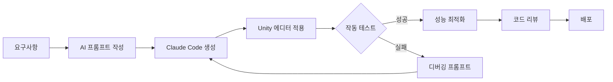

# ORE Frontend AI-Native Development Guide

_Unity AR 게임 개발을 위한 AI 활용 실전 가이드_

## Overview

- **목적**: Claude Code와 AI 도구를 활용한 Unity 프론트엔드 효율적 개발
- **독자**: Unity 개발자, AI 에이전트, 기술 리드
- **관련 문서**: ore-frontend-spec.md, ore-game-ux-guide.md, ai-native-team-strategy.md
- **Unity 버전**: 6.0 LTS
- **주요 AI 도구**: Claude Code (Primary), Cursor (Secondary), Copilot (Support)
- **최종 수정**: 2024-12-20
- **버전**: 2.0

---

## 1. AI-Native Unity 개발 철학

### 1.1 핵심 원칙

```yaml
AI First, Human Verify:
  - AI가 초안 생성, 인간이 검증/최적화
  - 반복적 작업은 100% AI
  - 창의적 결정은 인간 주도

Component-Based Prompting:
  - Unity 컴포넌트 단위로 프롬프트 작성
  - 단일 책임 원칙 준수
  - 재사용 가능한 모듈 생성

Performance by Design:
  - 모든 프롬프트에 성능 목표 명시
  - 모바일 제약사항 항상 포함
  - 프로파일링 코드 자동 생성

Test-Driven AI Development:
  - 테스트 코드 먼저 생성
  - 예상 결과 명확히 정의
  - 엣지 케이스 포함
```

### 1.2 Unity 특화 AI 워크플로우



---

## 2. Unity 컴포넌트 생성 프롬프트

### 2.1 AR 상호작용 매니저

````markdown
Create a Unity C# script for ARInteractionManager with these requirements:

## Component Name: ARInteractionManager

## Unity Version: 6.0 LTS

## Dependencies: AR Foundation 6.0+, DOTween Pro

## Core Functionality:

1. Detect AR planes and spawn ORE objects
2. Handle touch input for ORE collection
3. Manage distance-based interaction (10m radius)
4. Visual feedback for successful collection

## Performance Constraints:

- Mobile target: 30 FPS minimum in AR mode
- Max 100 ORE objects active simultaneously
- Memory usage < 50MB for this component
- Touch response < 16ms

## Code Structure:

```csharp
using UnityEngine;
using UnityEngine.XR.ARFoundation;
using DG.Tweening;
using System.Collections.Generic;

namespace ORE.AR
{
    public class ARInteractionManager : MonoBehaviour
    {
        [Header("AR Settings")]
        [SerializeField] private ARRaycastManager raycastManager;
        [SerializeField] private float interactionRadius = 10f;

        [Header("ORE Settings")]
        [SerializeField] private GameObject[] orePrefabs;
        [SerializeField] private int maxActiveOres = 100;

        [Header("Performance")]
        [SerializeField] private bool useLOD = true;
        [SerializeField] private int targetFrameRate = 30;

        // Include object pooling for performance
        private Queue<GameObject> orePool;

        // Include touch handling with debouncing
        // Include distance validation
        // Include particle effects pooling
        // Include haptic feedback
    }
}
```
````

## Special Requirements:

- Use object pooling for all spawned objects
- Implement LOD system for distant OREs
- Add profiling attributes for performance monitoring
- Include null safety checks for AR session
- Handle AR tracking loss gracefully

## Testing Hooks:

- Public methods for unit testing
- Mock AR input for editor testing
- Performance counters exposed

````

#### 💡 프롬프트 작성 팁
- **구체적인 버전 명시**: Unity 6.0 LTS, AR Foundation 6.0+
- **성능 목표 정량화**: 30 FPS, 100개 오브젝트, 50MB 메모리
- **의존성 명확화**: 필요한 패키지와 플러그인 명시
- **테스트 가능성**: 에디터에서 테스트 가능한 구조 요구

### 2.2 위치 매니저 컴포넌트
```markdown
Create LocationManager for Unity with GPS handling:

## Requirements:
- Platform: iOS (14+) and Android (10+)
- Update frequency: Every 5 seconds
- Accuracy: High (GPS + WiFi + Cellular)
- Battery optimization: Auto-switch to low power mode

## Implementation:
```csharp
using UnityEngine;
using UnityEngine.Android;
using System.Collections;
using System.Collections.Generic;

public class LocationManager : MonoBehaviour
{
    [Header("GPS Configuration")]
    [SerializeField] private float updateInterval = 5f;
    [SerializeField] private float minDistance = 10f;
    [SerializeField] private bool useBatterySaver = true;

    [Header("Debugging")]
    [SerializeField] private bool useMockLocation = false;
    [SerializeField] private Vector2 mockGPSCoordinate;

    // Kalman filter for GPS smoothing
    private KalmanFilter locationFilter;

    // Platform-specific implementation
    #if UNITY_IOS
    // iOS specific location handling
    #elif UNITY_ANDROID
    // Android permission request
    IEnumerator RequestLocationPermission()
    {
        if (!Permission.HasUserAuthorizedPermission(Permission.FineLocation))
        {
            Permission.RequestUserPermission(Permission.FineLocation);
        }
        yield return new WaitForSeconds(0.5f);
    }
    #endif
}
````

## Edge Cases to Handle:

1. GPS signal loss in tunnels
2. Location spoofing detection
3. Battery saver mode activation
4. Permission denied handling
5. Mock location for testing

## Performance Optimization:

- Cache last known location
- Batch location updates
- Use coroutines instead of Update()
- Implement distance threshold

````

### 2.3 인벤토리 시스템
```markdown
Create an optimized inventory system for Unity mobile:

## Specifications:
- Grid-based inventory (5x8 = 40 slots)
- Drag and drop support
- Stack system (max 99 per slot)
- Save/Load using JSON
- Memory efficient for mobile

## Complete Implementation:
```csharp
using UnityEngine;
using UnityEngine.UI;
using System.Collections.Generic;
using System.Linq;
using Newtonsoft.Json;

[System.Serializable]
public class InventoryItem
{
    public string id;
    public string name;
    public Sprite icon;
    public int stackCount;
    public ItemRarity rarity;
    public Dictionary<string, object> metadata;
}

public class InventorySystem : MonoBehaviour
{
    private const int GRID_WIDTH = 5;
    private const int GRID_HEIGHT = 8;
    private const int MAX_STACK = 99;

    [Header("UI References")]
    [SerializeField] private GameObject slotPrefab;
    [SerializeField] private Transform gridContainer;
    [SerializeField] private ScrollRect scrollView;

    [Header("Performance")]
    [SerializeField] private bool useVirtualization = true;
    [SerializeField] private int visibleRows = 4;

    private InventoryItem[,] items = new InventoryItem[GRID_WIDTH, GRID_HEIGHT];
    private Queue<GameObject> slotPool;

    // Implement drag and drop with touch support
    // Implement item stacking logic
    // Implement save/load with compression
    // Implement UI virtualization for performance
}
````

## Mobile Optimizations:

1. UI virtualization (only render visible slots)
2. Texture atlasing for item icons
3. Async loading for inventory open
4. Touch gesture optimization
5. Predictive preloading

````

---

## 3. AR 기능 구현 프롬프트

### 3.1 AR 평면 감지 및 ORE 스폰
```markdown
Implement AR plane detection and ORE spawning system:

## AR Foundation Setup:
```csharp
using UnityEngine.XR.ARFoundation;
using UnityEngine.XR.ARSubsystems;
using Unity.Collections;

public class ARPlaneORESpawner : MonoBehaviour
{
    [Header("AR Components")]
    [SerializeField] private ARPlaneManager planeManager;
    [SerializeField] private ARRaycastManager raycastManager;

    [Header("ORE Spawning")]
    [SerializeField] private GameObject[] orePrefabs;
    [SerializeField] private float spawnRadius = 50f;
    [SerializeField] private int maxOresPerPlane = 5;
    [SerializeField] private float minSpawnDistance = 2f;

    [Header("Visual Effects")]
    [SerializeField] private GameObject spawnEffectPrefab;
    [SerializeField] private AnimationCurve spawnCurve;

    private Dictionary<ARPlane, List<GameObject>> planarOres;

    void OnEnable()
    {
        planeManager.planesChanged += OnPlanesChanged;
    }

    void OnPlanesChanged(ARPlanesChangedEventArgs args)
    {
        // Handle new planes
        foreach(var plane in args.added)
        {
            SpawnOresOnPlane(plane);
        }

        // Handle removed planes
        foreach(var plane in args.removed)
        {
            RemoveOresFromPlane(plane);
        }
    }

    // Spawn logic with performance optimization
    // Use object pooling
    // Implement LOD based on distance
    // Add occlusion handling
}
````

## Performance Considerations:

- Limit plane detection after initial scan
- Use frustum culling for OREs
- Batch rendering for multiple OREs
- Dynamic LOD switching

````

### 3.2 AR 오클루전 처리
```markdown
Implement AR occlusion for realistic ORE rendering:

## Requirements:
- Human occlusion (iOS 13+, ARCore 1.24+)
- Environment occlusion
- Performance target: <5ms per frame

## Implementation:
```csharp
public class AROcclusionManager : MonoBehaviour
{
    [Header("Occlusion Settings")]
    [SerializeField] private AROcclusionManager occlusionManager;
    [SerializeField] private bool useHumanOcclusion = true;
    [SerializeField] private bool useEnvironmentOcclusion = true;

    [Header("Quality Settings")]
    [SerializeField] private EnvironmentDepthMode depthMode =
        EnvironmentDepthMode.Medium;
    [SerializeField] private bool temporalSmoothing = true;

    void Start()
    {
        ConfigureOcclusion();
    }

    void ConfigureOcclusion()
    {
        if (SystemInfo.supportsDepthTexture)
        {
            occlusionManager.requestedHumanDepthMode =
                useHumanOcclusion ? HumanSegmentationDepthMode.Fastest :
                HumanSegmentationDepthMode.Disabled;

            occlusionManager.requestedEnvironmentDepthMode =
                useEnvironmentOcclusion ? depthMode :
                EnvironmentDepthMode.Disabled;
        }
    }

    // Add quality adjustment based on device performance
    // Implement fallback for unsupported devices
}
````

````

---

## 4. 네트워킹 구현 프롬프트

### 4.1 REST API 통신
```markdown
Create REST API client for Unity using RestSharp:

## API Client Requirements:
- Base URL configuration
- JWT token handling
- Retry logic with exponential backoff
- Request queuing for offline mode
- Response caching

## Complete Implementation:
```csharp
using RestSharp;
using System.Threading.Tasks;
using UnityEngine;
using System.Collections.Generic;

public class OREAPIClient : MonoBehaviour
{
    private const string BASE_URL = "https://api.ore.game/v1";
    private RestClient client;
    private string authToken;
    private Queue<RestRequest> offlineQueue;

    [Header("Configuration")]
    [SerializeField] private int maxRetries = 3;
    [SerializeField] private float timeoutSeconds = 10f;
    [SerializeField] private bool enableCaching = true;

    void Awake()
    {
        client = new RestClient(BASE_URL);
        client.Timeout = (int)(timeoutSeconds * 1000);
        offlineQueue = new Queue<RestRequest>();
    }

    public async Task<T> GetAsync<T>(string endpoint,
        Dictionary<string, object> parameters = null)
    {
        var request = new RestRequest(endpoint, Method.GET);

        if (!string.IsNullOrEmpty(authToken))
            request.AddHeader("Authorization", $"Bearer {authToken}");

        if (parameters != null)
        {
            foreach(var param in parameters)
                request.AddParameter(param.Key, param.Value);
        }

        // Implement retry logic
        for(int i = 0; i < maxRetries; i++)
        {
            try
            {
                var response = await client.ExecuteAsync<T>(request);
                if (response.IsSuccessful)
                    return response.Data;
            }
            catch (Exception e)
            {
                if (i == maxRetries - 1)
                    throw;
                await Task.Delay((int)Math.Pow(2, i) * 1000);
            }
        }

        return default(T);
    }

    // Implement POST, PUT, DELETE methods
    // Implement offline queue processing
    // Implement response caching
    // Implement request deduplication
}
````

````

### 4.2 WebSocket 실시간 통신
```markdown
Implement WebSocket for real-time updates in Unity:

## Requirements:
- Auto-reconnection
- Heartbeat/ping-pong
- Message queuing
- Binary and text support

```csharp
using NativeWebSocket;
using System.Collections.Generic;
using UnityEngine;
using System.Threading.Tasks;

public class RealtimeManager : MonoBehaviour
{
    private WebSocket websocket;
    private Queue<string> messageQueue;
    private bool isReconnecting = false;

    [Header("Connection")]
    [SerializeField] private string wsUrl = "wss://realtime.ore.game";
    [SerializeField] private float reconnectDelay = 5f;
    [SerializeField] private float heartbeatInterval = 30f;

    async void Start()
    {
        await Connect();
        InvokeRepeating(nameof(SendHeartbeat), heartbeatInterval,
            heartbeatInterval);
    }

    async Task Connect()
    {
        websocket = new WebSocket(wsUrl);

        websocket.OnOpen += () =>
        {
            Debug.Log("WebSocket connected");
            isReconnecting = false;
        };

        websocket.OnMessage += (bytes) =>
        {
            var message = System.Text.Encoding.UTF8.GetString(bytes);
            messageQueue.Enqueue(message);
        };

        websocket.OnError += (e) =>
        {
            Debug.LogError($"WebSocket error: {e}");
        };

        websocket.OnClose += (e) =>
        {
            if (!isReconnecting)
                StartCoroutine(Reconnect());
        };

        await websocket.Connect();
    }

    // Implement message processing
    // Implement reconnection logic
    // Implement heartbeat
}
````

````

---

## 5. 성능 최적화 프롬프트

### 5.1 메모리 최적화
```markdown
Optimize Unity mobile memory usage for ORE game:

## Target Metrics:
- RAM usage < 500MB
- Texture memory < 200MB
- Mesh memory < 50MB
- Audio memory < 30MB

## Optimization Implementation:
```csharp
public class MemoryOptimizer : MonoBehaviour
{
    [Header("Texture Settings")]
    [SerializeField] private int maxTextureSize = 1024;
    [SerializeField] private bool compressTextures = true;

    [Header("Mesh Settings")]
    [SerializeField] private bool combineMeshes = true;
    [SerializeField] private float lodBias = 1.0f;

    [Header("Garbage Collection")]
    [SerializeField] private bool useIncrementalGC = true;
    [SerializeField] private float gcInterval = 30f;

    void Start()
    {
        ConfigureMemorySettings();
    }

    void ConfigureMemorySettings()
    {
        // Texture optimization
        QualitySettings.masterTextureLimit = 1; // Half resolution

        // Mesh optimization
        QualitySettings.lodBias = lodBias;
        QualitySettings.maximumLODLevel = 2;

        // Garbage collection
        if (useIncrementalGC)
        {
            UnityEngine.Scripting.GarbageCollector.GCMode =
                UnityEngine.Scripting.GarbageCollector.Mode.Enabled;
        }

        // Audio optimization
        AudioSettings.SetDSPBufferSize(256, 4);

        // Unload unused assets periodically
        InvokeRepeating(nameof(UnloadUnused), gcInterval, gcInterval);
    }

    void UnloadUnused()
    {
        Resources.UnloadUnusedAssets();
        System.GC.Collect();
    }
}
````

## Specific Optimizations:

1. Texture atlasing for UI icons
2. Mesh combining for static objects
3. LOD groups for ORE models
4. Audio compression settings
5. Particle system pooling

````

### 5.2 배터리 최적화
```markdown
Implement battery optimization for Unity AR game:

## Target: < 10% battery drain per hour

```csharp
public class BatteryOptimizer : MonoBehaviour
{
    [Header("Frame Rate")]
    [SerializeField] private int targetFPS_High = 60;
    [SerializeField] private int targetFPS_Medium = 30;
    [SerializeField] private int targetFPS_Low = 20;

    [Header("Quality Adjustment")]
    [SerializeField] private bool dynamicResolution = true;
    [SerializeField] private float minResolutionScale = 0.5f;

    private float batteryLevel;
    private BatteryStatus batteryStatus;

    void Start()
    {
        InvokeRepeating(nameof(CheckBatteryStatus), 0f, 10f);
    }

    void CheckBatteryStatus()
    {
        batteryLevel = SystemInfo.batteryLevel;
        batteryStatus = SystemInfo.batteryStatus;

        AdjustPerformanceSettings();
    }

    void AdjustPerformanceSettings()
    {
        // Adjust based on battery level
        if (batteryLevel < 0.2f) // Less than 20%
        {
            Application.targetFrameRate = targetFPS_Low;
            QualitySettings.SetQualityLevel(0); // Lowest
            Screen.brightness = 0.5f;

            // Disable non-essential features
            DisableParticleEffects();
            ReduceARTracking();
        }
        else if (batteryLevel < 0.5f) // Less than 50%
        {
            Application.targetFrameRate = targetFPS_Medium;
            QualitySettings.SetQualityLevel(1); // Medium
        }
        else
        {
            Application.targetFrameRate = targetFPS_High;
            QualitySettings.SetQualityLevel(2); // High
        }

        // Additional optimizations when charging
        if (batteryStatus == BatteryStatus.Charging)
        {
            Application.targetFrameRate = targetFPS_High;
            QualitySettings.SetQualityLevel(3); // Ultra
        }
    }
}
````

````

---

## 6. 테스트 코드 생성

### 6.1 Unity Test Framework 활용
```markdown
Generate unit tests for InventorySystem using Unity Test Framework:

```csharp
using NUnit.Framework;
using UnityEngine;
using UnityEngine.TestTools;
using System.Collections;

public class InventorySystemTests
{
    private InventorySystem inventory;
    private GameObject testObject;

    [SetUp]
    public void Setup()
    {
        testObject = new GameObject("TestInventory");
        inventory = testObject.AddComponent<InventorySystem>();
        inventory.Initialize(5, 8); // 5x8 grid
    }

    [TearDown]
    public void Teardown()
    {
        Object.DestroyImmediate(testObject);
    }

    [Test]
    public void AddItem_EmptySlot_ReturnsTrue()
    {
        // Arrange
        var item = new InventoryItem
        {
            id = "ore_common",
            stackCount = 1
        };

        // Act
        bool result = inventory.AddItem(item);

        // Assert
        Assert.IsTrue(result);
        Assert.AreEqual(1, inventory.GetItemCount("ore_common"));
    }

    [Test]
    public void AddItem_StackableItem_StacksProperly()
    {
        // Arrange
        var item1 = new InventoryItem
        {
            id = "ore_common",
            stackCount = 50
        };
        var item2 = new InventoryItem
        {
            id = "ore_common",
            stackCount = 30
        };

        // Act
        inventory.AddItem(item1);
        inventory.AddItem(item2);

        // Assert
        Assert.AreEqual(80, inventory.GetItemCount("ore_common"));
    }

    [UnityTest]
    public IEnumerator DragAndDrop_SwapsItems()
    {
        // Arrange
        inventory.AddItemAt(0, 0, new InventoryItem { id = "ore_rare" });
        inventory.AddItemAt(1, 1, new InventoryItem { id = "ore_epic" });

        // Act
        yield return inventory.SimulateDragAndDrop(0, 0, 1, 1);

        // Assert
        Assert.AreEqual("ore_epic", inventory.GetItemAt(0, 0).id);
        Assert.AreEqual("ore_rare", inventory.GetItemAt(1, 1).id);
    }
}
````

````

### 6.2 성능 테스트
```markdown
Create performance tests for AR spawning system:

```csharp
using Unity.PerformanceTesting;
using UnityEngine;
using NUnit.Framework;

public class ARPerformanceTests
{
    [Test, Performance]
    public void SpawnOres_100Objects_Under16ms()
    {
        Measure.Method(() =>
        {
            var spawner = new GameObject().AddComponent<ARPlaneORESpawner>();
            spawner.SpawnMultipleOres(100);
        })
        .WarmupCount(3)
        .MeasurementCount(10)
        .SampleGroup(new SampleGroup("ORE Spawning", SampleUnit.Millisecond))
        .Run();

        var results = PerformanceTest.Active.SampleGroups[0];
        Assert.Less(results.Median, 16.0); // Less than 16ms (60fps)
    }

    [Test, Performance]
    public void TouchDetection_Latency_Under50ms()
    {
        Measure.Method(() =>
        {
            var manager = new ARInteractionManager();
            var mockTouch = new Touch { position = new Vector2(100, 100) };
            manager.ProcessTouch(mockTouch);
        })
        .SampleGroup(new SampleGroup("Touch Latency", SampleUnit.Millisecond))
        .Run();

        var results = PerformanceTest.Active.SampleGroups[0];
        Assert.Less(results.Max, 50.0);
    }
}
````

````

---

## 7. 디버깅 프롬프트

### 7.1 AR 트래킹 문제 해결
```markdown
Debug AR tracking issues in Unity:

## Common Issues and Solutions:

```csharp
public class ARDebugger : MonoBehaviour
{
    [Header("Debug Visualization")]
    [SerializeField] private bool showTrackingState = true;
    [SerializeField] private bool showFeaturePoints = true;
    [SerializeField] private bool showPlanes = true;

    [Header("Logging")]
    [SerializeField] private bool logTrackingEvents = true;
    [SerializeField] private bool saveDebugData = false;

    private ARSession arSession;
    private Text debugText;
    private List<string> debugLog = new List<string>();

    void Start()
    {
        arSession = FindObjectOfType<ARSession>();
        ARSession.stateChanged += OnARStateChanged;
    }

    void OnARStateChanged(ARSessionStateChangedEventArgs args)
    {
        string stateInfo = $"AR State: {args.state}";

        switch(args.state)
        {
            case ARSessionState.None:
            case ARSessionState.Unsupported:
                LogError("AR not supported on this device");
                ShowFallbackUI();
                break;

            case ARSessionState.SessionInitializing:
                Log("Initializing AR session...");
                break;

            case ARSessionState.SessionTracking:
                Log("AR tracking active");
                CheckTrackingQuality();
                break;

            case ARSessionState.NeedsInstall:
                PromptARCoreInstall();
                break;
        }
    }

    void CheckTrackingQuality()
    {
        if (ARSession.notTrackingReason != NotTrackingReason.None)
        {
            switch(ARSession.notTrackingReason)
            {
                case NotTrackingReason.InsufficientLight:
                    ShowUserMessage("더 밝은 곳으로 이동하세요");
                    break;

                case NotTrackingReason.ExcessiveMotion:
                    ShowUserMessage("천천히 움직여주세요");
                    break;

                case NotTrackingReason.InsufficientFeatures:
                    ShowUserMessage("특징이 있는 표면을 비춰주세요");
                    break;
            }
        }
    }

    // Visualize debug info
    void OnGUI()
    {
        if (!showTrackingState) return;

        GUI.Box(new Rect(10, 10, 300, 150), "AR Debug Info");
        GUI.Label(new Rect(20, 40, 280, 20),
            $"State: {ARSession.state}");
        GUI.Label(new Rect(20, 60, 280, 20),
            $"Tracking: {ARSession.notTrackingReason}");
        GUI.Label(new Rect(20, 80, 280, 20),
            $"Frame Rate: {1.0f / Time.deltaTime:F1} FPS");
        GUI.Label(new Rect(20, 100, 280, 20),
            $"Planes: {FindObjectsOfType<ARPlane>().Length}");
    }
}
````

````

### 7.2 메모리 누수 탐지
```markdown
Detect and fix memory leaks in Unity:

```csharp
public class MemoryLeakDetector : MonoBehaviour
{
    [Header("Monitoring")]
    [SerializeField] private float checkInterval = 5f;
    [SerializeField] private bool autofix = true;

    private long lastMemory;
    private Dictionary<string, int> objectCounts;

    void Start()
    {
        InvokeRepeating(nameof(CheckMemory), checkInterval, checkInterval);
        objectCounts = new Dictionary<string, int>();
    }

    void CheckMemory()
    {
        // Check system memory
        long currentMemory = System.GC.GetTotalMemory(false);
        long memoryDelta = currentMemory - lastMemory;

        if (memoryDelta > 1024 * 1024) // 1MB increase
        {
            Debug.LogWarning($"Memory increased by {memoryDelta / 1024}KB");
            AnalyzeObjectCounts();

            if (autofix)
                AttemptAutoFix();
        }

        lastMemory = currentMemory;
    }

    void AnalyzeObjectCounts()
    {
        var newCounts = new Dictionary<string, int>();

        // Check common leak sources
        newCounts["Textures"] = Resources.FindObjectsOfTypeAll<Texture>().Length;
        newCounts["Materials"] = Resources.FindObjectsOfTypeAll<Material>().Length;
        newCounts["GameObjects"] = FindObjectsOfType<GameObject>().Length;
        newCounts["AudioClips"] = Resources.FindObjectsOfTypeAll<AudioClip>().Length;

        foreach(var kvp in newCounts)
        {
            if (objectCounts.ContainsKey(kvp.Key))
            {
                int delta = kvp.Value - objectCounts[kvp.Key];
                if (delta > 10)
                {
                    Debug.LogError($"Potential leak: {kvp.Key} increased by {delta}");
                }
            }
        }

        objectCounts = newCounts;
    }

    void AttemptAutoFix()
    {
        Resources.UnloadUnusedAssets();
        System.GC.Collect();
        System.GC.WaitForPendingFinalizers();
        System.GC.Collect();
    }
}
````

````

---

## 8. AI와의 대화 - 반복적 코드 개선

### 8.1 초기 생성 → 리팩토링 워크플로우

#### 단계 1: 기본 구조 생성
```markdown
초기 프롬프트:
"Create a simple inventory system for Unity that can add and remove items"
````

#### 단계 2: 아키텍처 패턴 적용

```markdown
개선 프롬프트 1:
"Refactor this code to use the Service Locator pattern as defined in our architecture:

- ServiceLocator should manage singleton instances
- Inventory should register itself on Awake
- Other systems should access via ServiceLocator.Get<InventorySystem>()"

현재 코드: [AI가 생성한 코드 붙여넣기]
```

#### 단계 3: 성능 최적화

```markdown
개선 프롬프트 2:
"Optimize this inventory system for mobile:

- Add object pooling for UI elements
- Implement virtual scrolling for items > 20
- Reduce memory allocations in hot paths
- Target: 60 FPS on mid-range devices"
```

#### 단계 4: 에러 처리 강화

```markdown
개선 프롬프트 3:
"Add comprehensive error handling:

- Null checks with meaningful error messages
- Try-catch for file I/O operations
- Graceful degradation when save fails
- User-friendly error notifications"
```

### 8.2 실전 리팩토링 대화 예시

#### 예시 1: LocationManager 배터리 최적화

```markdown
Human: "여기 내가 만든 LocationManager가 있는데, GPS 업데이트가 너무 자주 일어나서
배터리 소모가 심해. 개선해줘."

public class LocationManager : MonoBehaviour {
void Update() {
Input.location.Start();
var lat = Input.location.lastData.latitude;
var lon = Input.location.lastData.longitude;
UpdatePlayerPosition(lat, lon);
}
}

AI: "배터리 최적화를 위해 다음과 같이 개선하겠습니다:

1. Update에서 매 프레임 GPS 시작하는 문제 수정
2. 적응형 업데이트 간격 구현
3. 이동 거리 기반 필터링 추가"

public class LocationManager : MonoBehaviour {
[Header("Battery Optimization")]
[SerializeField] private float updateInterval = 5f; // 기본 5초
[SerializeField] private float minDistanceThreshold = 10f; // 10m

    private float lastUpdateTime;
    private LocationInfo lastValidLocation;
    private bool isStationary = true;

    void Start() {
        Input.location.Start(minDistanceThreshold, minDistanceThreshold);
        StartCoroutine(AdaptiveLocationUpdate());
    }

    IEnumerator AdaptiveLocationUpdate() {
        while (true) {
            // 정지 상태면 업데이트 간격 늘림
            float currentInterval = isStationary ? updateInterval * 2 : updateInterval;
            yield return new WaitForSeconds(currentInterval);

            if (Input.location.status == LocationServiceStatus.Running) {
                var currentLocation = Input.location.lastData;

                // 의미 있는 이동만 처리
                if (HasSignificantMovement(currentLocation)) {
                    UpdatePlayerPosition(currentLocation);
                    isStationary = false;
                } else {
                    isStationary = true;
                }
            }
        }
    }

}
```

#### 예시 2: 메모리 누수 해결

```markdown
Human: "이 ARInteractionManager에서 메모리 누수가 발생하는 것 같아.
ORE 오브젝트를 계속 생성하는데 제대로 정리가 안 되고 있어."

public class ARInteractionManager : MonoBehaviour {
public GameObject orePrefab;
private List<GameObject> activeOres = new List<GameObject>();

    void SpawnOre(Vector3 position) {
        var ore = Instantiate(orePrefab, position, Quaternion.identity);
        activeOres.Add(ore);
    }

}

AI: "메모리 누수를 해결하기 위해 오브젝트 풀링과 적절한 정리 로직을 추가하겠습니다:"

public class ARInteractionManager : MonoBehaviour {
[Header("Object Pooling")]
[SerializeField] private GameObject orePrefab;
[SerializeField] private int poolSize = 50;
[SerializeField] private int maxActiveOres = 100;

    private Queue<GameObject> orePool;
    private HashSet<GameObject> activeOres;

    void Awake() {
        InitializePool();
    }

    void InitializePool() {
        orePool = new Queue<GameObject>(poolSize);
        activeOres = new HashSet<GameObject>();

        for (int i = 0; i < poolSize; i++) {
            var ore = Instantiate(orePrefab);
            ore.SetActive(false);
            orePool.Enqueue(ore);
        }
    }

    void SpawnOre(Vector3 position) {
        // 최대 개수 제한
        if (activeOres.Count >= maxActiveOres) {
            RecycleOldestOre();
        }

        GameObject ore = GetFromPool();
        ore.transform.position = position;
        ore.SetActive(true);
        activeOres.Add(ore);
    }

    GameObject GetFromPool() {
        if (orePool.Count > 0) {
            return orePool.Dequeue();
        }

        // 풀이 비었으면 새로 생성 (경고 로그)
        Debug.LogWarning("Pool exhausted, creating new instance");
        return Instantiate(orePrefab);
    }

    void ReturnToPool(GameObject ore) {
        ore.SetActive(false);
        activeOres.Remove(ore);
        orePool.Enqueue(ore);
    }

    void OnDestroy() {
        // 명시적 정리
        foreach (var ore in activeOres) {
            if (ore != null) Destroy(ore);
        }
        while (orePool.Count > 0) {
            Destroy(orePool.Dequeue());
        }
    }

}
```

---

## 9. UI Toolkit 컴포넌트 생성 가이드

### 9.1 리더보드 UI 생성 (UXML + USS + C#)

#### UXML 구조 생성

````markdown
Create a leaderboard UI using Unity UI Toolkit:

Requirements:

- Display top 100 players
- Show rank, name, score, and avatar
- Virtual scrolling for performance
- Pull-to-refresh gesture
- Follow ORE design system (Reality Blue #00D4FF, dark theme)

Generate UXML:

```xml
<ui:UXML xmlns:ui="UnityEngine.UIElements" xmlns:uie="UnityEditor.UIElements">
    <ui:VisualElement name="LeaderboardContainer" class="leaderboard-container">
        <!-- Header -->
        <ui:VisualElement name="Header" class="header">
            <ui:Label text="Reality Layer Rankings" class="header-title"/>
            <ui:VisualElement class="header-tabs">
                <ui:Button name="DailyTab" text="Daily" class="tab-button active"/>
                <ui:Button name="WeeklyTab" text="Weekly" class="tab-button"/>
                <ui:Button name="AllTimeTab" text="All Time" class="tab-button"/>
            </ui:VisualElement>
        </ui:VisualElement>

        <!-- Pull to Refresh Indicator -->
        <ui:VisualElement name="RefreshIndicator" class="refresh-indicator">
            <ui:VisualElement class="refresh-spinner"/>
            <ui:Label text="Pull to refresh" class="refresh-text"/>
        </ui:VisualElement>

        <!-- Leaderboard List (Virtual Scrolling) -->
        <ui:ScrollView name="LeaderboardScrollView" class="leaderboard-scroll">
            <ui:VisualElement name="ContentContainer" class="content-container">
                <!-- Dynamic items will be inserted here -->
            </ui:VisualElement>
        </ui:ScrollView>

        <!-- Player's Own Rank Card -->
        <ui:VisualElement name="PlayerRankCard" class="player-rank-card">
            <ui:Label name="PlayerRank" text="#1337" class="player-rank"/>
            <ui:VisualElement class="player-info">
                <ui:VisualElement name="PlayerAvatar" class="avatar"/>
                <ui:Label name="PlayerName" text="You" class="player-name"/>
            </ui:VisualElement>
            <ui:Label name="PlayerScore" text="42,000" class="player-score"/>
        </ui:VisualElement>
    </ui:VisualElement>
</ui:UXML>
```
````

#### USS 스타일 생성

```css
/* ORE Design System Colors */
:root {
  --reality-blue: #00d4ff;
  --crack-purple: #9b59b6;
  --genesis-gold: #ffd700;
  --dark-bg: #0a0a0a;
  --dark-surface: #1a1a1a;
}

.leaderboard-container {
  flex: 1;
  background-color: var(--dark-bg);
  padding: 10px;
}

.header {
  height: 100px;
  margin-bottom: 10px;
}

.header-title {
  font-size: 24px;
  color: var(--reality-blue);
  -unity-font-style: bold;
  -unity-text-align: middle-center;
  margin-bottom: 10px;
}

.header-tabs {
  flex-direction: row;
  justify-content: center;
}

.tab-button {
  width: 100px;
  height: 40px;
  margin: 0 5px;
  background-color: transparent;
  border-width: 2px;
  border-color: var(--reality-blue);
  border-radius: 20px;
  color: var(--reality-blue);
  transition: all 0.3s;
}

.tab-button.active {
  background-color: var(--reality-blue);
  color: var(--dark-bg);
}

.leaderboard-scroll {
  flex: 1;
  margin: 10px 0;
}

/* Leaderboard Item Row */
.leaderboard-item {
  height: 80px;
  flex-direction: row;
  align-items: center;
  padding: 10px;
  margin: 5px 0;
  background-color: var(--dark-surface);
  border-radius: 10px;
  transition: all 0.2s;
}

.leaderboard-item:hover {
  background-color: rgba(0, 212, 255, 0.1);
  translate: 2px 0;
}

/* Rank Badge Styles */
.rank-badge {
  width: 50px;
  height: 50px;
  border-radius: 25px;
  -unity-text-align: middle-center;
  font-size: 18px;
  -unity-font-style: bold;
}

.rank-1 {
  background-color: var(--genesis-gold);
  color: black;
}
.rank-2 {
  background-color: #c0c0c0;
  color: black;
}
.rank-3 {
  background-color: #cd7f32;
  color: white;
}
.rank-default {
  background-color: var(--dark-surface);
  color: white;
}

/* Virtual Scrolling Performance */
.content-container {
  position: absolute;
}

.virtual-spacer {
  height: 0; /* Dynamically set */
}
```

#### C# Controller 생성

```csharp
using UnityEngine;
using UnityEngine.UIElements;
using System.Collections.Generic;
using System.Threading.Tasks;
using DG.Tweening;

public class LeaderboardUI : MonoBehaviour
{
    [Header("UI Document")]
    [SerializeField] private UIDocument uiDocument;

    [Header("Virtual Scrolling")]
    [SerializeField] private int itemHeight = 80;
    [SerializeField] private int bufferSize = 5;

    private VisualElement root;
    private ScrollView scrollView;
    private VisualElement contentContainer;
    private List<LeaderboardEntry> allEntries;
    private Dictionary<int, VisualElement> visibleItems;

    // Pull to refresh
    private bool isRefreshing = false;
    private float pullThreshold = 100f;

    void OnEnable()
    {
        root = uiDocument.rootVisualElement;
        SetupUI();
        LoadLeaderboard();
    }

    void SetupUI()
    {
        scrollView = root.Q<ScrollView>("LeaderboardScrollView");
        contentContainer = root.Q<VisualElement>("ContentContainer");

        // Tab buttons
        root.Q<Button>("DailyTab").clicked += () => SwitchTab(LeaderboardType.Daily);
        root.Q<Button>("WeeklyTab").clicked += () => SwitchTab(LeaderboardType.Weekly);
        root.Q<Button>("AllTimeTab").clicked += () => SwitchTab(LeaderboardType.AllTime);

        // Virtual scrolling setup
        scrollView.RegisterCallback<GeometryChangedEvent>(OnScrollViewGeometryChanged);
        scrollView.verticalScroller.valueChanged += OnScroll;

        // Pull to refresh
        SetupPullToRefresh();
    }

    void SetupPullToRefresh()
    {
        var refreshIndicator = root.Q<VisualElement>("RefreshIndicator");
        float startY = 0;

        scrollView.RegisterCallback<PointerDownEvent>(evt =>
        {
            startY = evt.position.y;
        });

        scrollView.RegisterCallback<PointerMoveEvent>(evt =>
        {
            if (scrollView.scrollOffset.y <= 0 && !isRefreshing)
            {
                float pullDistance = evt.position.y - startY;
                if (pullDistance > pullThreshold)
                {
                    TriggerRefresh();
                }

                // Visual feedback
                float progress = Mathf.Clamp01(pullDistance / pullThreshold);
                refreshIndicator.style.opacity = progress;
                refreshIndicator.transform.rotation = Quaternion.Euler(0, 0, progress * 360);
            }
        });
    }

    async void TriggerRefresh()
    {
        if (isRefreshing) return;

        isRefreshing = true;

        // Haptic feedback
        #if UNITY_IOS || UNITY_ANDROID
        Handheld.Vibrate();
        #endif

        // Animation
        var refreshIndicator = root.Q<VisualElement>("RefreshIndicator");
        DOTween.To(() => refreshIndicator.transform.rotation.eulerAngles.z,
                   z => refreshIndicator.transform.rotation = Quaternion.Euler(0, 0, z),
                   720, 1f);

        // Load new data
        await LoadLeaderboardAsync();

        // Hide indicator
        refreshIndicator.style.opacity = 0;
        isRefreshing = false;
    }

    void OnScroll(float value)
    {
        UpdateVirtualScroll();
    }

    void UpdateVirtualScroll()
    {
        float scrollOffset = scrollView.scrollOffset.y;
        int firstVisibleIndex = Mathf.Max(0, (int)(scrollOffset / itemHeight) - bufferSize);
        int lastVisibleIndex = Mathf.Min(allEntries.Count - 1,
            firstVisibleIndex + (int)(scrollView.contentRect.height / itemHeight) + bufferSize * 2);

        // Remove items outside visible range
        var toRemove = new List<int>();
        foreach (var kvp in visibleItems)
        {
            if (kvp.Key < firstVisibleIndex || kvp.Key > lastVisibleIndex)
            {
                contentContainer.Remove(kvp.Value);
                toRemove.Add(kvp.Key);
            }
        }
        toRemove.ForEach(key => visibleItems.Remove(key));

        // Add new visible items
        for (int i = firstVisibleIndex; i <= lastVisibleIndex; i++)
        {
            if (!visibleItems.ContainsKey(i))
            {
                var item = CreateLeaderboardItem(allEntries[i], i + 1);
                item.style.top = i * itemHeight;
                contentContainer.Add(item);
                visibleItems[i] = item;
            }
        }
    }

    VisualElement CreateLeaderboardItem(LeaderboardEntry entry, int rank)
    {
        var item = new VisualElement();
        item.AddToClassList("leaderboard-item");

        // Rank badge
        var rankBadge = new Label(rank.ToString());
        rankBadge.AddToClassList("rank-badge");
        rankBadge.AddToClassList(rank <= 3 ? $"rank-{rank}" : "rank-default");
        item.Add(rankBadge);

        // Player info
        var playerInfo = new VisualElement();
        playerInfo.style.flexDirection = FlexDirection.Row;
        playerInfo.style.flexGrow = 1;

        // Avatar
        var avatar = new VisualElement();
        avatar.AddToClassList("player-avatar");
        avatar.style.backgroundImage = new StyleBackground(entry.avatarTexture);
        playerInfo.Add(avatar);

        // Name
        var name = new Label(entry.playerName);
        name.AddToClassList("player-name");
        playerInfo.Add(name);

        item.Add(playerInfo);

        // Score
        var score = new Label(FormatScore(entry.score));
        score.AddToClassList("player-score");
        item.Add(score);

        return item;
    }

    string FormatScore(int score)
    {
        if (score >= 1000000)
            return $"{score / 1000000f:F1}M";
        if (score >= 1000)
            return $"{score / 1000f:F1}K";
        return score.ToString();
    }
}
```

### 9.2 반응형 UI 컴포넌트 패턴

````markdown
Create responsive UI components that adapt to device and orientation:

Pattern for adaptive layouts:

```csharp
public class ResponsiveUI : MonoBehaviour
{
    [Header("Breakpoints")]
    [SerializeField] private int phoneWidth = 480;
    [SerializeField] private int tabletWidth = 768;

    private UIDocument uiDocument;
    private VisualElement root;

    void Start()
    {
        uiDocument = GetComponent<UIDocument>();
        root = uiDocument.rootVisualElement;

        // Initial setup
        UpdateLayout();

        // Listen for orientation changes
        Screen.orientationChanged += OnOrientationChanged;
    }

    void UpdateLayout()
    {
        float width = Screen.width;
        float height = Screen.height;
        bool isPortrait = height > width;

        // Remove all layout classes
        root.RemoveFromClassList("phone-layout");
        root.RemoveFromClassList("tablet-layout");
        root.RemoveFromClassList("portrait");
        root.RemoveFromClassList("landscape");

        // Add appropriate classes
        if (width <= phoneWidth)
        {
            root.AddToClassList("phone-layout");
            AdjustForPhone(isPortrait);
        }
        else if (width <= tabletWidth)
        {
            root.AddToClassList("tablet-layout");
            AdjustForTablet(isPortrait);
        }
        else
        {
            root.AddToClassList("desktop-layout");
        }

        root.AddToClassList(isPortrait ? "portrait" : "landscape");
    }

    void AdjustForPhone(bool isPortrait)
    {
        var actionButtons = root.Q<VisualElement>("ActionButtons");
        if (isPortrait)
        {
            // Stack buttons vertically
            actionButtons.style.flexDirection = FlexDirection.Column;
            actionButtons.style.width = Length.Percent(100);
        }
        else
        {
            // Horizontal layout with smaller buttons
            actionButtons.style.flexDirection = FlexDirection.Row;
            actionButtons.Query<Button>().ForEach(btn =>
            {
                btn.style.width = Length.Percent(25);
            });
        }
    }
}
```
````

USS for responsive design:

```css
/* Phone Portrait */
.phone-layout.portrait .main-panel {
  width: 100%;
  height: 100%;
}

.phone-layout.portrait .side-panel {
  display: none;
}

/* Phone Landscape */
.phone-layout.landscape .main-panel {
  width: 70%;
}

.phone-layout.landscape .side-panel {
  width: 30%;
}

/* Tablet */
.tablet-layout .main-panel {
  width: 60%;
}

.tablet-layout .side-panel {
  width: 40%;
}

/* Animations for layout changes */
.main-panel,
.side-panel {
  transition: width 0.3s ease-in-out;
}
```

````

---

## 10. AI 도구별 활용 가이드

### 10.1 Claude Code 활용 전략
```yaml
최적 사용 케이스:
  복잡한 시스템:
    - 전체 매니저 클래스 생성
    - AR 통합 로직
    - 네트워킹 레이어
    - UI Toolkit 컴포넌트 세트

  알고리즘 구현:
    - GPS 필터링 (Kalman filter)
    - 오브젝트 풀링 시스템
    - LOD 관리
    - 가상 스크롤링

  성능 최적화:
    - 메모리 관리 코드
    - 배치 렌더링 설정
    - 프로파일링 통합

프롬프트 구조:
  1. Unity 버전과 의존성 명시
  2. 성능 목표 정량화
  3. 플랫폼 제약사항 포함
  4. 테스트 가능한 구조 요구
  5. 에러 처리 명시
````

### 10.2 Cursor 활용 전략

```yaml
최적 사용 케이스:
  빠른 수정:
    - 버그 픽스
    - 파라미터 조정
    - UI 레이아웃 변경

  리팩토링:
    - 변수명 일괄 변경
    - 메서드 추출
    - 코드 정리
    - 패턴 적용

  반복 작업:
    - Serialize fields 추가
    - Property 생성
    - 주석 추가

단축키 활용:
  - Cmd+K: AI 수정 요청
  - Cmd+L: 채팅 열기
  - Tab: 자동완성 수락
```

### 10.3 Copilot 활용 전략

```yaml
최적 사용 케이스:
  자동 완성:
    - 메서드 시그니처
    - 반복 패턴
    - 보일러플레이트

  주석 기반 생성:
    - // TODO 구현
    - 함수 설명 → 구현
    - 테스트 케이스

  Unity 특화:
    - Inspector 속성
    - Coroutine 패턴
    - Event handlers

효율적 사용법:
  - 명확한 주석 작성
  - 일관된 네이밍
  - 패턴 학습 유도
```

---

## 11. 프로젝트별 프롬프트 템플릿

### 11.1 MVP 개발용 템플릿 (12주)

```markdown
## Week 1-4: Core Systems

Create Unity LocationManager for MVP:

- Platform: iOS 14+, Android 10+
- GPS update: 5 seconds
- Battery optimization required
- Offline queue support
- Mock data for testing
- Service Locator pattern integration

## Week 5-8: AR Implementation

Implement AR Core mining:

- AR Foundation 6.0+
- Max 100 Cores visible
- 10m interaction radius
- Object pooling required
- 30 FPS minimum
- LOD system for performance

## Week 9-10: UI Development

Create UI with UI Toolkit:

- Leaderboard with virtual scrolling
- Inventory with drag & drop
- Responsive layouts
- Dark theme (Reality Layer style)
- 60 FPS UI animations

## Week 11-12: Polish & Optimization

Optimize for Genesis 1000 beta:

- 1000 concurrent users
- <500MB RAM usage
- <10% battery/hour
- Network resilience
- Crash reporting
```

### 11.2 Genesis 1000 특별 기능

```markdown
Implement Genesis member features:

- Special visual effects (golden aura)
- 2x point multiplier
- Exclusive UI theme
- Priority server queue
- Special achievements
- Custom UI Toolkit theme

Requirements:

- Minimal performance impact
- A/B testing support
- Analytics integration
- Graceful degradation
```

### 11.3 반복적 개선 템플릿

```markdown
Initial Request:
"Create basic [component name] for Unity"

Iteration 1 - Architecture:
"Apply Service Locator pattern from ore-frontend-spec.md"

Iteration 2 - Performance:
"Optimize for mobile: <50MB memory, 60 FPS"

Iteration 3 - UI Polish:
"Apply ORE design system from ore-ux-guide.md"

Iteration 4 - Error Handling:
"Add comprehensive error handling and user feedback"

Iteration 5 - Testing:
"Add unit tests using Unity Test Framework"
```

---

## 12. 트러블슈팅 가이드

### 12.1 일반적인 Unity AR 문제

```yaml
문제: AR 평면이 감지되지 않음
해결:
  1. ARPlaneManager 컴포넌트 확인
  2. 조명 조건 체크
  3. 카메라 권한 확인
  4. AR 서브시스템 활성화 확인

문제: 메모리 사용량 초과
해결:
  1. Texture 압축 설정
  2. 오브젝트 풀링 구현
  3. LOD 설정 조정
  4. 불필요한 리소스 언로드

문제: 배터리 소모 과다
해결:
  1. Frame rate 제한
  2. GPS 업데이트 주기 조정
  3. 백그라운드 처리 최소화
  4. 품질 설정 동적 조정

문제: UI Toolkit 성능 이슈
해결:
  1. 가상 스크롤링 구현
  2. USS 트랜지션 최소화
  3. 복잡한 셀렉터 피하기
  4. will-change 속성 활용
```

### 12.2 네트워킹 문제

```yaml
문제: API 응답 지연
해결:
  1. 타임아웃 설정 조정
  2. 재시도 로직 구현
  3. 응답 캐싱 활용
  4. 요청 배칭 구현

문제: WebSocket 연결 끊김
해결:
  1. 자동 재연결 구현
  2. 하트비트 간격 조정
  3. 메시지 큐잉
  4. 연결 상태 모니터링
```

### 12.3 UI Toolkit 특화 문제

```yaml
문제: 드래그 앤 드롭이 모바일에서 작동 안 함
해결:
  1. PointerEvent 대신 Touch 이벤트 사용
  2. manipulator 클래스 구현
  3. 터치 영역 확대
  4. 햅틱 피드백 추가

문제: 레이아웃이 다른 기기에서 깨짐
해결:
  1. 상대적 단위 사용 (%, em)
  2. flexbox 레이아웃 활용
  3. 미디어 쿼리 구현
  4. Safe area 고려
```

---

## 부록 A: Unity 성능 체크리스트

### 개발 단계별 체크리스트

```yaml
프로토타입 단계: □ 기본 기능 작동
  □ 에디터에서 테스트 가능
  □ 주요 에러 없음

알파 단계: □ 목표 FPS 달성 (30+)
  □ 메모리 사용 <600MB
  □ 배터리 테스트 통과
  □ 네트워크 에러 처리
  □ UI Toolkit 기본 구현

베타 단계: □ 모든 성능 목표 달성
  □ 크래시 율 <0.1%
  □ 로딩 시간 <3초
  □ 사용자 피드백 반영
  □ UI 반응성 최적화

출시 준비: □ 다양한 기기 테스트
  □ 메모리 누수 없음
  □ 분석 도구 통합
  □ 에러 리포팅 설정
  □ A/B 테스트 준비
```

---

## 부록 B: 권장 Unity 패키지

### 필수 패키지

```yaml
AR 개발:
  - AR Foundation: 5.1.0
  - ARCore XR Plugin: 5.1.0
  - ARKit XR Plugin: 5.1.0

UI 개발:
  - UI Toolkit: Built-in (2023.3)
  - UI Builder: Built-in
  - Vector Graphics: 2.0.0

네트워킹:
  - RestSharp: 106.15.0
  - NativeWebSocket: 1.1.0
  - Newtonsoft Json: 3.2.1

최적화:
  - Addressables: 1.21.0
  - TextMeshPro: 3.0.6
  - Universal RP: 14.0.0

애니메이션:
  - DOTween Pro: 1.0.0
  - Animation Rigging: 1.3.0
```

---

## 부록 C: AI 프롬프트 진화 패턴

### 프롬프트 성숙도 모델

```yaml
Level 1 - 기본 생성:
  "Create inventory system"
  → 기본 구조만 생성

Level 2 - 컨텍스트 포함:
  "Create inventory for Unity mobile game with 40 slots"
  → 플랫폼 특화 코드

Level 3 - 성능 명시:
  "Create inventory, 40 slots, <50MB memory, 60 FPS"
  → 최적화된 코드

Level 4 - 아키텍처 통합:
  "Create inventory using Service Locator pattern from spec"
  → 프로젝트 규칙 준수

Level 5 - 완전한 명세:
  "Create inventory: UI Toolkit, virtual scrolling,
   drag-drop, ORE design system, battery optimized"
  → 프로덕션 레디 코드
```

---

_"AI와 함께 만드는 Unity 개발의 새로운 패러다임"_
_"프롬프트가 곧 생산성이다"_
_"반복적 개선을 통한 코드 진화"_

_Version: 2.0_
_Last Updated: 2024-12-20_
_Major Updates: 반복적 개선 가이드, UI Toolkit 컴포넌트 추가, 프롬프트 성숙도 모델_
_Target Unity: 6.0 LTS_
