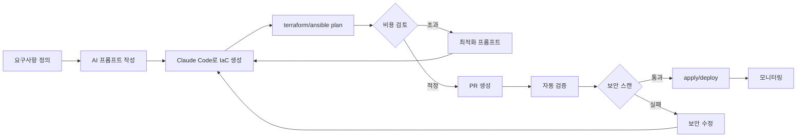

# ORE Infrastructure AI-Native Development Guide

_Terraform/Docker/K8s/Ansible 인프라를 AI로 구축하는 실전 가이드_

## Overview

- **목적**: Claude Code와 AI 도구를 활용한 하이브리드 인프라 코드 생성 및 관리
- **독자**: DevOps 엔지니어, SRE, AI 에이전트
- **관련 문서**: ore-infrastructure-spec.md, ore-mvp-roadmap.md, ai-native-team-strategy.md
- **주요 기술**: Terraform (AWS), Ansible (온프레미스), Docker, GitHub Actions, K8s (ECS → EKS), K3s
- **주요 AI 도구**: Claude Code (IaC 생성), Cursor (빠른 수정), Copilot (자동완성)
- **최종 수정**: 2024-12-20
- **버전**: 1.1

---

## 1. AI-Native 인프라 개발 철학

### 1.1 핵심 원칙

```yaml
Infrastructure as Code, Everything:
  - 수동 설정 제로
  - Git이 단일 진실의 소스
  - 변경사항은 모두 PR
  - 롤백 가능한 모든 것

Hybrid Cloud Native:
  - AWS 퍼블릭 클라우드 (85%)
  - 온프레미스 서버 (15%)
  - WireGuard VPN 연결
  - 통합 모니터링

Progressive Complexity:
  - MVP: 단순하게 시작 (ECS Fargate + K3s)
  - Growth: 필요시 복잡도 추가 (EKS)
  - Scale: 멀티 리전, 멀티 클라우드
  - 재설계 없는 진화

Cost-First Design:
  - 모든 리소스에 비용 태그
  - Spot 인스턴스 우선
  - Serverless 적극 활용
  - 자동 비용 최적화

Security by Default:
  - 최소 권한 원칙
  - 암호화 기본값
  - 네트워크 격리
  - 감사 로깅 필수
```

### 1.2 인프라 AI 워크플로우



---

## 2. Terraform 모듈 생성 프롬프트

### 2.1 VPC 및 네트워킹 설정

````markdown
Create a production-ready AWS VPC module with Terraform:

## Requirements:

- 3 availability zones for HA
- Public, private, and database subnets
- NAT Gateway for outbound traffic
- VPC Flow Logs for security
- Cost optimization with single NAT for dev
- WireGuard VPN endpoint for on-premise connection

## Implementation:

```hcl
# modules/networking/main.tf
variable "environment" {
  description = "Environment name"
  type        = string
}

variable "cidr_block" {
  description = "CIDR block for VPC"
  type        = string
  default     = "10.0.0.0/16"
}

variable "on_premise_cidr" {
  description = "On-premise network CIDR for VPN"
  type        = string
  default     = "192.168.0.0/16"
}

locals {
  azs = data.aws_availability_zones.available.names

  # Cost optimization: single NAT for dev
  nat_gateway_count = var.environment == "prod" ? 3 : 1

  # Subnet calculation
  public_subnets   = [for i in range(3) : cidrsubnet(var.cidr_block, 8, i)]
  private_subnets  = [for i in range(3) : cidrsubnet(var.cidr_block, 8, i + 10)]
  database_subnets = [for i in range(3) : cidrsubnet(var.cidr_block, 8, i + 20)]
  vpn_subnet       = cidrsubnet(var.cidr_block, 8, 30)  # For WireGuard
}

# VPC
resource "aws_vpc" "main" {
  cidr_block           = var.cidr_block
  enable_dns_hostnames = true
  enable_dns_support   = true

  tags = {
    Name        = "${var.environment}-vpc"
    Environment = var.environment
    ManagedBy   = "Terraform"
    CostCenter  = "Infrastructure"
  }
}

# WireGuard VPN Instance for on-premise connection
resource "aws_instance" "wireguard" {
  ami           = data.aws_ami.ubuntu.id
  instance_type = "t3.micro"
  subnet_id     = aws_subnet.public[0].id

  vpc_security_group_ids = [aws_security_group.wireguard.id]

  user_data = base64encode(templatefile("${path.module}/wireguard-init.sh", {
    on_premise_cidr = var.on_premise_cidr
    vpc_cidr        = var.cidr_block
  }))

  tags = {
    Name = "${var.environment}-wireguard-vpn"
    Type = "VPN"
  }
}

# Security Group for WireGuard
resource "aws_security_group" "wireguard" {
  name_prefix = "${var.environment}-wireguard-"
  vpc_id      = aws_vpc.main.id

  ingress {
    from_port   = 51820
    to_port     = 51820
    protocol    = "udp"
    cidr_blocks = ["0.0.0.0/0"]
    description = "WireGuard VPN"
  }

  egress {
    from_port   = 0
    to_port     = 0
    protocol    = "-1"
    cidr_blocks = ["0.0.0.0/0"]
  }

  tags = {
    Name = "${var.environment}-wireguard-sg"
  }
}

# Route for on-premise network
resource "aws_route" "on_premise" {
  count                  = length(local.private_subnets)
  route_table_id         = aws_route_table.private[count.index % local.nat_gateway_count].id
  destination_cidr_block = var.on_premise_cidr
  instance_id            = aws_instance.wireguard.id
}

# Internet Gateway
resource "aws_internet_gateway" "main" {
  vpc_id = aws_vpc.main.id

  tags = {
    Name = "${var.environment}-igw"
  }
}

# Public Subnets
resource "aws_subnet" "public" {
  count                   = 3
  vpc_id                  = aws_vpc.main.id
  cidr_block              = local.public_subnets[count.index]
  availability_zone       = local.azs[count.index]
  map_public_ip_on_launch = true

  tags = {
    Name                                           = "${var.environment}-public-${local.azs[count.index]}"
    Type                                           = "Public"
    "kubernetes.io/cluster/${var.environment}"    = "shared"
    "kubernetes.io/role/elb"                      = "1"
  }
}

# ... (rest of VPC configuration remains the same)

# Outputs
output "vpc_id" {
  value = aws_vpc.main.id
}

output "wireguard_public_ip" {
  value = aws_instance.wireguard.public_ip
  description = "WireGuard VPN public IP for on-premise configuration"
}
```
````

## Cost Optimization Features:

1. Single NAT Gateway for dev
2. Spot instances support via tags
3. VPC endpoints for AWS services (S3, ECR)
4. Flow logs to CloudWatch (cheaper than S3)
5. t3.micro for WireGuard VPN (low traffic)

````

### 2.2 ECS Fargate 클러스터 설정
```markdown
Create ECS Fargate cluster with auto-scaling and Spot support:

## Requirements:
- Fargate Spot for 70% cost reduction
- Auto-scaling based on CPU/Memory
- Service discovery
- Blue-green deployment

## Implementation:
```hcl
# modules/ecs/main.tf
resource "aws_ecs_cluster" "main" {
  name = "${var.environment}-cluster"

  setting {
    name  = "containerInsights"
    value = "enabled"
  }

  configuration {
    execute_command_configuration {
      logging = "OVERRIDE"

      log_configuration {
        cloud_watch_encryption_enabled = true
        cloud_watch_log_group_name     = aws_cloudwatch_log_group.ecs_exec.name
      }
    }
  }

  tags = {
    Name        = "${var.environment}-ecs-cluster"
    Environment = var.environment
  }
}

# Fargate Capacity Providers (with Spot)
resource "aws_ecs_cluster_capacity_providers" "main" {
  cluster_name = aws_ecs_cluster.main.name

  capacity_providers = [
    "FARGATE",
    "FARGATE_SPOT"
  ]

  default_capacity_provider_strategy {
    base              = 1
    weight            = 1
    capacity_provider = "FARGATE"
  }

  default_capacity_provider_strategy {
    base              = 0
    weight            = 3  # 75% Spot
    capacity_provider = "FARGATE_SPOT"
  }
}

# Task Definition for Microservice
resource "aws_ecs_task_definition" "service" {
  for_each = var.services

  family                   = "${var.environment}-${each.key}"
  network_mode             = "awsvpc"
  requires_compatibilities = ["FARGATE"]
  cpu                      = each.value.cpu
  memory                   = each.value.memory
  execution_role_arn       = aws_iam_role.ecs_execution.arn
  task_role_arn            = aws_iam_role.ecs_task[each.key].arn

  container_definitions = jsonencode([
    {
      name  = each.key
      image = "${var.ecr_repository_url}/${each.key}:${each.value.version}"

      portMappings = [
        {
          containerPort = each.value.port
          protocol      = "tcp"
        }
      ]

      environment = [
        for k, v in each.value.environment : {
          name  = k
          value = v
        }
      ]

      secrets = [
        for k, v in each.value.secrets : {
          name      = k
          valueFrom = v
        }
      ]

      logConfiguration = {
        logDriver = "awslogs"
        options = {
          "awslogs-group"         = "/ecs/${var.environment}/${each.key}"
          "awslogs-region"        = data.aws_region.current.name
          "awslogs-stream-prefix" = "ecs"
        }
      }

      healthCheck = {
        command     = ["CMD-SHELL", "curl -f http://localhost:${each.value.port}/health || exit 1"]
        interval    = 30
        timeout     = 5
        retries     = 3
        startPeriod = 60
      }
    }
  ])
}

# ... (rest remains the same)
````

````

### 2.3 Aurora Serverless v2 설정
```markdown
Create Aurora Serverless v2 cluster for cost-effective scaling:

## Requirements:
- Auto-pause for dev environment
- Read replicas for production
- Automatic backups
- Performance Insights

## Implementation:
```hcl
# modules/database/aurora.tf
resource "aws_rds_cluster" "main" {
  cluster_identifier      = "${var.environment}-aurora-cluster"
  engine                  = "aurora-postgresql"
  engine_mode             = "provisioned"  # For v2
  engine_version          = "15.4"
  database_name           = var.database_name
  master_username         = "postgres"
  master_password         = random_password.master.result

  # Serverless v2 scaling
  serverlessv2_scaling_configuration {
    max_capacity = var.environment == "prod" ? 16 : 2
    min_capacity = var.environment == "prod" ? 0.5 : 0.5
  }

  # Backup
  backup_retention_period      = var.environment == "prod" ? 30 : 7
  preferred_backup_window      = "03:00-04:00"
  preferred_maintenance_window = "sun:04:00-sun:05:00"

  # Security
  storage_encrypted               = true
  kms_key_id                      = aws_kms_key.rds.arn
  enabled_cloudwatch_logs_exports = ["postgresql"]

  # Network
  db_subnet_group_name   = aws_db_subnet_group.main.name
  vpc_security_group_ids = [aws_security_group.rds.id]

  # Skip final snapshot for dev
  skip_final_snapshot       = var.environment != "prod"
  final_snapshot_identifier = var.environment == "prod" ? "${var.environment}-aurora-final-snapshot-${formatdate("YYYY-MM-DD-hhmm", timestamp())}" : null

  tags = {
    Name        = "${var.environment}-aurora-cluster"
    Environment = var.environment
    CostCenter  = "Database"
  }
}
````

## Cost Optimization:

1. Serverless v2 scales to zero
2. Auto-pause for dev environment
3. Single instance for dev
4. Shorter backup retention for non-prod

````

---

## 3. Ansible 온프레미스 자동화 프롬프트

### 3.1 K3s 클러스터 설정
```markdown
Create an Ansible playbook for on-premise K3s cluster setup with Polygon node:

## Requirements:
- K3s lightweight Kubernetes
- WireGuard VPN to AWS VPC
- Polygon full node deployment
- Prometheus monitoring
- Automated backup

## Implementation:
```yaml
# playbooks/on-premise-setup.yml
---
- name: Configure On-Premise Infrastructure
  hosts: on_premise_servers
  become: yes
  vars:
    k3s_version: "v1.28.4+k3s1"
    wireguard_interface: wg0
    aws_vpc_cidr: "10.0.0.0/16"
    polygon_data_dir: "/data/polygon"
    backup_s3_bucket: "ore-blockchain-backups"

  tasks:
    # System preparation
    - name: Update system packages
      apt:
        update_cache: yes
        upgrade: dist
      when: ansible_os_family == "Debian"

    - name: Install required packages
      apt:
        name:
          - curl
          - wget
          - gnupg
          - lsb-release
          - software-properties-common
          - wireguard
          - nfs-common
        state: present

    # WireGuard VPN Setup
    - name: Generate WireGuard keys
      shell: |
        wg genkey | tee /etc/wireguard/privatekey | wg pubkey > /etc/wireguard/publickey
      args:
        creates: /etc/wireguard/privatekey

    - name: Configure WireGuard
      template:
        src: wireguard.conf.j2
        dest: /etc/wireguard/{{ wireguard_interface }}.conf
        mode: '0600'
      notify: restart wireguard

    - name: Enable and start WireGuard
      systemd:
        name: wg-quick@{{ wireguard_interface }}
        enabled: yes
        state: started

    # K3s Installation
    - name: Download K3s installer
      get_url:
        url: https://get.k3s.io
        dest: /tmp/install-k3s.sh
        mode: '0755'

    - name: Install K3s server
      shell: |
        INSTALL_K3S_VERSION="{{ k3s_version }}" \
        INSTALL_K3S_EXEC="server \
          --disable traefik \
          --disable servicelb \
          --write-kubeconfig-mode 644 \
          --node-label node-type=blockchain \
          --data-dir /var/lib/rancher/k3s" \
        /tmp/install-k3s.sh
      args:
        creates: /usr/local/bin/k3s
      when: inventory_hostname in groups['k3s_masters']

    - name: Install K3s agent
      shell: |
        INSTALL_K3S_VERSION="{{ k3s_version }}" \
        K3S_URL="https://{{ hostvars[groups['k3s_masters'][0]]['ansible_default_ipv4']['address'] }}:6443" \
        K3S_TOKEN="{{ k3s_token }}" \
        INSTALL_K3S_EXEC="agent \
          --node-label node-type=blockchain" \
        /tmp/install-k3s.sh
      args:
        creates: /usr/local/bin/k3s
      when: inventory_hostname not in groups['k3s_masters']

    # Helm installation
    - name: Install Helm
      shell: |
        curl https://raw.githubusercontent.com/helm/helm/main/scripts/get-helm-3 | bash
      args:
        creates: /usr/local/bin/helm

    # Storage setup for Polygon
    - name: Create Polygon data directory
      file:
        path: "{{ polygon_data_dir }}"
        state: directory
        mode: '0755'

    - name: Create storage class for Polygon
      k8s:
        state: present
        definition:
          apiVersion: storage.k8s.io/v1
          kind: StorageClass
          metadata:
            name: polygon-storage
          provisioner: rancher.io/local-path
          reclaimPolicy: Retain
          volumeBindingMode: WaitForFirstConsumer

    # Deploy Polygon node
    - name: Add Polygon Helm repository
      kubernetes.core.helm_repository:
        name: polygon
        repo_url: https://polygon-technology.github.io/helm-charts

    - name: Deploy Polygon full node
      kubernetes.core.helm:
        name: polygon-node
        chart_ref: polygon/polygon-node
        release_namespace: blockchain
        create_namespace: true
        values:
          replicaCount: 1
          image:
            repository: 0xpolygon/bor
            tag: v1.1.0
          persistence:
            enabled: true
            storageClass: polygon-storage
            size: 2Ti
          resources:
            requests:
              memory: "16Gi"
              cpu: "4"
            limits:
              memory: "32Gi"
              cpu: "8"
          config:
            network: mainnet
            syncMode: full
            maxPeers: 50
            cache: 4096
          monitoring:
            enabled: true
            serviceMonitor:
              enabled: true

    # Monitoring setup
    - name: Deploy Prometheus stack
      kubernetes.core.helm:
        name: kube-prometheus-stack
        chart_ref: prometheus-community/kube-prometheus-stack
        release_namespace: monitoring
        create_namespace: true
        values:
          prometheus:
            prometheusSpec:
              retention: 30d
              storageSpec:
                volumeClaimTemplate:
                  spec:
                    storageClassName: polygon-storage
                    resources:
                      requests:
                        storage: 100Gi
          grafana:
            adminPassword: "{{ grafana_admin_password }}"
            ingress:
              enabled: true
              hosts:
                - grafana.internal.ore.game

    # Backup configuration
    - name: Install AWS CLI for backups
      pip:
        name: awscli
        state: present

    - name: Create backup script
      template:
        src: backup-polygon.sh.j2
        dest: /usr/local/bin/backup-polygon
        mode: '0755'

    - name: Setup backup cron job
      cron:
        name: "Backup Polygon data"
        minute: "0"
        hour: "3"
        job: "/usr/local/bin/backup-polygon"
        user: root

  handlers:
    - name: restart wireguard
      systemd:
        name: wg-quick@{{ wireguard_interface }}
        state: restarted
````

## Templates:

```jinja2
# templates/wireguard.conf.j2
[Interface]
Address = {{ wireguard_ip }}/24
PrivateKey = {{ wireguard_private_key }}
ListenPort = 51820

# AWS VPC Peer
[Peer]
PublicKey = {{ aws_wireguard_public_key }}
Endpoint = {{ aws_wireguard_endpoint }}:51820
AllowedIPs = {{ aws_vpc_cidr }}
PersistentKeepalive = 25

# templates/backup-polygon.sh.j2
#!/bin/bash
DATE=$(date +%Y%m%d-%H%M%S)
BACKUP_FILE="/tmp/polygon-backup-${DATE}.tar.gz"

# Stop Polygon node for consistent backup
kubectl -n blockchain scale deployment polygon-node --replicas=0

# Create backup
tar -czf ${BACKUP_FILE} {{ polygon_data_dir }}

# Restart Polygon node
kubectl -n blockchain scale deployment polygon-node --replicas=1

# Upload to S3
aws s3 cp ${BACKUP_FILE} s3://{{ backup_s3_bucket }}/polygon/${DATE}/

# Cleanup
rm ${BACKUP_FILE}

# Keep only last 7 days of backups
aws s3 ls s3://{{ backup_s3_bucket }}/polygon/ | \
  awk '{print $2}' | \
  sort -r | \
  tail -n +8 | \
  xargs -I {} aws s3 rm -r s3://{{ backup_s3_bucket }}/polygon/{}
```

````

### 3.2 고가용성 구성
```markdown
Create Ansible playbook for HA on-premise setup:

## Requirements:
- 3-node K3s cluster
- Keepalived for VIP
- HAProxy load balancing
- Distributed storage with Longhorn

## Implementation:
```yaml
# playbooks/ha-setup.yml
---
- name: Configure High Availability On-Premise Cluster
  hosts: on_premise_servers
  become: yes
  vars:
    virtual_ip: "192.168.1.100"
    cluster_domain: "k3s.internal.ore.game"

  tasks:
    # Keepalived for HA
    - name: Install keepalived
      apt:
        name: keepalived
        state: present

    - name: Configure keepalived for master
      template:
        src: keepalived-master.conf.j2
        dest: /etc/keepalived/keepalived.conf
      when: inventory_hostname == groups['k3s_masters'][0]
      notify: restart keepalived

    - name: Configure keepalived for backup
      template:
        src: keepalived-backup.conf.j2
        dest: /etc/keepalived/keepalived.conf
      when: inventory_hostname in groups['k3s_masters'][1:]
      notify: restart keepalived

    # HAProxy for load balancing
    - name: Install HAProxy
      apt:
        name: haproxy
        state: present

    - name: Configure HAProxy
      template:
        src: haproxy.cfg.j2
        dest: /etc/haproxy/haproxy.cfg
      notify: restart haproxy

    # Longhorn distributed storage
    - name: Install Longhorn prerequisites
      apt:
        name:
          - open-iscsi
          - nfs-common
        state: present

    - name: Deploy Longhorn
      kubernetes.core.helm:
        name: longhorn
        chart_ref: longhorn/longhorn
        release_namespace: longhorn-system
        create_namespace: true
        values:
          defaultSettings:
            defaultDataPath: "/var/lib/longhorn"
            replicaCount: 2
            backupTarget: "s3://{{ backup_s3_bucket }}/longhorn"
          persistence:
            defaultClass: true
            defaultClassReplicaCount: 2

    # Network policies for security
    - name: Apply network policies
      k8s:
        state: present
        definition:
          apiVersion: networking.k8s.io/v1
          kind: NetworkPolicy
          metadata:
            name: polygon-network-policy
            namespace: blockchain
          spec:
            podSelector:
              matchLabels:
                app: polygon-node
            policyTypes:
              - Ingress
              - Egress
            ingress:
              - from:
                - podSelector:
                    matchLabels:
                      app: prometheus
                ports:
                  - protocol: TCP
                    port: 8545
            egress:
              - to:
                - podSelector: {}
              - to:
                - namespaceSelector: {}
                ports:
                  - protocol: TCP
                    port: 30303  # P2P
              - to:
                - podSelector: {}
                ports:
                  - protocol: TCP
                    port: 53  # DNS
                  - protocol: UDP
                    port: 53

  handlers:
    - name: restart keepalived
      systemd:
        name: keepalived
        state: restarted

    - name: restart haproxy
      systemd:
        name: haproxy
        state: restarted
````

## Templates:

```jinja2
# templates/keepalived-master.conf.j2
global_defs {
    router_id K3S_MASTER
}

vrrp_instance VI_1 {
    state MASTER
    interface {{ ansible_default_ipv4.interface }}
    virtual_router_id 51
    priority 100
    advert_int 1
    authentication {
        auth_type PASS
        auth_pass {{ keepalived_password }}
    }
    virtual_ipaddress {
        {{ virtual_ip }}
    }
}

# templates/haproxy.cfg.j2
global
    log 127.0.0.1:514 local0
    chroot /var/lib/haproxy
    stats socket /run/haproxy/admin.sock mode 660 level admin
    stats timeout 30s
    user haproxy
    group haproxy
    daemon

defaults
    log     global
    mode    tcp
    option  tcplog
    option  dontlognull
    timeout connect 5000
    timeout client  50000
    timeout server  50000

frontend k3s_frontend
    bind *:6443
    default_backend k3s_backend

backend k3s_backend
    balance roundrobin
    
    server {{ hostvars[host]['ansible_hostname'] }} {{ hostvars[host]['ansible_default_ipv4']['address'] }}:6443 check
    

listen stats
    bind *:8080
    stats enable
    stats uri /stats
    stats refresh 30s
```

````

### 3.3 보안 강화
```markdown
Create Ansible playbook for security hardening:

## Requirements:
- OS hardening (CIS benchmark)
- Firewall configuration
- SSL/TLS certificates
- Audit logging

## Implementation:
```yaml
# playbooks/security-hardening.yml
---
- name: Security Hardening for On-Premise Servers
  hosts: on_premise_servers
  become: yes
  vars:
    allowed_ssh_users: ["admin", "ansible"]
    fail2ban_maxretry: 3

  tasks:
    # OS Hardening
    - name: Disable root SSH login
      lineinfile:
        path: /etc/ssh/sshd_config
        regexp: '^PermitRootLogin'
        line: 'PermitRootLogin no'
      notify: restart sshd

    - name: Configure SSH key-only authentication
      lineinfile:
        path: /etc/ssh/sshd_config
        regexp: '^PasswordAuthentication'
        line: 'PasswordAuthentication no'
      notify: restart sshd

    - name: Set kernel parameters for security
      sysctl:
        name: "{{ item.name }}"
        value: "{{ item.value }}"
        state: present
        reload: yes
      loop:
        - { name: 'net.ipv4.tcp_syncookies', value: 1 }
        - { name: 'net.ipv4.ip_forward', value: 0 }
        - { name: 'net.ipv4.conf.all.send_redirects', value: 0 }
        - { name: 'net.ipv4.conf.default.accept_source_route', value: 0 }
        - { name: 'net.ipv4.conf.all.accept_redirects', value: 0 }
        - { name: 'net.ipv4.icmp_echo_ignore_broadcasts', value: 1 }
        - { name: 'net.ipv4.icmp_ignore_bogus_error_responses', value: 1 }
        - { name: 'net.ipv4.conf.all.log_martians', value: 1 }

    # Firewall configuration
    - name: Install UFW
      apt:
        name: ufw
        state: present

    - name: Configure UFW defaults
      ufw:
        direction: "{{ item.direction }}"
        policy: "{{ item.policy }}"
      loop:
        - { direction: 'incoming', policy: 'deny' }
        - { direction: 'outgoing', policy: 'allow' }

    - name: Allow specific ports
      ufw:
        rule: allow
        port: "{{ item.port }}"
        proto: "{{ item.proto }}"
        comment: "{{ item.comment }}"
      loop:
        - { port: 22, proto: tcp, comment: "SSH" }
        - { port: 6443, proto: tcp, comment: "K3s API" }
        - { port: 51820, proto: udp, comment: "WireGuard" }
        - { port: 30303, proto: tcp, comment: "Polygon P2P" }
        - { port: 8545, proto: tcp, comment: "Polygon RPC" }

    - name: Enable UFW
      ufw:
        state: enabled

    # Fail2ban installation
    - name: Install fail2ban
      apt:
        name: fail2ban
        state: present

    - name: Configure fail2ban for SSH
      template:
        src: jail.local.j2
        dest: /etc/fail2ban/jail.local
      notify: restart fail2ban

    # Audit logging with auditd
    - name: Install auditd
      apt:
        name: auditd
        state: present

    - name: Configure audit rules
      template:
        src: audit.rules.j2
        dest: /etc/audit/rules.d/audit.rules
      notify: restart auditd

    # SSL/TLS certificates with Let's Encrypt
    - name: Install certbot
      apt:
        name: certbot
        state: present

    - name: Generate SSL certificates
      command: |
        certbot certonly --standalone \
          -d {{ item }} \
          --non-interactive \
          --agree-tos \
          --email admin@ore.game
      args:
        creates: /etc/letsencrypt/live/{{ item }}/fullchain.pem
      loop:
        - polygon.internal.ore.game
        - grafana.internal.ore.game
        - k3s.internal.ore.game

    # Log shipping to AWS CloudWatch
    - name: Install CloudWatch agent
      shell: |
        wget https://s3.amazonaws.com/amazoncloudwatch-agent/ubuntu/amd64/latest/amazon-cloudwatch-agent.deb
        dpkg -i amazon-cloudwatch-agent.deb
      args:
        creates: /opt/aws/amazon-cloudwatch-agent/bin/amazon-cloudwatch-agent

    - name: Configure CloudWatch agent
      template:
        src: cloudwatch-config.json.j2
        dest: /opt/aws/amazon-cloudwatch-agent/etc/amazon-cloudwatch-agent.json
      notify: restart cloudwatch-agent

  handlers:
    - name: restart sshd
      systemd:
        name: sshd
        state: restarted

    - name: restart fail2ban
      systemd:
        name: fail2ban
        state: restarted

    - name: restart auditd
      systemd:
        name: auditd
        state: restarted

    - name: restart cloudwatch-agent
      systemd:
        name: amazon-cloudwatch-agent
        state: restarted
````

````

---

## 4. CI/CD Pipeline 생성 프롬프트

### 4.1 GitHub Actions 워크플로우
```markdown
Create comprehensive GitHub Actions workflow for infrastructure deployment:

## Requirements:
- Multi-environment support
- Terraform plan on PR
- Cost estimation
- Security scanning
- Automatic rollback

## Implementation:
```yaml
# .github/workflows/infrastructure.yml
name: Infrastructure Deployment

on:
  push:
    branches:
      - main
      - develop
    paths:
      - 'infrastructure/**'
      - '.github/workflows/infrastructure.yml'
  pull_request:
    paths:
      - 'infrastructure/**'

env:
  TERRAFORM_VERSION: '1.6.0'
  ANSIBLE_VERSION: '2.15.0'
  AWS_REGION: 'us-west-1'

jobs:
  # Determine environment from branch
  setup:
    runs-on: ubuntu-latest
    outputs:
      environment: ${{ steps.env.outputs.environment }}
    steps:
      - name: Determine environment
        id: env
        run: |
          if [[ "${{ github.ref }}" == "refs/heads/main" ]]; then
            echo "environment=prod" >> $GITHUB_OUTPUT
          else
            echo "environment=dev" >> $GITHUB_OUTPUT
          fi

  # Terraform validation and security scan
  validate-terraform:
    runs-on: ubuntu-latest
    needs: setup
    steps:
      - name: Checkout code
        uses: actions/checkout@v4

      - name: Setup Terraform
        uses: hashicorp/setup-terraform@v3
        with:
          terraform_version: ${{ env.TERRAFORM_VERSION }}

      - name: Terraform Format Check
        run: terraform fmt -check -recursive
        working-directory: ./infrastructure/terraform

      - name: Terraform Init
        run: |
          terraform init \
            -backend-config="bucket=ore-terraform-state-${{ secrets.AWS_ACCOUNT_ID }}" \
            -backend-config="key=${{ needs.setup.outputs.environment }}/terraform.tfstate" \
            -backend-config="region=${{ env.AWS_REGION }}"
        working-directory: ./infrastructure/terraform/environments/${{ needs.setup.outputs.environment }}
        env:
          AWS_ACCESS_KEY_ID: ${{ secrets.AWS_ACCESS_KEY_ID }}
          AWS_SECRET_ACCESS_KEY: ${{ secrets.AWS_SECRET_ACCESS_KEY }}

      - name: Terraform Validate
        run: terraform validate
        working-directory: ./infrastructure/terraform/environments/${{ needs.setup.outputs.environment }}

      - name: Checkov Security Scan
        uses: bridgecrewio/checkov-action@master
        with:
          directory: infrastructure/terraform
          framework: terraform
          output_format: sarif
          output_file_path: checkov.sarif

  # Ansible validation
  validate-ansible:
    runs-on: ubuntu-latest
    needs: setup
    steps:
      - name: Checkout code
        uses: actions/checkout@v4

      - name: Setup Python
        uses: actions/setup-python@v4
        with:
          python-version: '3.11'

      - name: Install Ansible
        run: |
          pip install ansible==${{ env.ANSIBLE_VERSION }}
          pip install ansible-lint

      - name: Ansible Lint
        run: ansible-lint playbooks/

      - name: Ansible Syntax Check
        run: |
          ansible-playbook playbooks/on-premise-setup.yml --syntax-check
          ansible-playbook playbooks/ha-setup.yml --syntax-check
          ansible-playbook playbooks/security-hardening.yml --syntax-check

  # ... (rest of CI/CD remains similar)
````

````

### 4.2 Service Deployment Pipeline
```markdown
Create service deployment pipeline with blue-green strategy:

```yaml
# .github/workflows/service-deploy.yml
name: Service Deployment

on:
  push:
    branches: [main, develop]
    paths:
      - 'services/**'
      - '.github/workflows/service-deploy.yml'

jobs:
  detect-changes:
    runs-on: ubuntu-latest
    outputs:
      services: ${{ steps.changes.outputs.services }}
    steps:
      - uses: actions/checkout@v4
      - uses: dorny/paths-filter@v2
        id: changes
        with:
          filters: |
            location-service:
              - 'services/location-service/**'
            game-service:
              - 'services/game-service/**'
            auth-service:
              - 'services/auth-service/**'
            ad-service:
              - 'services/ad-service/**'

  build-and-push:
    needs: detect-changes
    if: needs.detect-changes.outputs.services != '[]'
    strategy:
      matrix:
        service: ${{ fromJson(needs.detect-changes.outputs.services) }}
    runs-on: ubuntu-latest
    steps:
      - uses: actions/checkout@v4

      - name: Set up Docker Buildx
        uses: docker/setup-buildx-action@v3

      - name: Configure AWS credentials
        uses: aws-actions/configure-aws-credentials@v4
        with:
          aws-access-key-id: ${{ secrets.AWS_ACCESS_KEY_ID }}
          aws-secret-access-key: ${{ secrets.AWS_SECRET_ACCESS_KEY }}
          aws-region: us-west-1

      - name: Login to ECR
        uses: aws-actions/amazon-ecr-login@v2

      - name: Build and push Docker image
        uses: docker/build-push-action@v5
        with:
          context: ./services/${{ matrix.service }}
          push: true
          tags: |
            ${{ secrets.ECR_REGISTRY }}/${{ matrix.service }}:${{ github.sha }}
            ${{ secrets.ECR_REGISTRY }}/${{ matrix.service }}:latest
          cache-from: type=gha
          cache-to: type=gha,mode=max
          platforms: linux/amd64,linux/arm64
````

````

---

## 5. Docker 최적화 프롬프트

### 5.1 Multi-stage Rust Service Dockerfile
```markdown
Create optimized multi-stage Dockerfile for Rust service:

## Requirements:
- Minimal final image size
- Cache dependencies
- Security best practices
- Health check included

## Implementation:
```dockerfile
# Build stage
FROM rust:1.75-alpine AS builder

# Install build dependencies
RUN apk add --no-cache \
    musl-dev \
    openssl-dev \
    pkgconfig

# Create app user
RUN adduser \
    --disabled-password \
    --gecos "" \
    --home "/nonexistent" \
    --shell "/sbin/nologin" \
    --no-create-home \
    --uid 10001 \
    appuser

WORKDIR /build

# Copy manifests
COPY Cargo.toml Cargo.lock ./

# Cache dependencies
RUN mkdir src && \
    echo "fn main() {}" > src/main.rs && \
    cargo build --release && \
    rm -rf src

# Copy source code
COPY src ./src
COPY migrations ./migrations

# Build for release
RUN rm ./target/release/deps/location_service* && \
    cargo build --release

# Runtime stage
FROM alpine:3.19 AS runtime

# Install runtime dependencies
RUN apk add --no-cache \
    ca-certificates \
    openssl \
    && update-ca-certificates

# Import user from builder
COPY --from=builder /etc/passwd /etc/passwd
COPY --from=builder /etc/group /etc/group

# Copy binary from builder
COPY --from=builder /build/target/release/location-service /usr/local/bin/

# Set up working directory
WORKDIR /app

# Copy migrations
COPY --from=builder /build/migrations ./migrations

# Use non-root user
USER appuser:appuser

# Health check
HEALTHCHECK --interval=30s --timeout=3s --start-period=5s --retries=3 \
    CMD ["/usr/local/bin/location-service", "health"]

# Expose port
EXPOSE 8080

# Run binary
ENTRYPOINT ["/usr/local/bin/location-service"]
````

## Optimizations:

1. Alpine Linux for minimal size (~15MB final)
2. Multi-stage build
3. Dependency caching
4. Non-root user
5. Health check included

````

### 5.2 Go Service Dockerfile with Distroless
```markdown
Create optimized Dockerfile for Go service using distroless:

```dockerfile
# Build stage
FROM golang:1.21-alpine AS builder

# Install certificates
RUN apk add --no-cache ca-certificates git

# Set working directory
WORKDIR /build

# Copy go mod files
COPY go.mod go.sum ./

# Download dependencies
RUN go mod download

# Copy source code
COPY . .

# Build binary
RUN CGO_ENABLED=0 GOOS=linux GOARCH=amd64 go build \
    -ldflags="-w -s -X main.Version=${VERSION} -X main.BuildTime=${BUILD_TIME}" \
    -a -installsuffix cgo \
    -o app ./cmd/server

# Final stage - distroless
FROM gcr.io/distroless/static:nonroot

# Copy binary
COPY --from=builder /build/app /app

# Copy config files
COPY --from=builder /build/config /config

# Use non-root user
USER nonroot:nonroot

# Health check using built-in endpoint
HEALTHCHECK --interval=30s --timeout=3s --start-period=5s --retries=3 \
    CMD ["/app", "health"]

# Expose port
EXPOSE 8080

# Run binary
ENTRYPOINT ["/app"]
````

## Benefits:

1. Distroless image (~10MB)
2. No shell, reduced attack surface
3. Non-root by default
4. Minimal CVEs

````

---

## 6. 모니터링 및 Observability 프롬프트

### 6.1 CloudWatch 대시보드 설정
```markdown
Create comprehensive CloudWatch dashboard with Terraform:

```hcl
# modules/monitoring/dashboard.tf
resource "aws_cloudwatch_dashboard" "main" {
  dashboard_name = "${var.environment}-overview"

  dashboard_body = jsonencode({
    widgets = [
      # Service Health Overview
      {
        type = "metric"
        properties = {
          metrics = [
            for service in var.services : [
              "AWS/ECS", "CPUUtilization",
              { stat = "Average", label = service }
            ]
          ]
          period = 300
          stat   = "Average"
          region = var.region
          title  = "Service CPU Utilization"
        }
      },

      # On-Premise Polygon Node Metrics
      {
        type = "metric"
        properties = {
          metrics = [
            ["CWAgent", "polygon_sync_percentage", { stat = "Average" }],
            [".", "polygon_peer_count", { stat = "Average" }],
            [".", "polygon_block_height", { stat = "Maximum" }]
          ]
          period = 300
          region = var.region
          title  = "Polygon Node Status"
        }
      },

      # Hybrid Infrastructure Overview
      {
        type = "metric"
        properties = {
          metrics = [
            ["AWS/EC2", "NetworkIn", { stat = "Sum", label = "AWS Inbound" }],
            ["CWAgent", "wireguard_bytes_received", { stat = "Sum", label = "VPN Inbound" }],
            ["CWAgent", "wireguard_bytes_sent", { stat = "Sum", label = "VPN Outbound" }]
          ]
          period = 300
          region = var.region
          title  = "Hybrid Network Traffic"
        }
      }
    ]
  })
}
````

````

### 6.2 Prometheus & Grafana 설정
```markdown
Deploy Prometheus and Grafana for hybrid monitoring:

```hcl
# modules/monitoring/prometheus.tf
resource "aws_ecs_task_definition" "prometheus" {
  family                   = "${var.environment}-prometheus"
  network_mode             = "awsvpc"
  requires_compatibilities = ["FARGATE"]
  cpu                      = "512"
  memory                   = "1024"

  container_definitions = jsonencode([
    {
      name  = "prometheus"
      image = "prom/prometheus:latest"

      portMappings = [
        {
          containerPort = 9090
          protocol      = "tcp"
        }
      ]

      mountPoints = [
        {
          sourceVolume  = "prometheus-config"
          containerPath = "/etc/prometheus"
        }
      ]

      environment = [
        {
          name  = "STORAGE_TSDB_RETENTION_TIME"
          value = "30d"
        }
      ]

      # Configuration for scraping on-premise targets
      command = [
        "--config.file=/etc/prometheus/prometheus.yml",
        "--storage.tsdb.path=/prometheus",
        "--web.console.libraries=/usr/share/prometheus/console_libraries",
        "--web.console.templates=/usr/share/prometheus/consoles",
        "--web.enable-lifecycle",
        "--storage.tsdb.retention.time=30d"
      ]
    }
  ])
}

# Prometheus configuration for hybrid monitoring
resource "aws_ssm_parameter" "prometheus_config" {
  name  = "/${var.environment}/prometheus/config"
  type  = "SecureString"
  value = yamlencode({
    global = {
      scrape_interval     = "15s"
      evaluation_interval = "15s"
    }

    scrape_configs = [
      {
        job_name = "aws-ecs-services"
        ec2_sd_configs = [{
          region = var.region
          port   = 9090
        }]
      },
      {
        job_name = "on-premise-k3s"
        static_configs = [{
          targets = var.on_premise_prometheus_targets
          labels = {
            environment = "on-premise"
            cluster     = "k3s"
          }
        }]
      },
      {
        job_name = "polygon-node"
        static_configs = [{
          targets = ["${var.on_premise_ip}:8545"]
          labels = {
            chain = "polygon"
            type  = "full-node"
          }
        }]
      }
    ]
  })
}
````

````

---

## 7. 비용 최적화 프롬프트

### 7.1 AWS Cost Optimization 설정
```markdown
Implement comprehensive cost optimization for hybrid infrastructure:

```hcl
# modules/cost-optimization/main.tf

# Savings Plans
resource "aws_ce_cost_allocation_tag" "main" {
  tag_key = "CostCenter"
  status  = "Active"
}

# Budget Alerts including on-premise costs
resource "aws_budgets_budget" "monthly" {
  name         = "${var.environment}-monthly-budget"
  budget_type  = "COST"
  limit_amount = var.monthly_budget_limit
  limit_unit   = "USD"
  time_unit    = "MONTHLY"

  cost_filter {
    name = "TagKeyValue"
    values = [
      "user:Environment$${var.environment}",
      "user:Type$aws",
      "user:Type$on-premise"
    ]
  }

  notification {
    comparison_operator        = "GREATER_THAN"
    threshold                  = 80
    threshold_type            = "PERCENTAGE"
    notification_type         = "ACTUAL"
    subscriber_email_addresses = var.budget_alert_emails
  }
}

# On-premise server power management
resource "aws_lambda_function" "on_premise_power_mgmt" {
  filename         = "on-premise-power.zip"
  function_name    = "${var.environment}-on-premise-power"
  role            = aws_iam_role.lambda.arn
  handler         = "index.handler"
  runtime         = "python3.11"
  timeout         = 60

  environment {
    variables = {
      ANSIBLE_INVENTORY = var.ansible_inventory_s3_path
      ENVIRONMENT       = var.environment
    }
  }

  # This Lambda runs Ansible playbooks to manage on-premise servers
  # during off-peak hours to save power costs
}

# Schedule for on-premise power management
resource "aws_cloudwatch_event_rule" "on_premise_schedule" {
  count               = var.environment != "prod" ? 1 : 0
  name                = "${var.environment}-on-premise-schedule"
  schedule_expression = "cron(0 19 ? * MON-FRI *)"  # Power down at 7 PM
}

resource "aws_cloudwatch_event_rule" "on_premise_startup" {
  count               = var.environment != "prod" ? 1 : 0
  name                = "${var.environment}-on-premise-startup"
  schedule_expression = "cron(0 7 ? * MON-FRI *)"   # Power up at 7 AM
}
````

## Cost Saving Features:

1. Fargate Spot (70% savings)
2. Auto-stop dev resources
3. On-premise power management
4. S3 lifecycle policies
5. Budget alerts for hybrid costs
6. Reserved instance recommendations

````

---

## 8. AI와의 대화 - 하이브리드 아키텍처 진화

### 8.1 온프레미스 통합 전략
```markdown
Human: "현재 AWS ECS Fargate로 대부분 서비스를 운영 중인데,
Polygon 노드를 위해 온프레미스 서버를 추가해야 해.
하이브리드 아키텍처로 어떻게 확장하면 좋을까?"

AI: "하이브리드 아키텍처 구축 전략을 제안합니다:

## 1. 네트워크 연결 전략
```hcl
# WireGuard VPN for secure connection
resource "aws_instance" "wireguard" {
  ami           = data.aws_ami.ubuntu.id
  instance_type = "t3.micro"  # Low cost for VPN

  user_data = templatefile("wireguard-setup.sh", {
    on_premise_network = "192.168.0.0/16"
    aws_vpc_cidr       = var.vpc_cidr
  })
}
````

## 2. 온프레미스 Ansible 자동화

```yaml
- name: Deploy Polygon node on-premise
  hosts: on_premise
  tasks:
    - name: Install K3s
      shell: curl -sfL https://get.k3s.io | sh -

    - name: Deploy Polygon with Helm
      kubernetes.core.helm:
        name: polygon
        values:
          persistence:
            size: 2Ti # Large storage for blockchain
          resources:
            limits:
              memory: 32Gi
              cpu: 8
```

## 3. 통합 모니터링

- CloudWatch Agent on on-premise servers
- Prometheus federation
- Unified Grafana dashboard

## 4. 비용 최적화

- On-premise for storage-intensive workloads
- AWS for elastic compute
- Power management automation

````

### 8.2 재해 복구(DR) 전략 구현
```markdown
Human: "하이브리드 환경에서 온프레미스 Polygon 노드가 다운되면
어떻게 복구해야 할까? RTO 1시간, RPO 15분을 목표로 한다."

AI: "하이브리드 DR 전략을 구현하겠습니다:

## 1. 온프레미스 백업 전략
```yaml
# Ansible playbook for automated backups
- name: Polygon node backup
  hosts: on_premise_masters
  tasks:
    - name: Create snapshot
      shell: |
        # Stop node briefly for consistent snapshot
        kubectl scale deployment polygon --replicas=0

        # Create LVM snapshot
        lvcreate -L10G -s -n polygon-snap /dev/vg0/polygon-data

        # Restart node
        kubectl scale deployment polygon --replicas=1

    - name: Upload to S3
      aws_s3:
        bucket: ore-dr-backups
        object: /polygon/{{ ansible_date_time.epoch }}.tar.gz
        src: /tmp/polygon-backup.tar.gz
        mode: put
````

## 2. AWS Failover 준비

```hcl
# Standby Polygon node on AWS (normally stopped)
resource "aws_instance" "polygon_standby" {
  ami           = data.aws_ami.ubuntu.id
  instance_type = "r5.2xlarge"  # High memory for blockchain

  # Normally stopped to save costs
  count = var.dr_mode ? 1 : 0

  user_data = templatefile("polygon-restore.sh", {
    backup_bucket = aws_s3_bucket.dr_backups.id
  })
}
```

## 3. Automated Failover

```python
# Lambda for failover orchestration
def failover_handler(event, context):
    # 1. Check on-premise health
    if not check_on_premise_health():
        # 2. Start AWS standby instance
        ec2.start_instances(InstanceIds=[STANDBY_INSTANCE_ID])

        # 3. Restore from latest backup
        restore_from_s3()

        # 4. Update DNS
        route53.change_resource_record_sets(
            HostedZoneId=ZONE_ID,
            ChangeBatch={
                'Changes': [{
                    'Action': 'UPSERT',
                    'ResourceRecordSet': {
                        'Name': 'polygon.ore.game',
                        'Type': 'A',
                        'TTL': 60,
                        'ResourceRecords': [{'Value': standby_ip}]
                    }
                }]
            }
        )

        # 5. Notify team
        sns.publish(TopicArn=ALERT_TOPIC, Message='Failover completed')
```

```

```

---

## 9. 트러블슈팅 가이드

### 9.1 하이브리드 인프라 문제

```yaml
문제: WireGuard VPN 연결 불안정
해결:
  1. MTU 크기 조정 (1420 권장)
  2. Keepalive 설정 (25초)
  3. 네트워크 경로 확인
  4. 방화벽 규칙 검증

문제: 온프레미스 K3s 클러스터 성능 저하
해결:
  1. etcd 압축 실행
  2. 로그 로테이션 설정
  3. 메모리/CPU 리소스 확인
  4. 네트워크 대역폭 모니터링

문제: Polygon 노드 동기화 지연
해결:
  1. Peer 연결 수 증가
  2. SSD IOPS 확인
  3. 스냅샷에서 재시작
  4. 네트워크 대역폭 증가

문제: 하이브리드 모니터링 데이터 누락
해결:
  1. CloudWatch Agent 상태 확인
  2. VPN 터널 상태 검증
  3. Prometheus 스크래핑 설정 확인
  4. 시간 동기화 확인 (NTP)
```

### 9.2 비용 관련 문제

```yaml
문제: 온프레미스 전력 비용 증가
해결:
  1. 자동 전원 관리 스케줄 구현
  2. 불필요한 서비스 식별 및 제거
  3. 리소스 사용률 최적화
  4. 더 효율적인 하드웨어로 교체

문제: AWS-온프레미스 간 데이터 전송 비용
해결:
  1. VPC Endpoint 활용
  2. 데이터 압축 적용
  3. 배치 전송으로 변경
  4. CDN 캐싱 강화
```

---

## 10. AI 도구별 활용 가이드

### 10.1 Claude Code 활용 전략

```yaml
최적 사용 케이스:
  복잡한 Terraform 모듈:
    - Multi-region 설정
    - EKS 클러스터 구성
    - Service Mesh 설정

  Ansible 플레이북:
    - K3s 클러스터 구축
    - Polygon 노드 배포
    - 보안 강화 설정

  하이브리드 통합:
    - VPN 설정
    - 통합 모니터링
    - DR 자동화

프롬프트 전략: 1. 명확한 요구사항 (RTO, RPO, 비용)
  2. 기존 인프라 컨텍스트 제공
  3. 보안 요구사항 명시
  4. 온프레미스 제약사항 포함
```

### 10.2 Cursor 활용

```yaml
최적 사용 케이스:
  빠른 수정:
    - Variable 추가/수정
    - Ansible 인벤토리 업데이트
    - Tag 업데이트

  리팩토링:
    - 모듈 분리
    - 반복 코드 제거
    - 네이밍 일관성

효율적 사용:
  - Terraform 플러그인 설치
  - Ansible 플러그인 설치
  - 자동 포맷팅 설정
  - Validation 자동 실행
```

---

## 부록 A: 하이브리드 인프라 체크리스트

### 프로덕션 준비 체크리스트

```yaml
네트워크: □ WireGuard VPN 구성 완료
  □ 방화벽 규칙 설정
  □ DNS 설정 완료
  □ 네트워크 세그멘테이션
  □ DDoS 방어 설정

온프레미스: □ K3s 클러스터 구축
  □ Polygon 노드 배포
  □ 모니터링 에이전트 설치
  □ 백업 자동화 구성
  □ 보안 강화 완료

AWS: □ VPC 피어링 설정
  □ ECS/EKS 클러스터 준비
  □ RDS/Aurora 구성
  □ S3 백업 버킷 생성
  □ CloudWatch 대시보드

통합: □ 통합 모니터링 구성
  □ 중앙 로깅 설정
  □ DR 계획 수립
  □ 비용 추적 설정
  □ 알림 채널 구성

보안: □ SSL/TLS 인증서
  □ IAM 역할 설정
  □ 시크릿 관리
  □ 감사 로깅
  □ 취약점 스캔
```

---

## 부록 B: 하이브리드 아키텍처 구조

### 권장 디렉토리 구조

```
infrastructure/
├── terraform/
│   ├── modules/
│   │   ├── networking/
│   │   ├── compute/
│   │   ├── database/
│   │   ├── hybrid-network/
│   │   └── monitoring/
│   ├── environments/
│   │   ├── dev/
│   │   └── prod/
│   └── global/
├── ansible/
│   ├── playbooks/
│   │   ├── on-premise-setup.yml
│   │   ├── ha-setup.yml
│   │   ├── security-hardening.yml
│   │   └── dr-failover.yml
│   ├── roles/
│   │   ├── k3s/
│   │   ├── polygon/
│   │   ├── monitoring/
│   │   └── backup/
│   ├── inventory/
│   │   ├── prod.yml
│   └── group_vars/
├── scripts/
│   ├── init.sh
│   ├── deploy.sh
│   ├── failover.sh
│   └── backup.sh
└── docs/
    ├── architecture.md
    ├── runbooks/
    ├── dr-plan.md
    └── cost-analysis.md
```

---

_"Infrastructure as Code, Everything as Code, Hybrid by Design"_
_"클라우드와 온프레미스의 완벽한 조화"_

_Version: 1.1_
_Last Updated: 2024-12-20_
_Architecture: AWS (85%) + On-premise (15%)_
