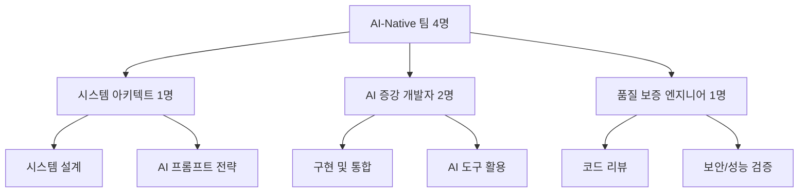
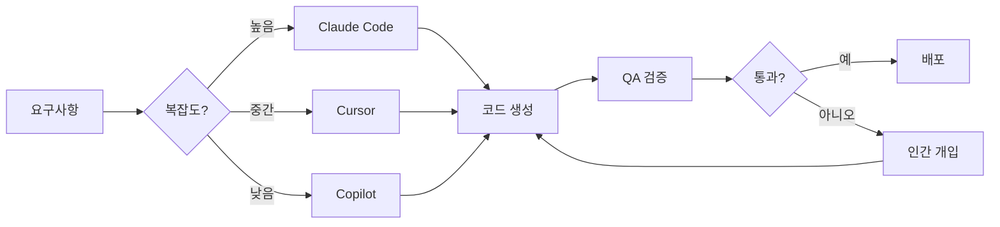

# AI-Native 시대의 기술팀 구성 전략 가이드

_AI 코딩 도구를 활용한 차세대 개발 조직 설계_

## 📌 Executive Summary

2025년 현재, Claude Code, Cursor, GitHub Copilot 등 AI 코딩 도구의 등장으로 소프트웨어 개발 패러다임이 근본적으로 변화했습니다. 한 명의 개발자가 AI 도구를 활용해 10명분의 아웃풋을 내는 시대가 도래했습니다. 본 문서는 이러한 AI-Native 시대에 최적화된 기술팀 구성 전략을 제시합니다.

### 핵심 변화

- **Before**: 10명 팀 → 제한적 아웃풋, 높은 인건비
- **After**: 4명 AI-Native 팀 → 10명 이상 아웃풋, 60% 비용 절감
- **핵심**: 코딩 능력 < 설계 능력 + AI 활용 능력

## 🎯 AI가 가져온 개발 패러다임 전환

### 전통적 개발 vs AI-Native 개발

| 영역                    | 전통적 방식 | AI-Native 방식 | 변화율   |
| ----------------------- | ----------- | -------------- | -------- |
| **보일러플레이트 작성** | 2-3시간     | 5분            | 95% 감소 |
| **CRUD API 구현**       | 1-2일       | 30분           | 95% 감소 |
| **테스트 코드 작성**    | 4시간       | 20분           | 90% 감소 |
| **버그 수정**           | 2-3시간     | 30분           | 85% 감소 |
| **문서화**              | 2시간       | 10분           | 90% 감소 |
| **리팩토링**            | 1일         | 1시간          | 85% 감소 |
| **새 언어 학습**        | 3-6개월     | 1주일          | 95% 감소 |

### 실제 개발 사례

```yaml
한 명의 개발자가 1주일 동안 구현 가능한 범위:

전통적 방식 (2020년):
  - 1개 마이크로서비스
  - 1개 언어
  - 기본 CRUD
  - 단위 테스트 일부

AI-Native 방식 (2025년):
  - 5개 마이크로서비스
  - 4개 언어 (Go, Rust, Python, TypeScript)
  - 복잡한 비즈니스 로직
  - 90% 테스트 커버리지
  - 완전한 문서화
  - CI/CD 파이프라인
  - 인프라 as Code
```

## 🏗️ 새로운 팀 구조 설계

### AI-Native 팀 구성 (MVP 단계)



### 역할별 상세 정의

#### 1. 시스템 아키텍트 (System Architect)

```typescript
interface SystemArchitect {
  primaryRole: "전체 시스템 설계 및 AI 전략 수립";

  responsibilities: {
    design: [
      "마이크로서비스 아키텍처 설계",
      "데이터 흐름 및 API 설계",
      "기술 스택 선정",
      "확장성 및 성능 목표 설정",
    ];

    aiStrategy: [
      "프롬프트 템플릿 라이브러리 구축",
      "AI 도구 선정 및 평가",
      "코드 생성 가이드라인 수립",
      "AI 활용 베스트 프랙티스 정의",
    ];

    leadership: [
      "기술 의사결정",
      "코드 리뷰 최종 승인",
      "팀 멘토링 및 교육",
      "이해관계자 커뮤니케이션",
    ];
  };

  requiredSkills: [
    "10년+ 시스템 설계 경험",
    "다양한 기술 스택 이해",
    "AI 도구 숙련도",
    "비즈니스 이해도",
  ];

  aiTools: {
    primary: "Claude Code (복잡한 설계)";
    secondary: "ChatGPT (아이디어 브레인스토밍)";
    specialized: "GitHub Copilot (코드 리뷰)";
  };

  dailyWorkflow: {
    morning: "AI와 함께 신규 기능 아키텍처 설계";
    midday: "생성된 코드 리뷰 및 통합";
    afternoon: "프롬프트 라이브러리 업데이트";
    evening: "팀 멘토링 및 지식 공유";
  };

  kpi: {
    systemUptime: "99.9%";
    architectureDebt: "< 10%";
    teamProductivity: "10x baseline";
    aiUtilization: "> 80%";
  };
}
```

#### 2. AI 증강 개발자 (AI-Augmented Developer)

```typescript
interface AIAugmentedDeveloper {
  primaryRole: "AI 도구를 활용한 고속 구현";

  responsibilities: {
    implementation: [
      "마이크로서비스 구현",
      "API 엔드포인트 개발",
      "데이터베이스 스키마 구현",
      "통합 테스트 작성",
    ];

    aiCollaboration: [
      "Claude Code로 복잡한 로직 구현",
      "Cursor로 빠른 버그 수정",
      "Copilot으로 테스트 생성",
      "AI 생성 코드 검증 및 최적화",
    ];

    polyglot: [
      "Go - 고성능 API",
      "Rust - 실시간 시스템",
      "Python - ML 파이프라인",
      "TypeScript - 풀스택 기능",
    ];
  };

  typicalDay: {
    "09:00": "스탠드업 미팅";
    "09:30": "Claude Code와 새 기능 설계 세션";
    "10:00": "Go 마이크로서비스 구현 (AI 페어링)";
    "11:30": "Python ML 파이프라인 구현";
    "14:00": "Rust 실시간 엔진 최적화";
    "15:30": "TypeScript 프론트엔드 통합";
    "16:30": "AI 생성 코드 리뷰 및 개선";
    "17:00": "문서 자동 생성 및 PR 제출";
  };

  weeklyOutput: {
    microservices: "2-3개 완성";
    apiEndpoints: "50+ 구현";
    testCoverage: "90%+";
    documentation: "완전 자동화";
    languages: "4개 동시 사용";
  };

  requiredSkills: [
    "빠른 학습 능력",
    "AI 프롬프트 엔지니어링",
    "코드 리뷰 능력",
    "문제 해결 능력",
  ];

  notRequired: [
    "특정 언어 10년 경력",
    "프레임워크 암기",
    "보일러플레이트 작성 경험",
  ];
}
```

#### 3. 품질 보증 엔지니어 (Quality Assurance Engineer)

```typescript
interface QualityAssuranceEngineer {
  primaryRole: "AI 생성 코드의 품질, 보안, 성능 보증";

  responsibilities: {
    codeReview: [
      "AI 생성 코드 보안 취약점 검사",
      "성능 병목 지점 식별",
      "아키텍처 일관성 검증",
      "코드 품질 메트릭 관리",
    ];

    testing: [
      "엣지 케이스 테스트 설계",
      "성능 테스트 시나리오 작성",
      "카오스 엔지니어링",
      "보안 침투 테스트",
    ];

    aiOversight: [
      "AI 할루시네이션 탐지",
      "생성 코드 패턴 분석",
      "라이센스 위반 검사",
      "의존성 취약점 스캔",
    ];
  };

  toolchain: {
    security: ["Snyk", "SonarQube", "OWASP ZAP"];
    performance: ["K6", "JMeter", "Lighthouse"];
    codeQuality: ["ESLint", "Clippy", "Black"];
    aiSpecific: ["AI 코드 검증 도구", "할루시네이션 탐지기"];
  };

  criticalChecks: [
    "SQL 인젝션 취약점",
    "메모리 누수",
    "레이스 컨디션",
    "비효율적 알고리즘",
    "하드코딩된 시크릿",
    "라이센스 위반",
  ];

  kpi: {
    bugEscapeRate: "< 1%";
    securityVulnerabilities: "0 critical";
    performanceRegression: "< 5%";
    codeQualityScore: "> 85%";
  };
}
```

### 확장 단계별 팀 구성

```yaml
MVP 단계 (0-6개월):
  팀 규모: 4명
  구성:
    - 시스템 아키텍트: 1명
    - AI 증강 개발자: 2명
    - 품질 보증 엔지니어: 1명
  월 비용: $40,000
  산출물: 10명 팀 수준

성장 단계 (6-12개월):
  팀 규모: 8명
  추가:
    - AI 프롬프트 엔지니어: 1명
    - 도메인 전문가: 2명
    - DevOps 엔지니어: 1명
  월 비용: $80,000
  산출물: 25명 팀 수준

확장 단계 (12개월+):
  팀 규모: 15명
  추가:
    - 팀 리드: 2명
    - ML 엔지니어: 2명
    - 보안 전문가: 1명
    - 기술 작가: 1명
    - AI 도구 개발자: 1명
  월 비용: $150,000
  산출물: 50명 팀 수준
```

## 🤖 AI 도구 스택 및 활용 전략

### 핵심 AI 도구 매트릭스

| 도구               | 주 사용 용도                        | 강점                        | 제한사항           | 월 비용   |
| ------------------ | ----------------------------------- | --------------------------- | ------------------ | --------- |
| **Claude Code**    | 복잡한 비즈니스 로직, 아키텍처 설계 | 긴 컨텍스트, 높은 추론 능력 | API 제한           | $200/user |
| **Cursor**         | 빠른 코드 수정, IDE 통합 개발       | IDE 통합, 빠른 반응         | 복잡한 로직 한계   | $20/user  |
| **GitHub Copilot** | 자동 완성, 보일러플레이트           | 컨텍스트 인식, 다양한 언어  | 창의적 솔루션 부족 | $19/user  |
| **ChatGPT Plus**   | 아이디어 생성, 문서화               | 범용성, 플러그인            | 코드 정확도        | $20/user  |
| **Codeium**        | 무료 대안, 기본 자동완성            | 무료, 기본 기능 충실        | 고급 기능 부족     | Free      |

### 도구별 활용 워크플로우



### AI 프롬프트 라이브러리

```typescript
// prompt-library/microservice-generator.ts
export const microservicePrompts = {
  goAPIService: `
    Create a production-ready Go microservice with the following requirements:
    - Framework: Fiber v2
    - Database: PostgreSQL with GORM
    - Authentication: JWT
    - Features: {features}
    - Include: Dockerfile, docker-compose, Makefile
    - Testing: Unit tests with testify
    - Monitoring: Prometheus metrics
    - Logging: Structured logging with zerolog
    - Error handling: Centralized error handling
    - API documentation: Swagger/OpenAPI 3.0
    
    Follow these patterns:
    - Clean Architecture (handlers -> services -> repositories)
    - Dependency injection
    - Graceful shutdown
    - Health checks
    - Rate limiting
    
    Performance requirements:
    - Response time < 100ms for 95th percentile
    - Support 10,000 concurrent connections
    - Memory usage < 100MB
  `,

  rustRealtimeEngine: `
    Implement a high-performance Rust service for {purpose}:
    - Framework: Tokio + Axum
    - WebSocket support with tokio-tungstenite
    - Zero-copy operations where possible
    - Lock-free data structures
    - Features: {features}
    
    Requirements:
    - Latency < 10ms p99
    - Memory safe without performance penalty
    - Graceful degradation
    - Comprehensive error handling with thiserror
    - Metrics with prometheus crate
    - Tracing with tokio-tracing
    
    Include benchmarks and load tests
  `,

  pythonMLPipeline: `
    Design a production ML pipeline with:
    - Framework: FastAPI + Pydantic
    - ML: scikit-learn/XGBoost/PyTorch
    - Data validation: Great Expectations
    - Feature store: Feast
    - Monitoring: MLflow
    - Requirements: {requirements}
    
    Include:
    - Data preprocessing pipeline
    - Model training with hyperparameter tuning
    - Model serving with batching
    - A/B testing framework
    - Drift detection
    - Explainability (SHAP/LIME)
  `,
};
```

## 📊 생산성 측정 및 KPI

### 팀 생산성 메트릭

```typescript
interface ProductivityMetrics {
  velocity: {
    storyPointsPerSprint: number; // 전통: 40 → AI: 120
    featuresDelivered: number; // 전통: 3 → AI: 15
    bugsIntroduced: number; // 전통: 10 → AI: 5
    timeToMarket: number; // 전통: 3개월 → AI: 3주
  };

  codeMetrics: {
    linesOfCode: number; // 의미 없음 (AI가 생성)
    testCoverage: number; // 목표: 90%+
    codeComplexity: number; // 유지: < 10
    technicalDebt: number; // 감소 추세
  };

  aiUtilization: {
    aiGeneratedCode: number; // 목표: 70%+
    aiAssistedTasks: number; // 목표: 90%+
    promptLibraryUsage: number; // 추적
    toolCostPerFeature: number; // 비용 효율성
  };

  qualityMetrics: {
    defectDensity: number; // 목표: < 0.1%
    meanTimeToRecover: number; // 목표: < 1시간
    customerSatisfaction: number; // NPS > 50
    performanceSLA: number; // 99.9%
  };
}

// 주간 리포트 생성
function generateWeeklyReport(team: AITeam): WeeklyReport {
  return {
    featuresCompleted: 15,
    microservicesDeployed: 3,
    apiEndpointsCreated: 75,
    testsWritten: 500,
    documentationPages: 50,

    aiMetrics: {
      claudeCodeUsage: "40 hours",
      cursorUsage: "60 hours",
      copilotSuggestions: 2000,
      promptsExecuted: 500,
      costSaved: "$15,000", // vs 전통 방식
    },

    comparison: {
      traditional10PersonTeam: {
        output: 100,
        cost: "$20,000/week",
        time: "2 weeks",
      },
      ai4PersonTeam: {
        output: 100,
        cost: "$8,000/week",
        time: "1 week",
      },
    },
  };
}
```

### ROI 계산

```javascript
const aiTeamROI = {
  // 비용 절감
  costSavings: {
    traditionalTeam: {
      size: 10,
      avgSalary: 120000,
      annualCost: 1200000,
      overhead: 360000, // 30%
      totalCost: 1560000,
    },

    aiNativeTeam: {
      size: 4,
      avgSalary: 150000, // 더 높은 급여
      annualCost: 600000,
      aiTools: 50000, // 도구 비용
      overhead: 195000, // 30%
      totalCost: 845000,
    },

    annualSaving: 715000, // 46% 절감
    roi: "84.6%",
  },

  // 생산성 향상
  productivityGains: {
    featuresPerYear: {
      traditional: 40,
      aiNative: 150,
    },
    timeToMarket: {
      traditional: "3 months",
      aiNative: "3 weeks",
    },
    revenueImpact: {
      fasterLaunch: 2000000, // 2.5개월 빠른 출시
      moreFeatures: 1000000, // 추가 기능으로 인한 수익
      total: 3000000,
    },
  },

  totalROI: {
    year1: "355%",
    year2: "420%",
    year3: "485%",
  },
};
```

## 🎓 채용 및 평가 기준

### 새로운 채용 프로세스

```yaml
스크리닝 (온라인):
  과제:
    - "Claude Code를 사용해 마이크로서비스 구현"
    - 시간: 2시간
    - 평가: 프롬프트 품질, 결과물 품질, 개선 능력

  평가 기준:
    - AI 도구 활용도: 40%
    - 문제 해결 능력: 30%
    - 코드 품질: 20%
    - 문서화: 10%

기술 면접 (2시간):
  Round 1 - AI 페어 프로그래밍 (1시간):
    - 실시간 문제 해결
    - AI 도구 사용하여 구현
    - 프롬프트 작성 능력 평가
    - 생성 코드 개선 능력

  Round 2 - 시스템 설계 (1시간):
    - 아키텍처 설계 능력
    - 트레이드오프 이해
    - AI 활용 전략 수립
    - 확장성 고려사항

문화 적합성 (1시간):
  평가 항목:
    - 지속적 학습 의지
    - AI와의 협업 마인드셋
    - 피드백 수용도
    - 팀워크 능력
```

### 성과 평가 기준

```typescript
interface PerformanceEvaluation {
  technicalExcellence: {
    weight: 30;
    criteria: [
      "시스템 설계 품질",
      "코드 리뷰 기여도",
      "기술적 의사결정",
      "문제 해결 능력",
    ];
  };

  aiProficiency: {
    weight: 30;
    criteria: [
      "AI 도구 활용도",
      "프롬프트 엔지니어링 스킬",
      "생산성 향상 기여",
      "프롬프트 라이브러리 기여",
    ];
  };

  delivery: {
    weight: 25;
    criteria: [
      "기능 delivery 속도",
      "품질 메트릭 달성",
      "데드라인 준수",
      "고객 만족도",
    ];
  };

  collaboration: {
    weight: 15;
    criteria: ["지식 공유", "멘토링", "팀 기여도", "커뮤니케이션"];
  };

  growthLevels: {
    junior: "AI 도구 기본 활용, 가이드 따라 구현";
    mid: "독립적 AI 활용, 복잡한 기능 구현";
    senior: "AI 전략 수립, 프롬프트 라이브러리 구축";
    staff: "팀 전체 AI 활용도 향상, 아키텍처 결정";
    principal: "조직 전체 AI 전략, 혁신 주도";
  };
}
```

## 🛡️ 리스크 관리

### AI 코드 생성 리스크

```yaml
보안 리스크:
  문제:
    - 취약한 코드 패턴 생성
    - 하드코딩된 시크릿
    - 안전하지 않은 의존성

  대응:
    - 자동 보안 스캔 파이프라인
    - Pre-commit hooks
    - SAST/DAST 도구 통합
    - Security champion 지정

품질 리스크:
  문제:
    - AI 할루시네이션
    - 비효율적 알고리즘
    - 일관성 없는 코드 스타일

  대응:
    - 엄격한 코드 리뷰 프로세스
    - 자동화된 성능 테스트
    - 코드 스타일 가이드 적용
    - AI 생성 코드 마킹

법적 리스크:
  문제:
    - 라이센스 위반
    - 저작권 침해
    - 오픈소스 컴플라이언스

  대응:
    - 라이센스 스캔 도구
    - AI 생성 코드 출처 추적
    - 법무팀 정기 검토
    - 화이트리스트 라이브러리

의존성 리스크:
  문제:
    - AI 도구 서비스 중단
    - 가격 인상
    - 기능 제한

  대응:
    - 멀티 도구 전략
    - 로컬 LLM 백업 플랜
    - 비용 모니터링
    - 벤더 계약 관리
```

### 팀 역량 리스크

```yaml
스킬 갭:
  문제:
    - AI 도구 활용 능력 부족
    - 프롬프트 엔지니어링 미숙
    - 과도한 AI 의존

  대응:
    - 정기 교육 프로그램
    - 프롬프트 엔지니어링 워크샵
    - 페어 프로그래밍 세션
    - 내부 지식 공유 세션

번아웃:
  문제:
    - 과도한 생산성 압박
    - 지속적 학습 피로
    - AI와의 경쟁 스트레스

  대응:
    - 현실적 목표 설정
    - 정기적 휴식 보장
    - 심리 상담 지원
    - 성과 인정 시스템
```

## 📚 교육 및 스킬 개발

### AI-Native 개발자 교육 커리큘럼

```yaml
Week 1 - AI 도구 기초:
  Day 1-2: AI 코딩 도구 소개
    - Claude Code 기본 사용법
    - Cursor IDE 설정
    - GitHub Copilot 활성화

  Day 3-4: 프롬프트 엔지니어링 기초
    - 효과적인 프롬프트 작성
    - 컨텍스트 제공 기법
    - 반복적 개선 방법

  Day 5: 실습 프로젝트
    - 간단한 CRUD API 구현
    - AI 도구로 테스트 작성
    - 문서 자동 생성

Week 2 - 고급 활용:
  Day 1-2: 복잡한 비즈니스 로직
    - 멀티 스텝 프롬프트
    - 아키텍처 레벨 설계
    - 리팩토링 기법

  Day 3-4: 폴리글랏 프로그래밍
    - 다중 언어 프로젝트
    - 언어별 최적 도구
    - 통합 전략

  Day 5: 성능 최적화
    - AI 생성 코드 최적화
    - 병목 지점 식별
    - 벤치마킹

Week 3 - 품질 보증:
  Day 1-2: 보안 및 테스팅
    - 보안 취약점 식별
    - 테스트 전략 수립
    - CI/CD 통합

  Day 3-4: 코드 리뷰
    - AI 코드 검증 기법
    - 리뷰 체크리스트
    - 개선 사항 도출

  Day 5: 프로덕션 준비
    - 배포 전략
    - 모니터링 설정
    - 운영 고려사항

Week 4 - 실전 프로젝트:
  - 팀 프로젝트 (4일)
  - 발표 및 리뷰 (1일)

평가:
  - 프로젝트 품질: 40%
  - AI 활용도: 30%
  - 협업 능력: 20%
  - 발표: 10%
```

### 지속적 학습 프로그램

```yaml
월간 워크샵:
  - 새로운 AI 도구 소개
  - 프롬프트 라이브러리 리뷰
  - 베스트 프랙티스 공유
  - 실패 사례 분석

분기별 해커톤:
  - AI-Only 개발 챌린지
  - 24시간 내 MVP 구축
  - 크로스 팀 협업
  - 혁신 아이디어 실험

연간 컨퍼런스:
  - 외부 전문가 초청
  - 업계 트렌드 공유
  - 네트워킹
  - 미래 전략 수립
```

## 💰 비용 효율성 분석

### 팀 운영 비용 비교

```javascript
const costComparison = {
  traditional: {
    team: {
      backendDevs: { count: 5, salary: 120000, total: 600000 },
      frontendDevs: { count: 3, salary: 110000, total: 330000 },
      devOps: { count: 2, salary: 130000, total: 260000 },
      qa: { count: 2, salary: 100000, total: 200000 },
      total: { count: 12, annualCost: 1390000 },
    },

    infrastructure: {
      offices: 120000,
      equipment: 60000,
      software: 30000,
      total: 210000,
    },

    totalAnnualCost: 1600000,
    monthlyBurn: 133333,
  },

  aiNative: {
    team: {
      architect: { count: 1, salary: 180000, total: 180000 },
      aiDevs: { count: 2, salary: 150000, total: 300000 },
      qaEngineer: { count: 1, salary: 140000, total: 140000 },
      total: { count: 4, annualCost: 620000 },
    },

    aiTools: {
      claudeCode: { users: 4, monthly: 200, annual: 9600 },
      cursor: { users: 4, monthly: 20, annual: 960 },
      copilot: { users: 4, monthly: 19, annual: 912 },
      other: 5000,
      total: 16472,
    },

    infrastructure: {
      remote: 20000, // 대부분 원격
      equipment: 20000,
      software: 10000,
      total: 50000,
    },

    totalAnnualCost: 686472,
    monthlyBurn: 57206,

    savings: {
      absolute: 913528,
      percentage: 57.1,
      productivityGain: 2.5,
      effectiveSaving: 71.4, // 생산성 고려
    },
  },
};
```

### Break-Even 분석

```typescript
function calculateBreakEven(projectSize: ProjectSize): BreakEvenAnalysis {
  const aiTeamSetup = {
    recruiting: 50000,
    training: 30000,
    toolSetup: 10000,
    total: 90000,
  };

  const monthlySaving = 76127; // 전통 팀 대비

  return {
    breakEvenMonth: Math.ceil(aiTeamSetup.total / monthlySaving), // 2개월
    yearOneROI:
      ((monthlySaving * 12 - aiTeamSetup.total) / aiTeamSetup.total) * 100, // 915%

    scenarios: {
      pessimistic: {
        assumption: "50% 생산성 향상만 달성",
        breakEven: "3개월",
        yearOneROI: "400%",
      },

      realistic: {
        assumption: "2.5x 생산성 향상",
        breakEven: "2개월",
        yearOneROI: "915%",
      },

      optimistic: {
        assumption: "4x 생산성 향상",
        breakEven: "1개월",
        yearOneROI: "1500%",
      },
    },
  };
}
```

## 🚀 실행 로드맵

### Phase 1: 파일럿 (Month 1-2)

```yaml
Week 1-2: 준비
  - AI 도구 선정 및 구매
  - 파일럿 팀 선발 (2명)
  - 초기 교육 실시
  - 프롬프트 라이브러리 초안

Week 3-4: 실험
  - 첫 프로젝트 시작
  - 일일 스탠드업 및 피드백
  - 메트릭 수집 시작
  - 문제점 식별 및 개선

Week 5-6: 검증
  - 프로젝트 완료
  - 성과 측정
  - ROI 계산
  - 확대 결정

Week 7-8: 준비
  - 채용 프로세스 설계
  - 교육 커리큘럼 완성
  - 인프라 준비
  - 정책 수립
```

### Phase 2: 확대 (Month 3-4)

```yaml
Month 3:
  - 2명 추가 채용
  - 전체 팀 교육
  - 프로덕션 프로젝트 시작
  - 프로세스 정립

Month 4:
  - 첫 프로덕션 배포
  - 성과 평가
  - 프로세스 개선
  - 지식 공유 체계 구축
```

### Phase 3: 최적화 (Month 5-6)

```yaml
Month 5:
  - 프롬프트 라이브러리 고도화
  - 자동화 파이프라인 완성
  - 품질 메트릭 안정화
  - 팀 문화 정착

Month 6:
  - 성과 리뷰
  - 확장 계획 수립
  - 조직 전체 적용 전략
  - 성공 사례 공유
```

## 🎯 성공 지표

### 단기 (3개월)

- 팀 생산성 2배 향상
- 개발 비용 40% 절감
- 배포 주기 50% 단축
- 코드 품질 점수 85% 이상

### 중기 (6개월)

- 팀 생산성 3배 향상
- 개발 비용 50% 절감
- Time-to-Market 70% 단축
- 팀 만족도 80% 이상

### 장기 (12개월)

- 조직 전체 AI-Native 전환
- 개발 비용 60% 절감
- 혁신 속도 5배 향상
- 업계 리더십 확보

## 📋 체크리스트

### 즉시 실행 사항

- [ ] AI 도구 라이센스 구매
- [ ] 파일럿 팀 선발
- [ ] 초기 교육 일정 수립
- [ ] 성과 메트릭 정의
- [ ] 프롬프트 템플릿 작성 시작

### 1개월 내 완료

- [ ] 채용 프로세스 재설계
- [ ] 교육 커리큘럼 완성
- [ ] 품질 보증 프로세스 수립
- [ ] 보안 가이드라인 작성
- [ ] 첫 파일럿 프로젝트 완료

### 3개월 내 완료

- [ ] 팀 전체 전환
- [ ] 프로덕션 배포
- [ ] ROI 검증
- [ ] 확장 계획 수립
- [ ] 성공 사례 문서화

## 🔑 핵심 성공 요인

1. **마인드셋 전환**: 코딩 < 설계 + AI 활용
2. **품질 우선**: AI 속도 + 인간 품질 검증
3. **지속적 학습**: AI 도구 진화 속도 따라가기
4. **균형 유지**: AI 활용 vs 핵심 역량 유지
5. **문화 구축**: 실험과 혁신 장려

## 💡 결론

AI-Native 팀 구성은 선택이 아닌 필수입니다. Claude Code와 같은 AI 도구를 활용하면:

- **4명이 10명의 일을**: 57% 비용 절감
- **1주일에 5개 마이크로서비스**: 10배 빠른 개발
- **4개 언어 동시 사용**: 진정한 폴리글랏
- **90% 테스트 커버리지**: 품질 향상

이제 "얼마나 많은 개발자가 필요한가?"가 아니라 "얼마나 잘 AI를 활용할 수 있는가?"가 경쟁력의 핵심입니다.

**"The future is not about coding, it's about orchestrating AI to code."**
