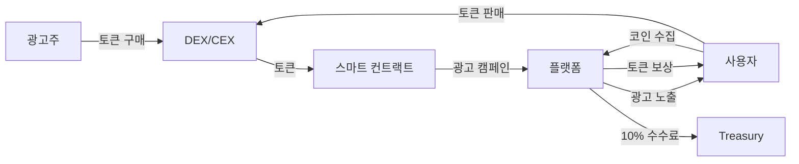

# Project ORE - 통합 비즈니스 모델 및 전략

_Open Reality Engine: 차세대 AR P2E 광고 플랫폼_

## 📋 Executive Summary

### Project ORE (Open Reality Engine)

현실과 디지털을 연결하는 개방형 AR 플랫폼으로, 포켓몬GO의 위치 기반 게임 메커닉과 블록체인의 투명한 광고 시스템을 결합하여, 사용자-광고주-플랫폼이 모두 수익을 얻는 차세대 광고 엔터테인먼트 생태계를 구축합니다.

### 핵심 가치 제안

- **사용자**: 일상 활동으로 월 $50-200 수익 창출
- **광고주**: 30배 높은 전환율, 100% 투명한 광고 집행
- **플랫폼**: 모든 거래의 10% 수수료, 지속가능한 비즈니스 모델

### 기술적 차별화

- **최초의 온체인 광고 DApp**: 스마트 컨트랙트로 광고비 집행
- **AI-Native 개발**: 최소 인력으로 최대 개발 속도
- **실시간 위치 검증**: Rust 기반 고성능 엔진

## 🎯 비즈니스 모델

### 핵심 수익 구조



### 수익원 분석

```yaml
주요 수익원:
  거래 수수료 (40% of revenue):
    - 모든 광고 거래의 10%
    - 예상 규모: Year 1: $1M → Year 3: $10M
    - 기술 요구: 스마트 컨트랙트 자동 집행

  프리미엄 서비스 (30%):
    - VIP 멤버십: $9.99/월
    - 프리미엄 광고 슬롯
    - 예상 규모: Year 1: $600K → Year 3: $6M
    - 기술 요구: 구독 관리 시스템

  데이터 인사이트 (20%):
    - 익명화된 위치 데이터 분석
    - 광고 효과 리포트
    - 예상 규모: Year 1: $400K → Year 3: $4M
    - 기술 요구: 실시간 분석 파이프라인

  NFT/디지털 자산 (10%):
    - 프리미엄 아이템 판매
    - NFT 거래 수수료
    - 예상 규모: Year 1: $200K → Year 3: $2M
```

## 📊 시장 기회 분석

### TAM/SAM/SOM

```yaml
TAM (Total Addressable Market): $105B
  - Location-based advertising: $38B
  - Mobile gaming: $90B
  - Blockchain gaming: $5B

SAM (Serviceable Addressable Market): $15B
  - AR gaming with ads: $3B
  - Crypto gaming: $2B
  - Location-based crypto: $1B

SOM (Serviceable Obtainable Market): $500M
  - Year 1: 0.1% market share = $15M
  - Year 3: 1% market share = $150M
  - Year 5: 3% market share = $450M
```

### 경쟁 우위 분석

| 경쟁사              | 강점                 | 약점                | 우리의 기회          |
| ------------------- | -------------------- | ------------------- | -------------------- |
| **Coin Hunt World** | 15만 활성 유저       | 중앙화, 투명성 부족 | 온체인 투명성 제공   |
| **STEPN**           | 강력한 토큰 이코노미 | 광고 모델 없음      | 지속가능한 수익 모델 |
| **Pokémon GO**      | 대규모 유저베이스    | Web3 부재           | 토큰 인센티브 제공   |

## 👥 팀 구성 및 확장 계획

### Project ORE 팀 빌딩 전략

```yaml
2025 Q4 - Founding Team (2명):
  CTO/Co-founder:
    - 시스템 아키텍처 설계
    - AI 도구 활용 개발
    - 투자자 관계

  AI-Native Developer:
    - Claude Code 활용 구현
    - 테스트 및 최적화
    - DevOps 관리

  생산성: 20명 팀 수준의 아웃풋

2026 Q1 - Post-Angel (4명):
  추가 채용:
    - Product Designer/PM
    - Community Manager

  팀 구조:
    - Tech: 2명 (CTO + Dev)
    - Product: 1명
    - Community: 1명

2026 Q2 - Post-Seed (10명):
  추가 채용:
    - Backend Dev: 2명
    - Unity Dev: 1명
    - Marketing Lead: 1명
    - BD/Sales: 1명
    - QA Engineer: 1명

  팀 구조:
    - Tech: 5명
    - Product: 1명
    - Marketing: 2명
    - Sales: 1명
    - Community: 1명

2026 Q4 - Post-Series A (30명):
  확장 영역:
    - Engineering: 15명
    - Product: 3명
    - Marketing: 5명
    - Sales/BD: 3명
    - Operations: 2명
    - Finance/Legal: 2명

  여전히 효율적:
    - 전통 기업 필요 인원: 100+명
    - ORE with AI: 30명
    - 생산성: 3-4x
```

### 핵심 기술 스택

```yaml
선택 근거:
  Unity (Client):
    - 비즈니스 가치: AR 경험으로 사용자 참여도 3배 증가
    - 기술적 우위: 크로스 플랫폼으로 개발 비용 50% 절감

  Go + Rust (Backend):
    - 비즈니스 가치: 100만 동시접속 처리 가능
    - 기술적 우위: 서버 비용 70% 절감 (vs Java)

  Polygon (Blockchain):
    - 비즈니스 가치: 거래당 $0.01 수수료
    - 기술적 우위: 2초 내 거래 확정

  PostgreSQL + Redis:
    - 비즈니스 가치: 위치 쿼리 < 50ms
    - 기술적 우위: 검증된 안정성
```

### AI-Native 개발로 가능한 비즈니스 속도

```yaml
Project ORE 개발 전략:

2025 Q4 - MVP Phase (2명):
  팀 구성:
    - CTO: 시스템 설계 + AI 개발
    - AI Dev: 구현 + 테스트

  개발 속도:
    - Week 1-4: 백엔드 인프라 (Go 마이크로서비스 5개)
    - Week 5-8: Unity AR 클라이언트
    - Week 9-12: 블록체인 통합 + 베타 테스트

  AI 도구 활용:
    - Claude Code: 복잡한 로직 구현 (70% 코드)
    - Cursor: 빠른 수정 (20% 코드)
    - Copilot: 자동 완성 (10% 코드)

  산출물:
    - 완성된 MVP
    - Genesis 1000 커뮤니티
    - 10개 초기 광고주

  비용 절감:
    - 전통적 10명 팀: $300K/분기
    - ORE 2명 팀: $50K/분기
    - 절감액: $250K (83% 절감)

2026 Q1-Q2 - Growth Phase (4-10명):
  Angel 후 (Q1): 4명으로 확장
  Seed 후 (Q2): 10명으로 확장

  여전히 효율적:
    - 전통적 필요 인원: 30-40명
    - ORE 필요 인원: 10명
    - AI 활용 생산성: 3-4x
```

## 💰 재무 계획 및 예측

### 3년 재무 예측

```typescript
const financialProjection = {
  // 2025 Q4 - MVP 개발 (자체 자금)
  year0_Q4: {
    revenue: 0,
    costs: 50000, // 최소 운영비
    team: 2, // CTO + 1 AI Dev
    status: "MVP Development",
  },

  // 2026 - 본격 성장
  year1_2026: {
    q1: {
      // Angel $1M
      revenue: 50000,
      costs: 250000,
      users: 5000,
      status: "Angel Round + Beta Launch",
    },
    q2: {
      // Seed $10M
      revenue: 300000,
      costs: 2000000,
      users: 50000,
      status: "Seed Round + Official Launch",
    },
    q3: {
      revenue: 800000,
      costs: 3000000,
      users: 200000,
      status: "Growth Phase",
    },
    q4: {
      // Series A $50M
      revenue: 2000000,
      costs: 4000000,
      users: 500000,
      status: "Series A + Global Expansion",
    },
    total: {
      revenue: 3150000,
      costs: 9250000,
      netIncome: -6100000, // 투자금으로 커버
      endingUsers: 500000,
      arpu: 6.3,
    },
  },

  // 2027 - 규모 확장
  year2_2027: {
    revenue: 24000000,
    costs: 18000000,
    netIncome: 6000000,
    users: 2000000,
    arpu: 12,
    status: "Scale & Profitability",
  },

  // 2028 - 수익성 극대화
  year3_2028: {
    revenue: 60000000,
    costs: 30000000,
    netIncome: 30000000,
    users: 5000000,
    arpu: 12,
    status: "Market Leader",
  },
};
```

### 투자 계획

```yaml
MVP 개발 (2025 Q4):
  팀 구성: 1-2명 (CTO + AI Dev)
  개발 비용: 자체 자금
  목표: 작동하는 프로토타입 + Genesis 1000

Angel Round (2026 Q1):
  목표 금액: $1M
  밸류에이션: $10M (10% 지분)
  용도:
    - 팀 확장 (4명): $400K
    - 마케팅/유저 획득: $300K
    - 인프라/서버: $150K
    - 운영 자금: $150K
  마일스톤:
    - MVP 완성
    - Genesis 1000 활성
    - 초기 광고주 10개

Seed Round (2026 Q2):
  목표 금액: $10M
  밸류에이션: $40M (25% 지분)
  용도:
    - 팀 확장 (10명): $3M
    - 마케팅 확대: $4M
    - 제품 고도화: $2M
    - 운영 자금: $1M
  마일스톤:
    - 10만 MAU 달성
    - MRR $100K
    - 광고주 100개
    - 토큰 런칭 준비

Series A (2026 Q4):
  목표 금액: $50M
  밸류에이션: $200M (25% 지분)
  용도:
    - 글로벌 확장: $20M
    - 팀 확장 (30명): $10M
    - 기술 개발: $10M
    - 마케팅: $7M
    - 운영 자금: $3M
  마일스톤:
    - 100만 MAU
    - MRR $1M
    - 3개국 진출
    - 토큰 생태계 활성화
```

## 🎮 제품 전략

### MVP 핵심 기능 (2025 Q4)

```yaml
Project ORE MVP (12주 개발):

필수 기능:
  1. 위치 기반 코인 수집
  2. AR 시각화
  3. 광고 코인 시스템
  4. 기본 토큰 이코노미 (포인트로 시작)
  5. 리더보드
  6. Genesis 1000 전용 기능

기술적 구현 (2명이 가능한 이유):
  - Go 마이크로서비스 5개 (Claude Code로 1주 완성)
  - Rust 실시간 엔진 1개 (Claude Code로 3일 완성)
  - Unity AR 클라이언트 (AI 도구로 2주 완성)
  - 스마트 컨트랙트 초안 (Claude로 3일 완성)
  - 총 코드량: 50K 라인
    * AI 생성: 45K (90%)
    * 수동 작성/수정: 5K (10%)

2025년 12월 목표:
  - Genesis 1000 베타 테스터 확보
  - 일일 활성 사용자 500명
  - 초기 광고주 10개
  - 투자 데모 준비 완료
```

### 성장 단계별 제품 로드맵

```yaml
Phase 1 - MVP (2025 Q4):
  핵심 기능:
    - 위치 기반 코인 수집
    - 기본 AR 뷰
    - Genesis 1000 전용 기능
    - 리더보드
    - 테스트 광고 시스템
  목표: 제품 검증

Phase 2 - Beta (2026 Q1):
  추가 기능:
    - 곡괭이 시스템
    - 일일 퀘스트
    - 친구 시스템
    - 광고주 대시보드
    - 기본 토큰 이코노미 (포인트)
  목표: 10K 유저, 엔젤 투자

Phase 3 - Launch (2026 Q2):
  추가 기능:
    - NFT 아이템
    - 길드 시스템
    - 고급 AR 기능
    - 스마트 컨트랙트 통합
    - 프로그래매틱 광고
  목표: 100K 유저, 시드 투자

Phase 4 - Scale (2026 Q3-Q4):
  추가 기능:
    - PvP 배틀
    - 메타버스 통합
    - ORE 토큰 런칭
    - 글로벌 이벤트
    - B2B API
  목표: 1M 유저, Series A

Phase 5 - Expansion (2027+):
  추가 기능:
    - Open Reality Protocol
    - 크리에이터 도구
    - DAO 거버넌스
    - 크로스 체인 지원
    - AR 글래스 지원
  목표: 글로벌 리더십
```

## 🚀 Go-to-Market 전략

### 사용자 획득

```yaml
Genesis 1000 (2025 Q4):
  전략: 코어 커뮤니티 구축
  방법:
    - Discord/Twitter 커뮤니티
    - 토큰 에어드롭 약속 (3%)
    - 독점 NFT 뱃지
  CAC: $0 (토큰 인센티브)
  목표: 1,000명 충성 유저

Beta Expansion (2026 Q1):
  전략: 입소문 확산
  방법:
    - Genesis 멤버 추천
    - 소셜 미디어 챌린지
    - 로컬 이벤트
  CAC: $2
  목표: 10,000 유저 (엔젤 투자 시점)

Official Launch (2026 Q2):
  전략: 본격 성장
  방법:
    - 인플루언서 마케팅
    - 페이드 광고 시작
    - PR 캠페인
  CAC: $5
  목표: 100,000 유저 (시드 투자 시점)

Global Expansion (2026 Q4):
  전략: 대규모 확장
  방법:
    - TV/온라인 광고
    - 글로벌 파트너십
    - 이스포츠 이벤트
  CAC: $10
  목표: 1,000,000 유저 (Series A 시점)
```

### 광고주 획득

```yaml
MVP Stage (2025 Q4):
  타겟: Early Adopters
  접근: 직접 영업
  제안: 무료 크레딧 $500
  목표: 10개 테스트 광고주

Angel Stage (2026 Q1):
  타겟: 지역 비즈니스
  접근: 셀프서브 플랫폼
  제안: 첫 캠페인 50% 할인
  목표: 100개 광고주

Seed Stage (2026 Q2):
  타겟: 중소 브랜드
  접근: 세일즈 팀
  제안: 성과 보장 프로그램
  목표: 500개 광고주

Series A Stage (2026 Q4):
  타겟: 대기업/에이전시
  접근: 엔터프라이즈 세일즈
  제안: API 통합, 맞춤 솔루션
  목표: 50개 대형 광고주
```

## 📈 핵심 성과 지표 (KPI)

### Project ORE 마일스톤별 KPI

```yaml
2025 Q4 (MVP):
  User Metrics:
    - Genesis Members: 1,000
    - DAU: 500
    - D7 Retention: 80%
  Tech Metrics:
    - API Response: < 200ms
    - Crash Rate: < 1%
    - Code Coverage: 80%
  Business Metrics:
    - Test Advertisers: 10
    - Development Cost: < $50K

2026 Q1 (Angel $1M):
  User Metrics:
    - Total Users: 10,000
    - MAU: 5,000
    - D30 Retention: 40%
  Revenue Metrics:
    - MRR: $10K
    - Advertisers: 100
    - ARPU: $2
  Tech Metrics:
    - Uptime: 99.5%
    - Concurrent Users: 1,000

2026 Q2 (Seed $10M):
  User Metrics:
    - Total Users: 100,000
    - MAU: 50,000
    - D30 Retention: 35%
  Revenue Metrics:
    - MRR: $100K
    - Advertisers: 500
    - ARPU: $2
    - CAC: $5
    - LTV/CAC: 10x
  Tech Metrics:
    - Uptime: 99.9%
    - Concurrent Users: 10,000

2026 Q4 (Series A $50M):
  User Metrics:
    - Total Users: 1,000,000
    - MAU: 500,000
    - D30 Retention: 30%
  Revenue Metrics:
    - MRR: $1M
    - ARR: $12M
    - Advertisers: 2,000
    - ARPU: $2
  Blockchain Metrics:
    - Token Holders: 100,000
    - Daily Transactions: 50,000
    - TVL: $10M
```

## ⚠️ 리스크 관리

### 주요 리스크 및 대응

```yaml
기술 리스크:
  GPS 스푸핑:
    - 영향: 토큰 이코노미 붕괴
    - 대응: ML 기반 이상 탐지, 다중 검증

  스케일링:
    - 영향: 서비스 다운
    - 대응: 자동 스케일링, 다중 리전

규제 리스크:
  SEC 규제:
    - 영향: 서비스 중단
    - 대응: 유틸리티 토큰 명확화, 법률 자문

  앱스토어 정책:
    - 영향: 앱 삭제
    - 대응: 정책 준수, 웹앱 백업

시장 리스크:
  경쟁사 진입:
    - 영향: 시장 점유율 감소
    - 대응: 빠른 실행, 네트워크 효과

  광고주 부족:
    - 영향: 수익 모델 실패
    - 대응: 효과 증명, 무료 크레딧
```

## 🔄 Exit 전략

### Project ORE의 잠재적 Exit 시나리오

```yaml
Strategic M&A (3-5년):
  잠재 인수자:
    - Meta: "Open Reality" 비전 시너지
    - Google: AR 광고 플랫폼 확보
    - Microsoft: 게임 + AR 생태계
    - Niantic: Web3 진출 가속화

  예상 밸류: $1-3B
  근거:
    - 500만 활성 유저
    - $50M ARR
    - 독점 기술 (온체인 광고)

IPO (5-7년):
  조건:
    - $100M+ ARR
    - 1000만+ 유저
    - 3년 연속 흑자
    - 글로벌 10개국 진출

  예상 밸류: $5-10B
  비교: Roblox ($30B), Unity ($20B)

Token Economy (2027):
  ORE Token Launch:
    - 점진적 탈중앙화
    - 토큰 판매: $100M
    - 생태계 펀드: $50M
    - 거버넌스 토큰화

  프로토콜화:
    - Open Reality Protocol
    - 누구나 AR 콘텐츠 제작
    - 탈중앙화 광고 거래소
```

## 💡 결론

### Project ORE - Open Reality Engine

**"원석(Ore)을 캐듯, 현실에서 가치를 채굴하다"**

### 왜 지금인가?

1. **기술 컨버전스**: AR + Blockchain + AI가 모두 성숙
2. **시장 검증**: Coin Hunt World (15만 유저), STEPN ($1B 밸류) 성공 사례
3. **AI 혁명**: 2명이 20명의 개발을 가능하게 함
4. **Web3 전환기**: 유틸리티 토큰 규제 명확화

### 왜 우리인가?

1. **최초 무버**: 온체인 광고 DApp (특허 출원 예정)
2. **실행 속도**: 2025 Q4 MVP → 2026 Q1 엔젤 투자
3. **기술 우위**: AI-Native로 83% 개발 비용 절감
4. **비전**: Open Reality - 개방형 AR 생태계 구축

### 투자 하이라이트

```yaml
2026 Q1 (Angel $1M):
  - MVP 완성 + Genesis 1000 활성
  - 밸류에이션: $10M
  - 투자 리스크: 낮음 (제품 검증됨)

2026 Q2 (Seed $10M):
  - 10만 유저 + MRR $100K
  - 밸류에이션: $40M (4x)
  - 성장률: 월 50%

2026 Q4 (Series A $50M):
  - 100만 유저 + MRR $1M
  - 밸류에이션: $200M (5x)
  - 글로벌 확장 준비
```

### 핵심 성공 지표

- **제품**: Coin Hunt World보다 재미있고, 투명한 광고 시스템
- **기술**: 100만 동시접속 처리 가능한 확장성
- **비즈니스**: LTV/CAC 10x, 광고주 전환율 30x
- **팀**: AI 도구로 10배 생산성

**"Open Reality Engine - Where Reality Becomes Valuable"**

현실을 게임으로, 광고를 투명하게, 모두에게 가치를.
