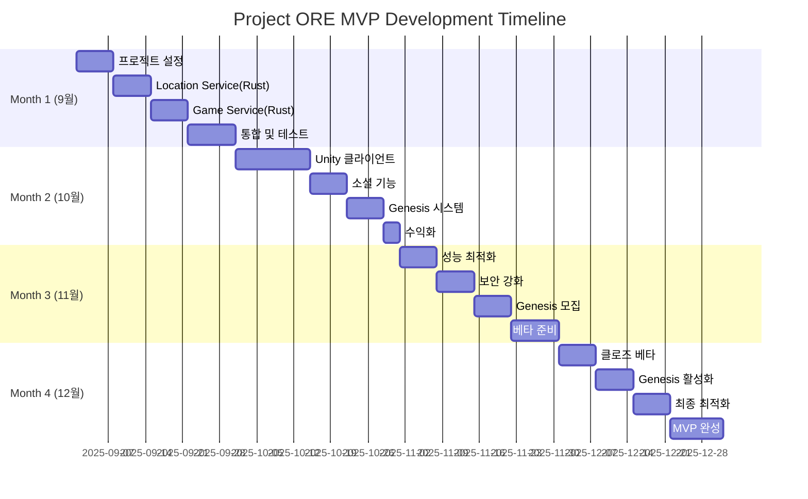
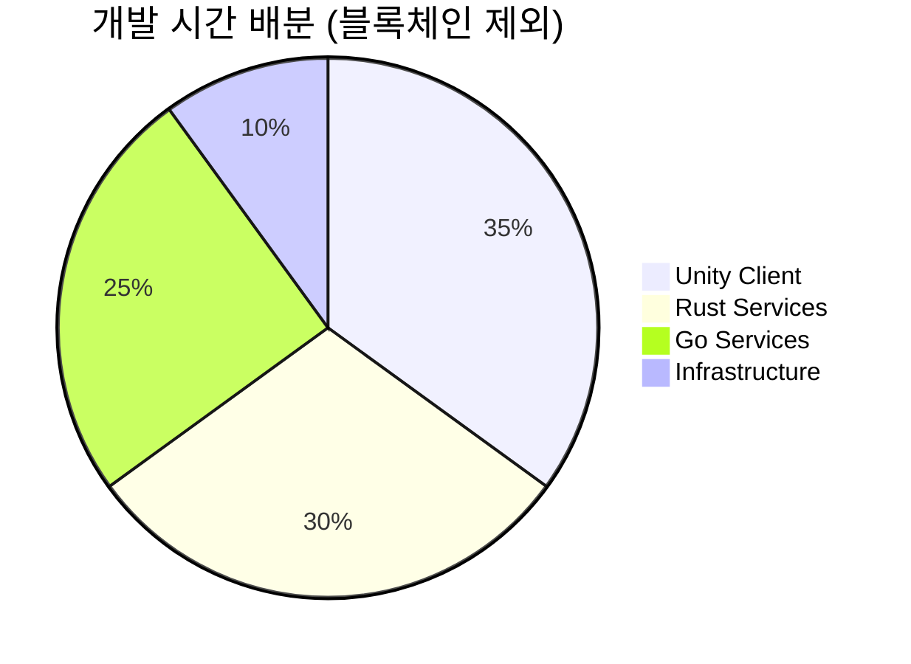

# Project ORE - MVP 개발 로드맵 v2.0

_Open Reality Engine: AI-Native 개발로 구현하는 확장 가능한 AR P2E 플랫폼_

## 📋 로드맵 개요

### 개발 기간 (수정)

- **시작**: 2025년 9월 1일
- **MVP 완성**: 2025년 12월 31일 (4개월)
- **Genesis 1000 베타**: 2026년 1월 초
- **블록체인 통합**: 2026년 Q1 (Post-MVP)

### 핵심 원칙

1. **Rust 우선 전략**: 성능 크리티컬 서비스는 처음부터 Rust (50%)
2. **Go 보완 전략**: 비즈니스 로직과 빠른 개발 (40%)
3. **확장 가능한 MVP**: 100만 사용자까지 재작성 없이 확장
4. **AI 도구 극대화**: Claude Code로 Rust 복잡도 극복
5. **블록체인 Post-MVP**: 게임 검증 후 토큰 이코노미 도입

### 기술 스택 배분

```yaml
개발 시간 할당:
  Unity Client (35%):
    - AR 기능
    - 게임 플레이
    - UI/UX

  Rust Services (30%): # 블록체인 서비스 제외
    - Location Service ⭐
    - Game Service ⭐
    - Realtime Engine

  Go Services (25%): # 시간 증가
    - API Gateway
    - Auth Service
    - Ad Service (오프체인)
    - Analytics Service

  Infrastructure (10%):
    - AWS Setup
    - CI/CD
    - Monitoring
```

### 개발 환경 및 도구

```yaml
개발 장비:
  - MacBook Pro M3 Max (64GB RAM)
  - iPhone 14 Pro (테스트)
  - Android Pixel 7 (테스트)

핵심 개발 도구:
  - Unity 2023.3 LTS
  - Rust 1.75+ (rustup, cargo)
  - Go 1.21+
  - Visual Studio Code + rust-analyzer
  - Docker Desktop

AI 도구 (필수):
  - Claude Code Pro: $200/월 (Rust 복잡 로직)
  - Cursor Pro: $20/월 (빠른 수정)
  - GitHub Copilot: $19/월 (자동완성)
  - ChatGPT Plus: $20/월 (문서화)

클라우드 서비스:
  - AWS (ECS Fargate, RDS, ElastiCache)
  - Mapbox (지도)
  - Firebase (인증, 푸시)
  # Polygon 제외 (Post-MVP로 이동)
```

## 🗓️ Month 1: 기반 구축 (9월)

### Week 1 (9/1-9/7): 프로젝트 초기화 및 기반 설정

#### Day 1-2: 프로젝트 구조 및 인프라

```yaml
작업 내용:
  Repository 설정:
    - GitHub 모노레포 생성
    - Rust + Go 하이브리드 구조
    - CI/CD 파이프라인 설정

  프로젝트 구조:
    ore-platform/
    ├── unity-client/         # Unity AR 클라이언트
    ├── backend/
    │   ├── services-rust/    # Rust 마이크로서비스
    │   │   ├── location/     # ⭐ 위치 처리 (성능 크리티컬)
    │   │   ├── game/        # ⭐ 게임 로직 (안정성 크리티컬)
    │   │   └── realtime/    # WebSocket 엔진
    │   ├── services-go/     # Go 마이크로서비스
    │   │   ├── gateway/     # API Gateway
    │   │   ├── auth/       # 인증 서비스
    │   │   ├── ad/         # 광고 서비스 (오프체인)
    │   │   └── analytics/  # 분석 서비스
    │   └── shared/         # 공통 코드 (protobuf 등)
    ├── infrastructure/     # Terraform, Docker
    └── docs/              # 문서

  AWS 인프라:
    - ECS Fargate 클러스터 생성
    - RDS PostgreSQL + PostGIS
    - ElastiCache Redis 클러스터
    - S3 버킷 설정

Claude Code 프롬프트:
  "Create hybrid Rust+Go monorepo for AR P2E platform:
  - Rust services for performance-critical components
  - Go services for business logic
  - Shared protobuf definitions
  - Docker Compose for local development
  - GitHub Actions CI/CD for both Rust and Go
  - AWS ECS Fargate deployment configs
  - Skip blockchain integration for MVP"

예상 산출물:
  ✓ 완전한 프로젝트 구조
  ✓ 로컬 개발 환경 작동
  ✓ AWS 기본 인프라 구축
  ✓ CI/CD 파이프라인 설정
```

#### Day 3-4: Unity 프로젝트 및 Rust 개발 환경

```yaml
Unity 프로젝트:
  - Unity 2023.3 LTS 프로젝트 생성
  - URP (Universal Render Pipeline) 설정
  - AR Foundation 5.1 패키지 설치
  - Mapbox SDK 통합
  - 기본 씬 구성 (로그인, 메인, AR)

Rust 개발 환경:
  - Cargo workspace 설정
  - 공통 의존성 정의 (tokio, axum, sqlx 등)
  - 테스트 환경 구성
  - 벤치마크 설정

Cursor 활용:
  - Unity UI 컴포넌트 빠른 생성
  - Rust 보일러플레이트 코드

체크포인트: ✓ Unity 프로젝트 빌드 성공
  ✓ Rust workspace 컴파일
  ✓ cargo test 통과
  ✓ 모바일 디바이스 테스트
```

#### Day 5-7: 백엔드 서비스 기초

```yaml
Go 서비스 (빠른 구현):
  API Gateway:
    - Fiber v2 프레임워크
    - 라우팅 설정
    - 미들웨어 (CORS, Logger)

  Auth Service:
    - JWT 토큰 발급/검증
    - 회원가입/로그인
    - 세션 관리 (Redis)

Rust 서비스 스켈레톤:
  Location Service:
    - Axum 웹 프레임워크
    - SQLx + PostgreSQL
    - 기본 API 구조

  Game Service:
    - 서비스 아키텍처
    - 데이터베이스 연결
    - 에러 처리 구조

Claude Code 프롬프트 (Rust): "Create Rust microservice foundation:
  - Axum web framework with Tower middleware
  - SQLx for PostgreSQL with compile-time checked queries
  - Tokio async runtime optimized settings
  - Structured error handling with thiserror
  - Tracing for structured logging
  - Service layer architecture pattern
  - Integration test setup"

주말 체크포인트: ✓ API Gateway 실행
  ✓ 인증 시스템 작동
  ✓ Rust 서비스 컴파일
  ✓ Docker Compose 전체 실행
```

### Week 2 (9/8-9/14): 위치 시스템 구현 (Rust 핵심)

#### Day 8-10: Location Service (Rust) ⭐

```yaml
작업 내용:
  핵심 기능 구현:
    - S2 Geometry 통합 (s2 crate)
    - PostGIS 공간 쿼리 (SQLx)
    - R-tree 공간 인덱싱
    - GPS 데이터 스트림 처리

  성능 최적화:
    - Zero-copy 데이터 처리
    - Lock-free 동시성 업데이트
    - 배치 처리 최적화
    - 캐싱 전략 (Redis)

  위치 검증:
    - 속도 체크 (비현실적 이동 감지)
    - 지그재그 패턴 감지
    - GPS 스푸핑 방지

Claude Code 프롬프트: "Implement high-performance Rust location service:
  - S2 geometry for hierarchical spatial indexing
  - R-tree for efficient nearest neighbor queries
  - PostGIS integration with SQLx for spatial queries
  - Zero-copy GPS data processing pipeline
  - Lock-free concurrent location updates
  - Batch processing for 100K updates/second
  - Location validation and anti-spoofing
  - Redis caching layer
  Include comprehensive benchmarks and property-based tests"

성능 목표:
  - 초당 10만 위치 업데이트 처리
  - P95 쿼리 응답 < 10ms
  - 메모리 사용 < 500MB
  - Zero GC pause

산출물: ✓ Location Service API 완성
  ✓ S2 Cell 기반 인덱싱
  ✓ 위치 검증 시스템
  ✓ 벤치마크 테스트 통과
```

#### Day 11-12: Unity GPS 통합 및 지도

```yaml
Unity 작업:
  위치 추적:
    - Unity Location Service API
    - GPS 필터링 (칼만 필터)
    - 배터리 최적화 설정

  Mapbox 통합:
    - 지도 렌더링
    - 현재 위치 마커
    - 줌/패닝 컨트롤

  서버 연동:
    - RestSharp HTTP 클라이언트
    - Location API 연동
    - 위치 업데이트 전송

체크포인트: ✓ 실시간 GPS 추적
  ✓ 지도에 위치 표시
  ✓ Rust Location Service 연동
  ✓ 5초 간격 위치 업데이트
```

#### Day 13-14: 코인 스폰 시스템

```yaml
Location Service 확장:
  코인 스폰:
    - S2 Cell 기반 분포
    - 밀도 기반 스폰 알고리즘
    - 시간대별 변화
    - 레어리티 시스템

  API 엔드포인트:
    - GET /coins/nearby
    - POST /coins/spawn
    - DELETE /coins/expire

Unity 통합:
  - 코인 마커 표시
  - 거리 계산
  - 수집 가능 영역 표시

주말 마일스톤: ✓ 위치 기반 코인 스폰
  ✓ 100m 반경 코인 조회
  ✓ 실시간 코인 업데이트
  ✓ 기본 수집 메커닉
```

### Week 3 (9/15-9/21): Game Service & 실시간 엔진 (Rust)

#### Day 15-17: Game Service (Rust) ⭐

```yaml
핵심 게임 로직:
  코인 수집:
    - 트랜잭션 처리 (ACID)
    - 멱등성 보장
    - 동시성 제어
    - 거리 검증 (10m)

  게임 시스템:
    - 곡괭이 시스템 (3종)
    - 효율 계산 (1x/1.5x/2x)
    - 경험치/레벨 관리
    - 포인트 시스템 # 토큰 대신 포인트

  퀘스트 시스템:
    - 일일 퀘스트 3종
    - 진행 상황 추적
    - 보상 처리
    - State Machine

Claude Code 프롬프트: "Build Rust game service with compile-time safety:
  - Actor model for game entities (actix)
  - Idempotent coin collection transactions
  - State machine for quest progression
  - ACID guarantees with SQLx transactions
  - Event sourcing for game events
  - Fearless concurrency patterns
  - No data races, no memory leaks
  - Property-based testing with proptest
  - Load testing for 10K TPS"

안정성 목표:
  - 0 동시성 버그 (컴파일 타임 보장)
  - 0 아이템 복제 버그
  - 100% 데이터 무결성
  - 초당 1만 트랜잭션 처리

산출물: ✓ Game Service API 완성
  ✓ 코인 수집 트랜잭션
  ✓ 게임 메커닉 구현
  ✓ 퀘스트 시스템 작동
```

#### Day 18-19: Realtime Engine (Rust)

```yaml
WebSocket 서버:
  기술 스택:
    - Tokio + Axum
    - tungstenite (WebSocket)
    - Binary protocol (MessagePack)

  핵심 기능:
    - 연결 관리
    - Room 시스템 (S2 Cell 기반)
    - 위치 브로드캐스팅
    - 이벤트 전파

  최적화:
    - Zero-copy 메시지 전달
    - Lock-free 데이터 구조
    - 메시지 압축 (zstd)
    - 배치 처리

성능 목표:
  - 10,000 동시접속 지원
  - P99 레이턴시 < 50ms
  - 메모리 < 1GB (10K 연결)

체크포인트: ✓ WebSocket 서버 작동
  ✓ 1,000 동시접속 테스트
  ✓ Unity 클라이언트 연동
```

#### Day 20-21: AR Foundation 통합

```yaml
Unity AR 구현:
  AR 초기화:
    - AR Session 구성
    - 카메라 권한 처리
    - 평면 감지 설정

  AR 코인 렌더링:
    - 3D 모델 임포트
    - LOD 시스템 (3단계)
    - AR 공간 배치
    - 오클루전 처리

  인터랙션:
    - 터치 레이캐스팅
    - 수집 애니메이션
    - 파티클 효과
    - 사운드 효과

Week 3 완료: ✓ Rust 핵심 서비스 완성
  ✓ 실시간 엔진 작동
  ✓ AR 기능 구현
  ✓ 멀티플레이어 동기화
```

### Week 4 (9/22-9/30): 통합 및 최적화

#### Day 22-24: Go 비즈니스 서비스 완성

```yaml
Ad Service (Go) - 오프체인:
  광고 시스템:
    - 캠페인 CRUD API
    - 지역 타겟팅 (S2 Cell)
    - 매칭 알고리즘
    - 성과 추적
    - 크레딧 시스템 (포인트 기반)

  광고 코인:
    - 광고 코인 생성
    - 수집 시 광고 표시
    - CPC 계산

Analytics Service (Go):
  데이터 수집:
    - 이벤트 트래킹
    - 실시간 집계
    - 사용자 행동 분석

  리포팅:
    - 대시보드 API
    - 메트릭 계산
    - A/B 테스트 지원

Go 장점 활용:
  - 빠른 개발 속도
  - 풍부한 라이브러리
  - 간단한 비즈니스 로직
```

#### Day 25-26: 서비스 통합 및 Service Mesh

```yaml
Service Mesh 구성:
  AWS App Mesh:
    - Envoy 프록시 설정
    - 서비스 디스커버리
    - 로드 밸런싱
    - Circuit Breaker

  서비스 간 통신:
    - gRPC (Rust ↔ Go)
    - Protobuf 정의
    - 헬스 체크

  모니터링:
    - Prometheus 메트릭
    - Jaeger 분산 추적
    - CloudWatch 통합
```

#### Day 27-30: 월말 부하 테스트

```yaml
성능 테스트:
  Location Service (Rust):
    - 10만 req/s 처리
    - P95 < 10ms
    - 메모리 < 500MB

  Game Service (Rust):
    - 1만 TPS 처리
    - 0 동시성 에러
    - 데이터 일관성 100%

  전체 시스템:
    - 1,000 동시접속 안정
    - 10,000 부하 테스트
    - 99.9% 가동률

Month 1 완료: ✓ Rust 핵심 서비스 완성
  ✓ Go 비즈니스 서비스 구현
  ✓ Unity 클라이언트 작동
  ✓ 기본 게임 루프 완성
  ✓ AR 기능 구현
```

## 📈 Month 2: 핵심 기능 완성 (10월)

### Week 5 (10/1-10/7): Unity 클라이언트 심화

#### Day 31-33: Unity 게임플레이 구현

```yaml
게임 메커닉:
  - 코인 수집 시스템
  - 곡괭이 사용
  - 퀘스트 진행
  - 레벨업 시스템

Claude Code 활용: "Create Unity AR coin collection gameplay:
  - Touch interaction with raycasting
  - Collection animations with DOTween
  - Particle effects and sound
  - Server synchronization
  - Offline mode support"
```

#### Day 34-35: 광고주 대시보드 (웹)

```yaml
Next.js 대시보드:
  기능:
    - 캠페인 생성/관리
    - 예산 설정 (크레딧)
    - 타겟팅 설정
    - 실시간 분석

  통합:
    - Go Ad Service API
    - 결제 게이트웨이
    - 실시간 업데이트

주말 체크포인트: ✓ 게임플레이 완성
  ✓ 광고주 포털 MVP
```

### Week 6 (10/8-10/14): 소셜 기능 및 리더보드

#### Day 36-38: 소셜 시스템 구현

```yaml
친구 시스템:
  기능:
    - 친구 추가/삭제
    - 친구 목록 관리
    - 위치 공유 (선택적)
    - 온라인 상태

  채팅:
    - 전체 채팅
    - 친구 1:1 채팅
    - 이모티콘 지원
    - 메시지 히스토리

Unity UI:
  - 친구 목록 화면
  - 채팅 인터페이스
  - 프로필 보기
```

#### Day 39-40: 리더보드 시스템

```yaml
순위 시스템:
  Redis 구현:
    - Sorted Set 활용
    - 일간/주간/전체 순위
    - 실시간 업데이트
    - 효율적 페이징

  Unity 표시:
    - 리더보드 UI
    - 순위 애니메이션
    - 내 순위 하이라이트
    - 무한 스크롤
```

#### Day 41-42: UI/UX 폴리싱

```yaml
UI 개선:
  화면 전환:
    - 로딩 화면
    - 전환 애니메이션
    - 에러 처리

  사용자 경험:
    - 튜토리얼 플로우
    - 툴팁 시스템
    - 피드백 애니메이션
    - 햅틱 피드백
```

### Week 7 (10/15-10/21): Genesis 1000 시스템

#### Day 43-45: Genesis 시스템 구현

```yaml
Genesis 기능:
  신청 시스템:
    - 신청 페이지 (웹)
    - Discord OAuth
    - Twitter 연동
    - 점수 계산 알고리즘

  독점 혜택:
    - 2x 포인트 보너스
    - 독점 뱃지/타이틀
    - 우선 지원 채널
    - 미래 토큰 에어드롭 자격 (3%)

  관리 도구:
    - 멤버 관리
    - 활동 추적
    - 혜택 관리

Claude Code 활용: "Implement Genesis 1000 system:
  - Member application workflow
  - Scoring algorithm for selection
  - Discord/Twitter OAuth integration
  - Benefit management system
  - Admin dashboard for management"
```

#### Day 46-47: Discord Bot 개발

```yaml
Discord 통합:
  Bot 기능:
    - OAuth 인증
    - 역할 자동 부여
    - 활동 추적
    - 알림 시스템

  커맨드:
    - /verify (계정 연동)
    - /stats (게임 통계)
    - /leaderboard (순위)
    - /help (도움말)
```

#### Day 48-49: 커뮤니티 도구

```yaml
커뮤니티 관리:
  도구:
    - 피드백 수집 시스템
    - 버그 리포트
    - 제안 투표
    - 공지사항

Week 7 완료: ✓ Genesis 시스템 완성
  ✓ Discord 통합 완료
  ✓ 커뮤니티 도구 준비
```

### Week 8 (10/22-10/31): 수익화 및 분석

#### Day 50-52: 수익화 기능

```yaml
Unity Ads 통합:
  광고 타입:
    - 보상형 광고 (2x 부스터)
    - 전면 광고 (레벨업 시)
    - 배너 광고 (선택적)

포인트 시스템: # IAP 대신
  상품:
    - 포인트 패키지
    - 에너지 리필
    - 프리미엄 아이템
    - VIP 멤버십 ($9.99/월)

  결제:
    - Stripe/PayPal 통합
    - 영수증 검증
    - 복구 시스템
```

#### Day 53-54: Analytics 통합

```yaml
분석 시스템:
  Unity Analytics:
    - 기본 이벤트
    - 커스텀 이벤트
    - Funnel 분석
    - 리텐션 추적

  커스텀 메트릭:
    - 코인 수집률
    - 이동 거리
    - 플레이 시간
    - 광고 CTR
```

#### Day 55-60: 월말 최적화

```yaml
성능 최적화:
  Unity:
    - 텍스처 압축
    - 드로우콜 최적화
    - 오브젝트 풀링
    - LOD 설정

  서버:
    - 쿼리 최적화
    - 캐싱 전략
    - 인덱스 튜닝

Month 2 완료: ✓ Unity 클라이언트 완성
  ✓ 광고 시스템 완성 (오프체인)
  ✓ 소셜 기능 구현
  ✓ Genesis 시스템 준비
  ✓ 수익화 통합
```

## 🚀 Month 3: 최적화 및 테스트 (11월)

### Week 9 (11/1-11/7): 성능 최적화 및 부하 테스트

#### Day 61-63: 대규모 부하 테스트

```yaml
테스트 시나리오:
  K6 스크립트:
    - 점진적 부하 증가
    - 스파이크 테스트
    - 장시간 안정성

  테스트 목표:
    - 1,000 동시접속 (실제)
    - 10,000 동시접속 (스트레스)
    - 100,000 req/s (Location)
    - 10,000 TPS (Game)

  병목 현상 해결:
    - 데이터베이스 연결 풀
    - 캐싱 히트율 개선
    - API 응답 최적화
```

#### Day 64-65: Unity 클라이언트 최적화

```yaml
모바일 최적화:
  성능:
    - 60 FPS (고사양)
    - 30 FPS (저사양)
    - 메모리 < 500MB

  배터리:
    - GPS 최적화
    - 렌더링 최적화
    - 네트워크 배칭
    - < 10%/시간

  앱 크기:
    - 에셋 압축
    - 코드 스트리핑
    - < 200MB
```

#### Day 66-67: 서버 Auto-scaling

```yaml
ECS Fargate 설정:
  Auto-scaling:
    - Target Tracking
    - CPU/Memory 기반
    - 예측 스케일링

  Fargate Spot:
    - 70% 비용 절감
    - 혼합 전략
    - 안정성 보장

  모니터링:
    - CloudWatch 대시보드
    - X-Ray 추적
    - 알람 설정
```

### Week 10 (11/8-11/14): 보안 강화 및 안정성

#### Day 68-70: 보안 구현

```yaml
API 보안:
  - Rate Limiting (분당 60)
  - JWT 토큰 검증
  - API Key 관리
  - CORS 정책

위치 보안:
  - GPS 스푸핑 감지
  - 속도 검증
  - 패턴 분석
  - ML 기반 탐지

데이터 보안:
  - 암호화 (전송/저장)
  - GDPR 준수
  - 개인정보 처리
```

#### Day 71-72: 안정성 개선

```yaml
에러 처리:
  - Graceful Degradation
  - Circuit Breaker
  - 재시도 로직
  - 폴백 메커니즘

오프라인 모드:
  - 로컬 캐싱
  - 동기화 큐
  - 충돌 해결
```

#### Day 73-74: 백업 및 복구

```yaml
백업 전략:
  - RDS 자동 백업
  - S3 크로스 리전 복제
  - 스냅샷 스케줄

복구 테스트:
  - RTO < 1시간
  - RPO < 5분
  - 복구 시뮬레이션
```

### Week 11 (11/15-11/21): Genesis 1000 준비

#### Day 75-77: 마케팅 자료 준비

```yaml
홍보 자료:
  랜딩 페이지:
    - 게임 소개
    - Genesis 혜택
    - 신청 방법

  프로모션 비디오:
    - 게임플레이 영상
    - AR 기능 시연
    - 혜택 소개

  소셜 미디어:
    - Twitter 캠페인
    - Discord 서버
    - 인플루언서 협업
```

#### Day 78-79: Genesis 모집 시작

```yaml
모집 프로세스:
  신청:
    - 신청서 오픈
    - 자격 확인
    - 점수 계산

  홍보:
    - 소셜 미디어
    - 커뮤니티 포럼
    - 크립토 미디어
```

#### Day 80-81: 선발 및 온보딩

```yaml
선발 과정:
  - 상위 1000명 선정
  - 합격 통지
  - 대기자 리스트

온보딩:
  - 환영 이메일
  - Discord 역할 부여
  - 튜토리얼 제공
  - 독점 혜택 활성화
```

### Week 12 (11/22-11/30): 베타 준비

#### Day 82-84: 베타 배포 준비

```yaml
앱 준비:
  iOS:
    - TestFlight 준비
    - 앱 스토어 메타데이터
    - 스크린샷 준비

  Android:
    - Play Console 설정
    - APK/AAB 빌드
    - 내부 테스트 트랙

서버 준비:
  - 프로덕션 환경 설정
  - 모니터링 강화
  - 핫픽스 프로세스
```

#### Day 85-87: 내부 테스트

```yaml
테스트:
  - 전체 기능 테스트
  - 엣지 케이스 확인
  - 성능 검증
  - 보안 점검

피드백:
  - 내부 팀 피드백
  - 버그 수정
  - UI/UX 개선
```

#### Day 88-90: 최종 점검

```yaml
체크리스트:
  기술: ✓ 99.9% 가동률
    ✓ 1,000 동시접속 안정
    ✓ 모든 기능 작동

  콘텐츠: ✓ 튜토리얼 완성
    ✓ 게임 밸런스
    ✓ 광고 캠페인 준비

  준비: ✓ 고객 지원 준비
    ✓ 커뮤니티 관리
    ✓ 응급 대응 계획
```

## 🎆 Month 4: 마무리 및 출시 (12월)

### Week 13 (12/1-12/7): 클로즈 베타

#### Day 91-93: 소규모 베타 테스트

```yaml
베타 테스터:
  - 50-100명 선발
  - NDA 서명
  - 테스트 가이드 제공

피드백 수집:
  - 일일 서베이
  - 버그 리포트
  - 개선 제안
```

#### Day 94-96: 긴급 수정

```yaml
우선순위:
  - Critical 버그
  - 성능 이슈
  - UX 개선
  - 밸런스 조정
```

### Week 14 (12/8-12/14): Genesis 1000 활성화

#### Day 97-99: Genesis 멤버 초대

```yaml
초대 프로세스:
  - 베타 액세스 제공
  - 특별 혜택 활성화
  - Discord 활동 시작
  - 피드백 채널 오픈
```

#### Day 100-102: 커뮤니티 이벤트

```yaml
이벤트:
  - 런칭 카운트다운
  - AMA 세션
  - 미니 대회
  - 보상 이벤트
```

### Week 15 (12/15-12/21): 최종 최적화

#### Day 103-105: 성능 튜닝

```yaml
최종 최적화:
  - 서버 캐싱
  - DB 인덱싱
  - CDN 설정
  - 로드 밸런싱
```

#### Day 106-108: 문서화

```yaml
문서 작성:
  - API 문서
  - 운영 가이드
  - 유저 가이드
  - FAQ
```

### Week 16 (12/22-12/31): MVP 완성

#### Day 109-111: 최종 테스트

```yaml
종합 테스트:
  - End-to-End 테스트
  - 스트레스 테스트
  - 보안 감사
  - 규정 준수 확인
```

#### Day 112-115: 런칭 준비

```yaml
런칭 체크리스트: ✓ 서버 안정성 확인
  ✓ 앱 스토어 제출 준비
  ✓ 마케팅 자료 완성
  ✓ 지원 팀 준비
  ✓ 모니터링 대시보드
```

#### Day 116-120: MVP 완성 및 2026 준비

```yaml
최종 상태:
  기술: ✓ Unity AR 게임 완성
    ✓ Rust 서비스 3개 (Location, Game, Realtime)
    ✓ Go 서비스 4개 (Gateway, Auth, Ad, Analytics)
    ✓ 1,000 동시접속 실운영
    ✓ 10,000 동시접속 테스트 통과

  비즈니스: ✓ Genesis 1000 활성화
    ✓ 광고주 10개 확보
    ✓ 포인트 경제 시스템 작동

  준비: ✓ 2026년 1월 베타 런칭 준비
    ✓ 블록체인 통합 계획 수립
    ✓ 투자자 데모 준비
```

## 📊 주요 마일스톤 체크리스트

### 월별 핵심 산출물



### 기술 스택별 개발 시간



### 주차별 성공 지표

```yaml
Week 4 (9월 말): ✓ 기본 게임 루프 완성
  ✓ Rust 핵심 서비스 작동
  ✓ 100 동시접속 테스트
  ✓ 내부 알파 테스트

Week 8 (10월 말): ✓ 모든 기능 구현 완료
  ✓ 1,000 동시접속 안정
  ✓ Genesis 시스템 준비
  ✓ 클로즈 베타 준비

Week 12 (11월 말): ✓ Genesis 1000 모집 완료
  ✓ 10,000 부하 테스트 통과
  ✓ 베타 빌드 준비

Week 16 (12월 말): ✓ MVP 완성
  ✓ DAU 목표 달성 준비
  ✓ 2026년 런칭 준비 완료
```

## 🛠️ AI 도구 활용 전략

### Claude Code 활용 (Rust 중심)

```yaml
주요 용도:
  Rust 서비스:
    - Location Service 전체 구현
    - Game Service 복잡 로직
    - 동시성 패턴 구현
    - 성능 최적화 코드

  복잡한 알고리즘:
    - S2 Geometry 구현
    - 매칭 알고리즘
    - GPS 스푸핑 방어

예상 생산성: 10x (특히 Rust)
월 비용: $200
```

### Cursor 활용

```yaml
주요 용도:
  - 빠른 코드 수정
  - UI 컴포넌트 생성
  - 버그 수정
  - 리팩토링

예상 생산성: 5x
월 비용: $20
```

### GitHub Copilot

```yaml
주요 용도:
  - 자동 완성
  - 보일러플레이트
  - 테스트 코드
  - 문서화

예상 생산성: 2x
월 비용: $19
```

## 💰 MVP 개발 예산 (4개월)

### 총 예산

```yaml
개발 비용:
  인건비:
    - CTO: $0 (지분)
    - 프리랜서 (필요시): $5,000

  AI 도구:
    - Claude Code: $200 × 4 = $800
    - Cursor: $20 × 4 = $80
    - Copilot: $19 × 4 = $76
    - ChatGPT: $20 × 4 = $80
    소계: $1,036

인프라:
  AWS:
    - 개발/테스트: $300 × 4 = $1,200
    - 프로덕션: $500 × 1 = $500

  기타 서비스:
    - Mapbox: $0 (무료 티어)
    - Firebase: $0 (무료 티어)
    - 도메인/SSL: $100
    소계: $1,800

마케팅:
  - Genesis 캠페인: $3,000
  - 인플루언서: $2,000
  - 광고: $2,000
  소계: $7,000

총 예산: ~$15,000
```

## ⚠️ 리스크 관리

### 기술적 리스크

```yaml
Rust 학습 곡선:
  위험도: 중간
  대응: Claude Code 적극 활용, 컴파일러 의존

AR 성능:
  위험도: 높음
  대응: LOD 시스템, 단계적 품질 설정

GPS 정확도:
  위험도: 중간
  대응: 필터링, 다중 소스 활용

스케일링:
  위험도: 낮음 (MVP)
  대응: Fargate 자동 확장, 캐싱
```

### 일정 리스크

```yaml
주요 지연 포인트:
  Week 2: Rust Location Service
    → Claude Code로 가속화

  Week 3: Game Service 동시성
    → Rust 컴파일러 활용

  Week 7: Genesis 시스템
    → 필수 기능만 구현

대응 전략:
  - 주 단위 스프린트
  - 매주 금요일 검토
  - 우선순위 유연 조정
  - 프리랜서 백업 준비
```

## 🎯 최종 목표 (12월 31일)

### 기술적 달성

```yaml
✓ Unity AR 게임 완성
✓ Rust 서비스 3개 (안정성 100%)
✓ Go 서비스 4개 (비즈니스 로직)
✓ 포인트 시스템 완성 (블록체인 준비)
✓ 1,000 동시접속 실운영
✓ 10,000 동시접속 테스트 통과
```

### 비즈니스 달성

```yaml
✓ Genesis 1000 활성화
✓ DAU 목표 설정 (500명)
✓ 광고주 10개 확보
✓ 포인트 경제 검증
✓ 투자 데모 준비 완료
```

### 제품 달성

```yaml
✓ 완전한 게임 루프
✓ AR 코인 수집 작동
✓ 광고 시스템 검증 (오프체인)
✓ 소셜 기능 구현
✓ D7 리텐션 목표 설정
✓ 버그 없는 경제 시스템
```

## 📝 Day 1 실행 계획

### 9월 1일 즉시 시작

```bash
# 1. 프로젝트 생성
mkdir ore-platform && cd ore-platform
git init

# 2. Rust + Go 구조 생성
mkdir -p backend/services-rust/{location,game,realtime}
mkdir -p backend/services-go/{gateway,auth,ad,analytics}
mkdir unity-client infrastructure docs

# 3. Rust workspace 설정
cat > Cargo.toml << EOF
[workspace]
members = [
    "backend/services-rust/location",
    "backend/services-rust/game",
    "backend/services-rust/realtime",
]
EOF

# 4. Docker Compose 설정
touch docker-compose.yml

# 5. Claude Code 첫 프롬프트
"Create Rust+Go hybrid monorepo structure for AR game platform..."

# 6. 첫 커밋
git add . && git commit -m "Initial project structure - MVP without blockchain"
```

---

**"Build Fast with Go, Build Right with Rust, Scale Forever"**

이 로드맵은 4개월 동안 블록체인 없이도 완전한 AR P2E 게임을 만들고, 2026년에 토큰 이코노미를 추가할 준비를 완료합니다.

