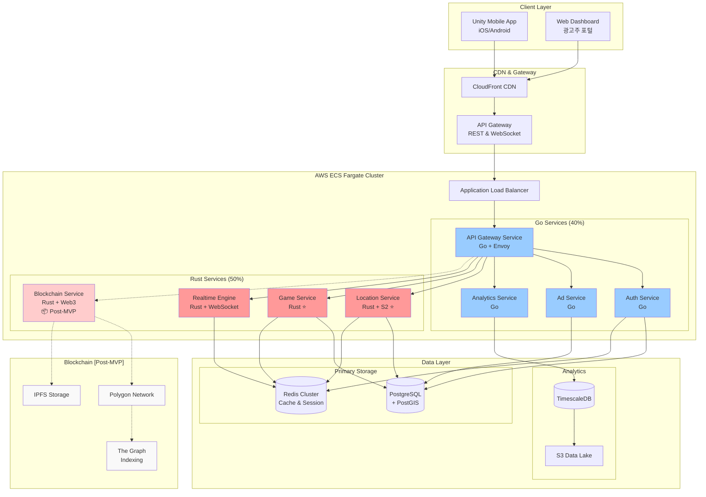
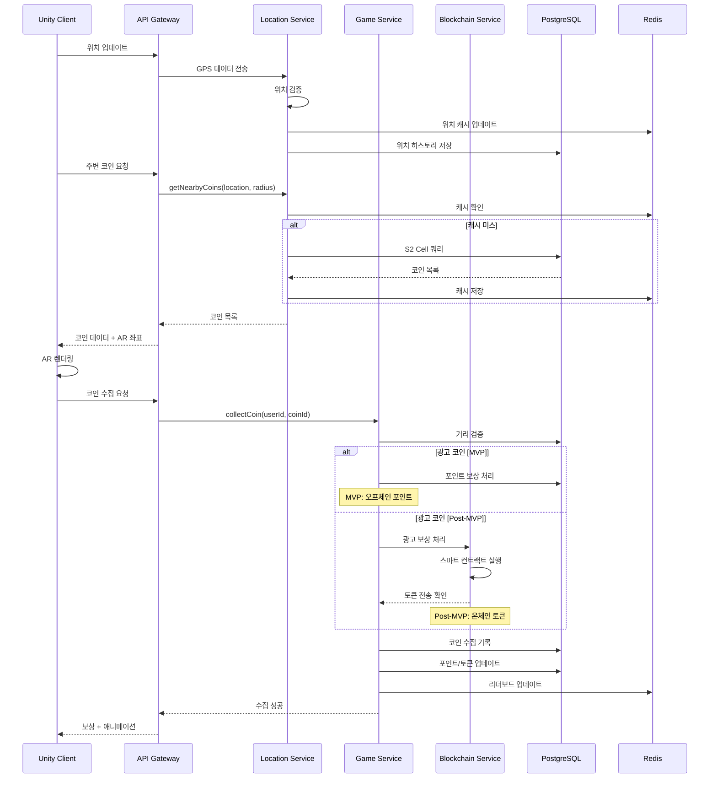
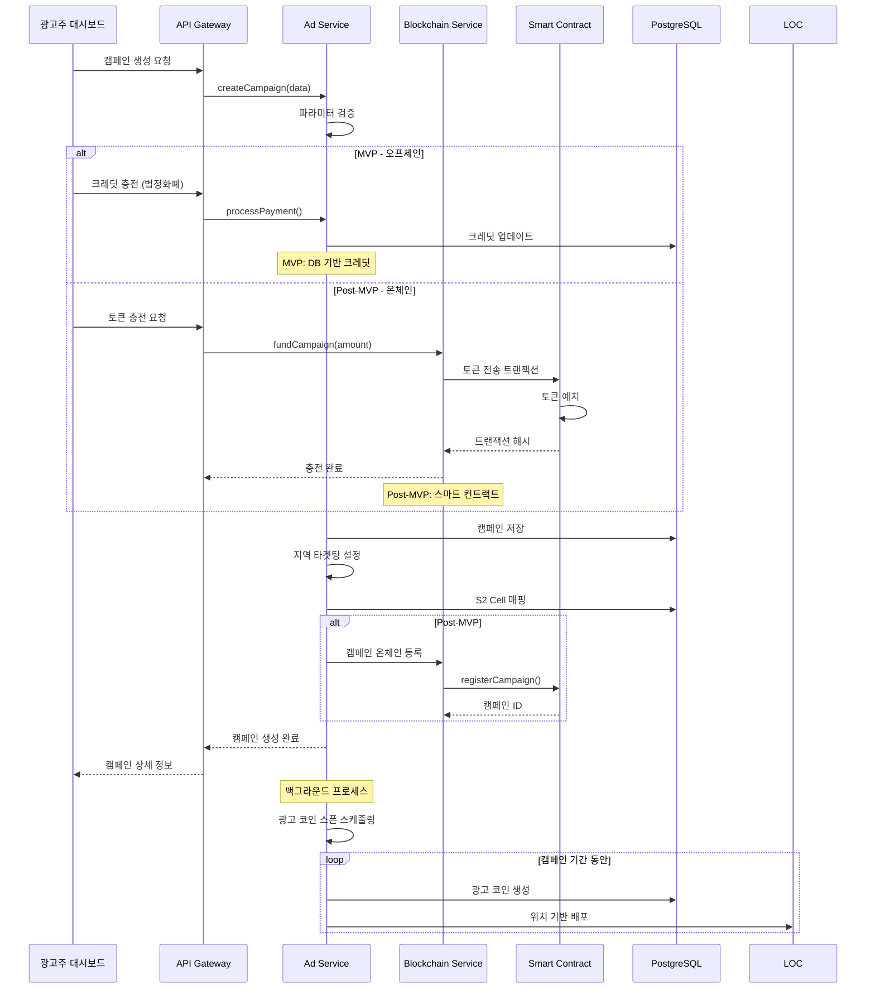
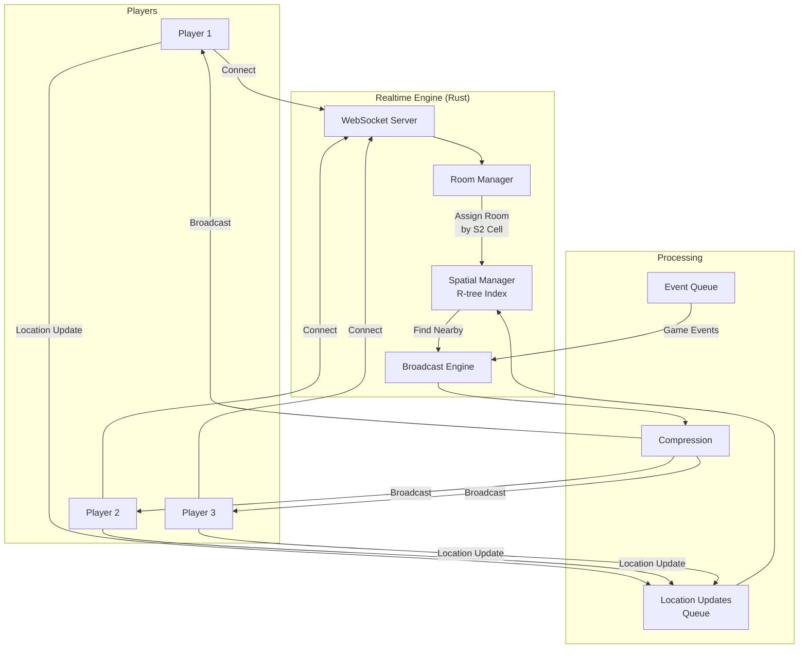
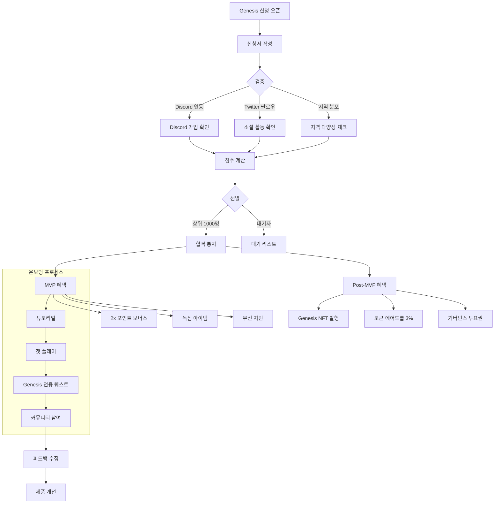
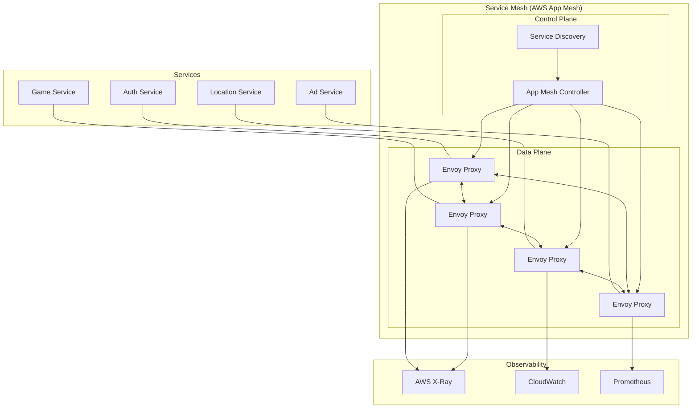

# Project ORE - MVP 정의서 (MVP & Post-MVP 통합)

_Open Reality Engine: 확장 가능한 AR P2E 광고 플랫폼_

## 📌 개발 단계 구분

```yaml
MVP Phase (2025 Q4 - 16주):
  목표: 게임 핵심 검증 및 커뮤니티 구축
  범위:
    - 완전한 게임 루프
    - 포인트 기반 경제
    - 오프체인 광고 시스템
    - Genesis 1000 커뮤니티

Post-MVP Phase (2026 Q1):
  목표: 블록체인 통합 및 토큰 이코노미
  범위:
    - 스마트 컨트랙트 배포
    - 토큰 발행 및 에어드롭
    - 온체인 광고 시스템
    - NFT 아이템

전략적 이유:
  - 게임의 재미를 먼저 검증
  - 초기 개발 비용 절감 (약 5,400만원)
  - 규제 리스크 회피
  - 사용자 데이터 기반 토큰 설계
```

## 1. MVP 비전 및 목표

### 1.1 프로젝트 비전

**"현실을 게임으로, 광고를 투명하게, 보상을 공정하게"**

- 최초의 온체인 광고 DApp과 AR 게임의 완벽한 융합
- 100만 동시접속을 처리할 수 있는 확장 가능한 아키텍처
- 사용자, 광고주, 플랫폼 모두가 Win-Win하는 생태계

### 1.2 MVP 핵심 목표

```yaml
기술적 목표:
  실제 운영:
    - 1,000 동시접속 안정적 처리
    - Genesis 1000의 피크 타임 대응
    - 예상 동시접속: 200-300명

  미래 대비:
    - 10,000 동시접속 부하 테스트 통과
    - 바이럴 성장 시 즉시 확장 가능
    - 인프라 여유율 5-10배 확보

  성능 목표:
    - API 응답속도 < 100ms (P95)
    - 99.9% 가동률
    - 스마트 컨트랙트 기반 광고 시스템 POC [Post-MVP]

비즈니스 목표:
  Genesis 1000:
    - 총 멤버: 1,000명
    - DAU: 500명 (50% 활성률)
    - 피크 동시접속: 200-300명
    - D7 리텐션: 70% 이상

  성장 지표:
    - 초기 광고주: 10개
    - 일일 광고 노출: 10,000회
    - 월간 거래량:
      * MVP: 1억 포인트
      * Post-MVP: $10,000 토큰

제품 목표:
  - 완전한 게임 루프 구현
  - AR 코인 수집 메커닉
  - 광고 시스템:
    * MVP: 오프체인 포인트
    * Post-MVP: 온체인 토큰
  - 소셜 기능 (리더보드, 친구)
```

## 2. MVP 핵심 기능 정의

### 2.1 필수 기능 (Must Have)

#### 🎮 게임 코어 시스템 [MVP]

```yaml
위치 기반 게임플레이:
  - GPS 실시간 추적 (5초 간격 업데이트)
  - S2 Geometry 기반 효율적 공간 인덱싱
  - 100m 반경 내 코인 실시간 스폰
  - 거리 기반 수집 검증 (10m 이내)
  - 일일 이동거리 추적

AR 시스템:
  - AR Foundation 6.0+ 기반 구현
  - 3D 코인 모델 렌더링 (LOD 3단계)
  - 평면 인식 및 오클루전 처리
  - 터치 인터랙션 (레이캐스팅)
  - AR/Map 모드 즉시 전환

게임 메커닉:
  - 코인 수집 시스템 (일반/레어/에픽)
  - 곡괭이 3종 (나무/돌/철) - 효율 1x/1.5x/2x
  - 포인트 시스템 (MVP) → 토큰 전환 (Post-MVP)
  - 일일 퀘스트 3종
  - 경험치 & 레벨 시스템 (1-50)
  - 리더보드 (일간/주간/전체)
```

#### 💰 광고 & 수익화 시스템

```yaml
MVP - 오프체인 광고 시스템:
  - DB 기반 광고 캠페인 관리
  - 광고주 크레딧 충전 (결제 게이트웨이)
  - 사용자 광고 코인 수집 → 포인트 보상
  - 10% 플랫폼 수수료
  - 투명한 광고 집행 리포트

Post-MVP - 온체인 광고 시스템:
  - 스마트 컨트랙트 기반 광고 캠페인
  - 광고주 토큰 예치 → 캠페인 생성
  - 사용자 광고 코인 수집 → 토큰 보상
  - 10% 플랫폼 수수료 자동 징수
  - 블록체인 기반 투명성

광고주 대시보드:
  - 셀프서브 캠페인 생성
  - 지역 타겟팅 (S2 Cell 기반)
  - 실시간 성과 추적
  - 예산 관리 및 충전
  - 상세 분석 리포트

수익화 기능:
  - 보상형 광고 (2x 부스터)
  - 프리미엄 아이템 판매
  - VIP 멤버십 ($9.99/월)
  - 에너지 시스템 (시간당 10 회복)
```

#### 👥 소셜 & 커뮤니티 [MVP]

```yaml
Genesis 1000 시스템:
  - 전용 뱃지 및 타이틀
  - 2x 포인트 보너스
  - 독점 아이템 접근
  - 우선 지원 채널
  - 토큰 에어드롭 자격 (3%) [Post-MVP]

소셜 기능:
  - 프로필 시스템
  - 친구 추가/관리
  - 친구 위치 공유 (선택적)
  - 추천 시스템 (보상 포함)
  - 기본 채팅 (전체/친구)
```

### 2.2 추후 구현 (Nice to Have)

```yaml
Phase 2 (Post-MVP):
  - 길드 시스템
  - PvP 배틀
  - NFT 아이템
  - 복잡한 토큰 이코노미
  - 메타버스 통합
  - 고급 AR 효과
  - 실시간 이벤트
```

## 3. 기술 스택 상세 정의

### 3.1 프론트엔드 (Unity 클라이언트) [MVP]

#### 핵심 기술 스택

```yaml
Game Engine:
  - Unity 6.0 LTS
  - Universal Render Pipeline (URP)
  - IL2CPP 빌드

AR Framework:
  - AR Foundation 6.0+
  - ARCore (Android) / ARKit (iOS)
  - AR Occlusion Manager

Maps & Location:
  - Online Maps v4.2.1 (Unity Asset Store, $120)
  - Unity Location Service
  - GPS 필터링 (Kalman Filter with ScriptableObject config)

Networking:
  - RestSharp (REST API)
  - NativeWebSocket (실시간)
  - Mirror Networking (P2P)

UI/UX:
  - UI Toolkit (신규 UI)
  - TextMeshPro
  - DOTween Pro (애니메이션)

Performance:
  - Addressables (에셋 관리)
  - Unity Profiler
  - Frame Timing Manager
```

#### Unity 프로젝트 구조

```
Assets/
├── _Project/
│   ├── Scripts/
│   │   ├── Core/           # 싱글톤, 매니저
│   │   ├── Gameplay/       # 게임 로직
│   │   ├── AR/            # AR 관련
│   │   ├── Networking/    # API 통신
│   │   ├── UI/            # UI 컨트롤러
│   │   └── Utils/         # 유틸리티
│   ├── Prefabs/
│   ├── Materials/
│   ├── Models/
│   ├── Animations/
│   └── Resources/
├── Plugins/
│   ├── OnlineMaps/
│   ├── RestSharp/
│   └── WebSocket/
└── StreamingAssets/
```

### 3.2 백엔드 (마이크로서비스)

#### 핵심 기술 스택

```yaml
Primary Language: Go (40%)
  사용 영역:
    - API Gateway [MVP]
    - Auth Service [MVP]
    - Ad Service [MVP]
    - Analytics Service [MVP]
  선택 이유:
    - I/O bound 작업에 최적
    - 빠른 개발 속도
    - 풍부한 웹 생태계
    - 간단한 배포

Core Performance: Rust (50%)
  사용 영역:
    - Location Service (성능 크리티컬) ⭐ [MVP]
    - Game Service (안정성 크리티컬) ⭐ [MVP]
    - Realtime Engine (당연) [MVP]
    - Blockchain Service (보안 크리티컬) [Post-MVP]
  선택 이유:
    - Zero GC pause (예측 가능한 지연시간)
    - Fearless Concurrency (동시성 안정성)
    - Memory Safety (메모리 안정성)
    - 극한의 성능 (C++ 수준)

  ⭐ MVP부터 Rust 구현 이유:
    Location Service:
      - S2 Geometry 연산 성능이 전체 서비스 병목
      - 0.1초 지연도 게임 경험에 치명적
      - 재작성 시 서비스 중단 리스크

    Game Service:
      - 코인/아이템 버그 = 경제 시스템 붕괴
      - 동시성 버그 = 신뢰도 상실
      - 컴파일 타임에 안정성 보장 필수

API Framework:
  - Go: Fiber v2 (Express 스타일)
  - Rust: Axum (Tokio 기반)

Database:
  - PostgreSQL 15 + PostGIS 3.3 (메인 DB)
  - Redis 7 (캐싱/세션)
  - TimescaleDB (분석)

Message Queue:
  - Apache Kafka (이벤트 스트리밍)
  - Redis Pub/Sub (실시간 알림)

Monitoring:
  - Prometheus + Grafana
  - Jaeger (분산 추적)
  - Sentry (에러 추적)
```

#### 마이크로서비스 아키텍처

```yaml
서비스 구성:
  1. API Gateway (Go) [MVP]:
     - 라우팅 및 로드 밸런싱
     - 인증/인가
     - Rate Limiting
     - Circuit Breaker
     선택 이유: I/O bound 작업, 빠른 개발

  2. Auth Service (Go) [MVP]:
     - JWT 토큰 발급/검증
     - OAuth2 소셜 로그인
     - 세션 관리
     - 권한 관리
     선택 이유: 단순 CRUD, 생태계 성숙

  3. Game Service (Rust) ⭐ [MVP]:
     - 게임 로직 처리
     - 코인 스폰/수집 (멱등성 보장)
     - 퀘스트 시스템
     - 레벨/경험치 관리
     선택 이유:
       * 동시성 안정성 필수 (아이템 복제 방지)
       * 데이터 무결성 크리티컬
       * 컴파일 타임 안정성 보장

  4. Location Service (Rust) ⭐ [MVP]:
     - GPS 데이터 처리
     - S2 Geometry 연산
     - 지오펜싱
     - 위치 검증
     선택 이유:
       * CPU 집약적 연산 (초당 수만 건)
       * 예측 가능한 낮은 지연시간 (No GC)
       * 메모리 효율성 극대화

  5. Ad Service (Go) [MVP]:
     - 광고 캠페인 관리
     - 매칭 알고리즘
     - 성과 추적
     - 결제 처리
     선택 이유: 비즈니스 로직 중심, 빠른 반복

  6. Realtime Engine (Rust) [MVP]:
     - WebSocket 관리
     - 위치 브로드캐스팅
     - P2P 매칭
     - 실시간 이벤트
     선택 이유: 당연히 Rust (10K+ 동시접속)

  7. Blockchain Service (Rust) [Post-MVP]:
     - Web3 인터페이스
     - 스마트 컨트랙트 호출
     - 트랜잭션 모니터링
     - 가스 최적화
     선택 이유: 보안 크리티컬, 정확성 필수

  8. Analytics Service (Go) [MVP]:
     - 이벤트 수집
     - 실시간 집계
     - 리포트 생성
     - A/B 테스트
     선택 이유: 현재는 Go, 향후 Rust 전환 검토

⭐ 표시: MVP부터 Rust로 개발 (재작성 방지)
```

### 3.3 블록체인 (Polygon) [Post-MVP]

#### 스마트 컨트랙트 구조

```solidity
// 핵심 컨트랙트 [Post-MVP]
contracts/
├── token/
│   ├── OREToken.sol         // ERC-20 게임 토큰
│   └── ORETokenVesting.sol  // 베스팅 스케줄
├── advertising/
│   ├── AdCampaign.sol       // 광고 캠페인 관리
│   ├── AdPayment.sol        // 결제 처리
│   └── AdRewards.sol        // 보상 분배
├── nft/
│   ├── OREItems.sol         // ERC-1155 게임 아이템
│   └── GenesisNFT.sol       // Genesis 1000 NFT
└── governance/
    └── OREGovernance.sol    // DAO 거버넌스
```

#### 블록체인 기술 스택 [Post-MVP]

```yaml
Development:
  - Solidity 0.8.20
  - Hardhat (개발 프레임워크)
  - OpenZeppelin 5.0 (보안 라이브러리)
  - Ethers.js 6.0 (Web3 인터페이스)

Testing:
  - Chai (단위 테스트)
  - Hardhat Network (로컬 테스트)
  - Tenderly (시뮬레이션)

Deployment:
  - Polygon Mumbai (테스트넷)
  - Polygon Mainnet (프로덕션)
  - Gnosis Safe (다중서명)

Infrastructure:
  - Alchemy (RPC 프로바이더)
  - The Graph (인덱싱)
  - IPFS (메타데이터 저장)
```

### 3.4 인프라 (AWS)

#### AWS 서비스 구성

```yaml
Compute:
  ECS Fargate:
    - 서버리스 컨테이너 실행
    - 자동 스케일링
    - Fargate Spot (70% 비용 절감)
    - 서비스 메시 (App Mesh)

  Lambda:
    - 이벤트 처리
    - 이미지 리사이징
    - 스케줄 작업

Storage:
  RDS PostgreSQL:
    - Multi-AZ 배포
    - Read Replica 2개
    - 자동 백업 (30일)
    - Performance Insights

  ElastiCache Redis:
    - 클러스터 모드
    - 3개 노드
    - 자동 페일오버

  S3:
    - 정적 에셋 저장
    - 로그 아카이빙
    - 백업 저장

Networking:
  CloudFront:
    - 글로벌 CDN
    - 엣지 로케이션 활용
    - 캐싱 전략

  API Gateway:
    - REST API 관리
    - WebSocket API
    - 사용량 계획

  Route 53:
    - DNS 관리
    - 헬스 체크
    - 지리적 라우팅

Monitoring:
  CloudWatch:
    - 로그 수집
    - 메트릭 모니터링
    - 알람 설정

  X-Ray:
    - 분산 추적
    - 성능 분석
    - 서비스 맵
```

#### 인프라 아키텍처 다이어그램



### 3.5 시스템 플로우 다이어그램

#### 코인 수집 플로우



#### 광고 캠페인 생성 플로우 (MVP vs Post-MVP)



#### 실시간 멀티플레이어 플로우 [MVP]



#### 토큰 이코노미 플로우 (MVP → Post-MVP)

```mermaid
graph LR
    subgraph "MVP - 포인트 이코노미"
        POINTS[포인트 시스템]
        REWARDS[일일 보상<br/>10K 포인트]
        ADS_MVP[광고 포인트]
        SHOP_MVP[아이템 샵]

        REWARDS --> POINTS
        ADS_MVP --> POINTS
        POINTS --> SHOP_MVP
    end

    subgraph "Post-MVP - 토큰 이코노미"
        MINT[Token Minting<br/>Daily Cap: 100K]
        TREASURY[Treasury Pool<br/>Reserve: 30%]
        DEX[DEX/CEX<br/>유동성 풀]
        SC[Smart Contract<br/>광고 에스크로]
        STAKE[스테이킹 풀]
        BURN[소각 메커니즘]

        MINT --> TREASURY
        TREASURY --> DEX
        DEX --> SC
        SC --> STAKE
        STAKE --> BURN
    end

    POINTS -.->|포인트→토큰 전환| DEX

    Note over POINTS: Genesis 1000 포인트 2x
    Note over DEX: Genesis NFT 에어드롭
```

#### Genesis 1000 온보딩 플로우



### 3.6 서비스 간 통신 아키텍처



## 4. 데이터베이스 설계

### 4.1 핵심 스키마

```sql
-- 사용자 테이블
CREATE TABLE users (
    id UUID PRIMARY KEY DEFAULT gen_random_uuid(),
    wallet_address VARCHAR(42) UNIQUE, -- Post-MVP에 사용
    username VARCHAR(50) UNIQUE NOT NULL,
    email VARCHAR(255) UNIQUE NOT NULL,
    level INTEGER DEFAULT 1,
    experience BIGINT DEFAULT 0,
    points BIGINT DEFAULT 0, -- MVP: 포인트, Post-MVP: 토큰 잔액 참조
    energy INTEGER DEFAULT 100,
    last_location GEOGRAPHY(POINT, 4326),
    last_active TIMESTAMP WITH TIME ZONE DEFAULT NOW(),
    is_genesis BOOLEAN DEFAULT FALSE,
    created_at TIMESTAMP WITH TIME ZONE DEFAULT NOW(),
    updated_at TIMESTAMP WITH TIME ZONE DEFAULT NOW()
);

-- 위치 히스토리 (분석용)
CREATE TABLE location_history (
    id BIGSERIAL PRIMARY KEY,
    user_id UUID REFERENCES users(id),
    location GEOGRAPHY(POINT, 4326) NOT NULL,
    accuracy FLOAT,
    speed FLOAT,
    heading FLOAT,
    recorded_at TIMESTAMP WITH TIME ZONE DEFAULT NOW()
) PARTITION BY RANGE (recorded_at);

-- 코인 테이블
CREATE TABLE coins (
    id UUID PRIMARY KEY DEFAULT gen_random_uuid(),
    type VARCHAR(20) NOT NULL, -- 'normal', 'rare', 'epic', 'ad'
    value INTEGER NOT NULL,
    location GEOGRAPHY(POINT, 4326) NOT NULL,
    s2_cell_id BIGINT NOT NULL, -- S2 Cell ID for efficient querying
    spawned_at TIMESTAMP WITH TIME ZONE DEFAULT NOW(),
    expires_at TIMESTAMP WITH TIME ZONE,
    collected_by UUID REFERENCES users(id),
    collected_at TIMESTAMP WITH TIME ZONE,
    ad_campaign_id UUID REFERENCES ad_campaigns(id)
);

-- 광고 캠페인
CREATE TABLE ad_campaigns (
    id UUID PRIMARY KEY DEFAULT gen_random_uuid(),
    advertiser_id UUID REFERENCES users(id),
    title VARCHAR(255) NOT NULL,
    description TEXT,
    budget_tokens BIGINT, -- Post-MVP: 토큰
    budget_credits BIGINT, -- MVP: 크레딧
    spent_tokens BIGINT DEFAULT 0,
    spent_credits BIGINT DEFAULT 0,
    cpc_rate INTEGER NOT NULL, -- Cost per collection
    target_location GEOGRAPHY(POLYGON, 4326),
    target_radius INTEGER, -- meters
    status VARCHAR(20) DEFAULT 'draft',
    blockchain_tx VARCHAR(66), -- Post-MVP: 트랜잭션 해시
    starts_at TIMESTAMP WITH TIME ZONE,
    ends_at TIMESTAMP WITH TIME ZONE,
    created_at TIMESTAMP WITH TIME ZONE DEFAULT NOW()
);

-- 곡괭이 인벤토리
CREATE TABLE pickaxes (
    id UUID PRIMARY KEY DEFAULT gen_random_uuid(),
    user_id UUID REFERENCES users(id),
    type VARCHAR(20) NOT NULL, -- 'wood', 'stone', 'iron'
    efficiency_multiplier DECIMAL(3,2) DEFAULT 1.0,
    durability INTEGER DEFAULT 100,
    is_equipped BOOLEAN DEFAULT FALSE,
    nft_token_id BIGINT, -- Post-MVP: NFT ID
    created_at TIMESTAMP WITH TIME ZONE DEFAULT NOW()
);

-- 퀘스트 진행
CREATE TABLE quest_progress (
    id UUID PRIMARY KEY DEFAULT gen_random_uuid(),
    user_id UUID REFERENCES users(id),
    quest_id VARCHAR(50) NOT NULL,
    progress INTEGER DEFAULT 0,
    target INTEGER NOT NULL,
    completed BOOLEAN DEFAULT FALSE,
    completed_at TIMESTAMP WITH TIME ZONE,
    expires_at TIMESTAMP WITH TIME ZONE
);

-- 인덱스 최적화
CREATE INDEX idx_users_location ON users USING GIST(last_location);
CREATE INDEX idx_coins_location ON coins USING GIST(location);
CREATE INDEX idx_coins_s2_cell ON coins(s2_cell_id);
CREATE INDEX idx_coins_not_collected ON coins(collected_by) WHERE collected_by IS NULL;
CREATE INDEX idx_location_history_user_time ON location_history(user_id, recorded_at DESC);
CREATE INDEX idx_ad_campaigns_active ON ad_campaigns(status, starts_at, ends_at);
```

### 4.2 Redis 캐싱 전략

```yaml
캐싱 구조:
  user:{userId}:
    - 프로필 정보 (TTL: 1시간)
    - 현재 위치 (TTL: 5분)
    - 에너지 상태 (TTL: 10분)

  coins:cell:{s2CellId}:
    - 해당 셀의 코인 목록 (TTL: 1분)
    - 스폰 예정 코인 (TTL: 5분)

  leaderboard:
    daily: ZSET (TTL: 1일)
    weekly: ZSET (TTL: 1주)
    alltime: ZSET (영구)

  session:{token}:
    - 사용자 세션 (TTL: 24시간)
    - 디바이스 정보
    - 마지막 활동

  rate_limit:{userId}:
    - API 호출 카운터 (TTL: 1분)
    - 수집 제한 (TTL: 1시간)
```

## 5. API 설계

### 5.1 RESTful API 엔드포인트

```yaml
Authentication: POST   /api/v1/auth/register
  POST   /api/v1/auth/login
  POST   /api/v1/auth/refresh
  POST   /api/v1/auth/logout
  POST   /api/v1/auth/wallet [Post-MVP]

User Management: GET    /api/v1/users/profile
  PUT    /api/v1/users/profile
  GET    /api/v1/users/{id}
  GET    /api/v1/users/search
  GET    /api/v1/users/balance [Post-MVP]

Location: POST   /api/v1/location/update
  GET    /api/v1/location/nearby-coins
  GET    /api/v1/location/nearby-players
  POST   /api/v1/location/collect-coin

Game: GET    /api/v1/game/inventory
  POST   /api/v1/game/use-item
  GET    /api/v1/game/quests
  POST   /api/v1/game/complete-quest
  GET    /api/v1/game/leaderboard

Advertising: GET    /api/v1/ads/campaigns
  POST   /api/v1/ads/campaigns
  PUT    /api/v1/ads/campaigns/{id}
  GET    /api/v1/ads/analytics/{campaignId}
  POST   /api/v1/ads/fund-campaign

Blockchain [Post-MVP]: POST   /api/v1/blockchain/mint
  POST   /api/v1/blockchain/transfer
  GET    /api/v1/blockchain/transactions
  POST   /api/v1/blockchain/stake

Social: GET    /api/v1/social/friends
  POST   /api/v1/social/add-friend
  DELETE /api/v1/social/remove-friend
  GET    /api/v1/social/feed
  POST   /api/v1/social/share
```

### 5.2 WebSocket 실시간 이벤트

```yaml
Client → Server:
  location.update: 위치 업데이트
  game.collect: 코인 수집
  social.message: 채팅 메시지
  presence.online: 온라인 상태

Server → Client:
  coins.spawned: 새 코인 생성
  coins.collected: 다른 유저가 수집
  players.nearby: 주변 플레이어
  quest.completed: 퀘스트 완료
  event.special: 특별 이벤트
  system.notification: 시스템 알림
  blockchain.confirmed: 트랜잭션 확인 [Post-MVP]
```

## 6. 보안 및 안티치트

### 6.1 보안 전략

```yaml
API 보안:
  - JWT 토큰 (15분 만료, Refresh 토큰 7일)
  - Rate Limiting (분당 60 요청)
  - API Key 관리 (광고주)
  - CORS 정책 엄격 적용
  - SQL Injection 방지 (Prepared Statements)

위치 검증:
  - 속도 체크 (시속 150km 초과 거부)
  - 지그재그 패턴 감지
  - 연속 동일 위치 차단
  - 디바이스 센서 교차 검증

안티치트:
  - 서버 권위 원칙
  - 클라이언트 검증 이중화
  - 행동 패턴 ML 분석
  - 신고 시스템
  - Shadow Ban 시스템

블록체인 [Post-MVP]:
  - 다중서명 지갑
  - 시간 잠금 (Timelock)
  - 일일 한도 설정
  - 감사 로그
```

## 7. 성능 목표 및 SLA

### 7.1 성능 KPI

```yaml
Application Performance:
  - API Response Time: < 100ms (P95)
  - WebSocket Latency: < 50ms (P99)
  - AR Frame Rate: 60 FPS (고사양), 30 FPS (저사양)
  - App Startup Time: < 3초
  - Memory Usage: < 500MB (모바일)

System Performance (단계별 목표):
  MVP (4개월):
    - Concurrent Users: 1,000
    - Genesis 1000 충분 대응
    - 여유율 3-5배 확보

  Growth (8개월):
    - Concurrent Users: 10,000
    - 총 유저 50,000명 대응
    - 바이럴 성장 대비

  Scale (1년):
    - Concurrent Users: 100,000
    - 글로벌 확장 준비
    - 무제한 스케일링

  - Requests per Second: 50,000
  - Database Queries: < 10ms (P95)
  - Cache Hit Rate: > 90%

Reliability:
  - Uptime: 99.9% (월 43분 다운타임 허용)
  - Error Rate: < 0.1%
  - Data Durability: 99.999999999% (11 nines)

Scalability:
  - Horizontal Scaling: 무제한
  - Auto-scaling Response: < 30초
  - Database Connections: 10,000
  - Storage: Petabyte 스케일
```

### 7.2 모니터링 대시보드

```yaml
Real-time Metrics:
  - Active Users
  - Requests per Second
  - Error Rate
  - Response Time Distribution
  - Server Resource Usage

Business Metrics:
  - Coins Collected per Hour
  - Ad Impressions
  - Revenue per User
  - User Retention Cohorts
  - Geographic Distribution

Technical Alerts:
  - High Error Rate (> 1%)
  - Slow Response (> 500ms)
  - Low Cache Hit Rate (< 80%)
  - Database Connection Pool Exhaustion
  - Abnormal Traffic Patterns
```

## 8. 개발 프로세스 및 도구

### 8.1 개발 환경

```yaml
Version Control:
  - Git (GitHub)
  - Git Flow 브랜칭 전략
  - PR 기반 코드 리뷰

CI/CD Pipeline:
  - GitHub Actions
  - 자동 테스트 (Unit, Integration)
  - 자동 빌드 및 배포
  - Blue-Green Deployment

Development Tools:
  - VS Code + Cursor (Go/Rust)
  - rust-analyzer (Rust IDE 지원)
  - Unity Editor (클라이언트)
  - Hardhat (스마트 컨트랙트) [Post-MVP]
  - Docker (컨테이너화)
  - Postman (API 테스트)

AI Assistance:
  - Claude Code (복잡한 로직, 특히 Rust)
  - GitHub Copilot (자동완성)
  - Cursor (빠른 수정)
  - ChatGPT (문서화)

개발 우선순위:
  Week 1-2: Rust 핵심 서비스 구조
    - Location Service 스켈레톤
    - Game Service 스켈레톤
    - 동시성 안정성 확보

  Week 3-4: Go 서비스 빠른 구현
    - API Gateway
    - Auth/Ad Service
    - 빠른 프로토타이핑
```

### 8.2 테스트 전략

```yaml
Unit Testing:
  - Coverage: 80% 이상
  - 모든 핵심 로직 테스트
  - Mock 활용
  - Rust: 컴파일 = 50% 테스트 완료

Integration Testing:
  - API 엔드포인트 테스트
  - 데이터베이스 통합 테스트
  - 외부 서비스 통합 테스트
  - Rust 서비스: 동시성 테스트 자동화

Load Testing:
  - K6로 부하 테스트
  - 1,000 동시 사용자 (실제)
  - 10,000 동시 사용자 (스트레스)
  - Location Service: 초당 10만 위치 업데이트
  - Game Service: 초당 1만 트랜잭션

Security Testing:
  - OWASP Top 10 체크
  - Penetration Testing
  - Smart Contract Audit [Post-MVP]
  - Rust: 메모리 안정성 자동 보장

User Testing:
  - Genesis 1000 베타 테스트
  - A/B 테스트
  - 사용성 테스트
```

### 8.3 AI를 활용한 Rust 개발 전략

```yaml
Claude Code로 Rust 복잡도 극복:

Location Service 예시:
  프롬프트: "Create Rust location service with:
  - S2 geometry spatial indexing
  - R-tree for nearest neighbor queries
  - Zero-copy GPS data processing
  - Lock-free concurrent updates
  - Handle 100K updates/second
  Include benchmarks and tests"

  예상 결과: 2주 작업 → 2일 완성

Game Service 예시:
  프롬프트: "Implement Rust game service with:
  - Fearless concurrency for coin collection
  - Idempotent transaction processing
  - State machine for quest progress
  - Actor model for player entities
  - No data races, no memory leaks
  Full test coverage required"

  예상 결과: 3주 작업 → 3일 완성

Rust 학습 곡선 해결:
  - 소유권 시스템: Claude가 자동 처리
  - 라이프타임: AI가 최적화
  - 에러 처리: Result/Option 패턴 자동 적용
  - 동시성: Arc/Mutex vs Channel 자동 선택

"컴파일되면 = 안전하다" 철학 활용
```

## 9. Post-MVP 상세 계획

### 9.1 블록체인 통합 로드맵 (2026 Q1)

```yaml
Week 1-2: 스마트 컨트랙트 개발
  - OREToken.sol 구현
  - AdCampaign.sol 구현
  - GenesisNFT.sol 구현
  - 로컬 테스트

Week 3-4: 테스트넷 배포
  - Mumbai 테스트넷 배포
  - 통합 테스트
  - 보안 감사 준비

Week 5-6: Blockchain Service 구현
  - Rust Web3 서비스
  - 트랜잭션 큐
  - 가스 최적화

Week 7-8: 포인트→토큰 마이그레이션
  - 스냅샷 생성
  - 에어드롭 스크립트
  - Genesis NFT 발행

Week 9-10: 메인넷 준비
  - 보안 감사 완료
  - 메인넷 배포
  - 모니터링 강화

Week 11-12: 공식 런칭
  - 토큰 에어드롭
  - DEX 리스팅
  - 마케팅 캠페인
```

### 9.2 기술적 확장 로드맵

```yaml
Phase 1 (MVP - 4개월):
  Rust 우선 개발:
    - Location Service (Rust) ✅
    - Game Service (Rust) ✅
    - Realtime Engine (Rust) ✅
    # Blockchain Service는 설계만

  Go 빠른 개발:
    - API Gateway (Go)
    - Auth Service (Go)
    - Ad Service (Go)
    - Analytics Service (Go)

  인프라:
    - 1,000 동시접속 (실제 필요)
    - 10,000 동시접속 (테스트 검증)
    - 단일 리전 (US East)
    - Genesis 1000 대응

  핵심 전략:
    "재작성 없는 확장 가능한 MVP"
    - 성능 크리티컬 서비스는 처음부터 Rust
    - I/O bound 서비스는 Go로 빠르게

Phase 2 (8개월):
  블록체인 통합:
    - Blockchain Service (Rust) 구현
    - 스마트 컨트랙트 배포
    - 토큰 이코노미 활성화

  최적화:
    - Analytics Service → Rust 전환 검토
    - 성능 튜닝 및 최적화

  확장:
    - 10,000 동시접속 (실제 운영)
    - 100,000 동시접속 (부하 테스트)
    - 멀티 리전 (US, EU, Asia)
    - 총 유저 50,000명

Phase 3 (1년):
  완성:
    - 모든 크리티컬 서비스 Rust 최적화 완료
    - 100,000 동시접속 (실제 운영)
    - 1,000,000 동시접속 (목표)
    - 글로벌 인프라
    - 총 유저 1,000,000명
```

### 9.3 비즈니스 확장 계획

```yaml
User Acquisition:
  - Month 1-3: Genesis 1000
  - Month 4-6: 10,000 users (블록체인 통합)
  - Month 7-12: 100,000 users
  - Year 2: 1,000,000 users

Revenue Growth:
  - MVP: $0 (포인트 시스템)
  - Post-MVP: $10K MRR (토큰 거래 수수료)
  - 6 months: $50K MRR
  - 1 year: $500K MRR
  - 2 years: $2M MRR

Token Economy:
  - 총 발행량: 1,000,000,000 ORE
  - Genesis 에어드롭: 3% (30M)
  - 팀/어드바이저: 15% (150M)
  - 생태계 펀드: 30% (300M)
  - 마이닝 리워드: 40% (400M)
  - 투자자: 12% (120M)
```

## 10. 성공 기준

### 10.1 MVP 성공 지표

```yaml
기술적 성공:
  성능: ✓ 99.9% 가동률 달성
    ✓ 1,000 동시접속 안정적 처리 (Genesis 대응)
    ✓ 10,000 동시접속 부하 테스트 통과 (미래 대비)
    ✓ API 응답 < 100ms (P95)
    ✓ 위치 처리 < 50ms (Rust Location Service)

  안정성 (Rust 서비스):
    ✓ Game Service: 0 동시성 버그
    ✓ Location Service: 0 GC pause
    ✓ 아이템/코인 복제 버그: 0건
    ✓ 메모리 누수: 0건
    ✓ 데이터 무결성: 100%

비즈니스 성공: ✓ Genesis 1000 달성
  ✓ DAU 500명 (Genesis의 50%)
  ✓ 피크 동시접속 200-300명
  ✓ D7 리텐션 70%
  ✓ 광고주 10개 확보

제품 성공: ✓ 완전한 게임 루프
  ✓ AR 기능 작동
  ✓ 광고 시스템 POC
  ✓ 소셜 기능 구현
  ✓ 버그 없는 경제 시스템 (Rust 덕분)
```

### 10.2 Post-MVP 성공 지표

```yaml
블록체인 통합: ✓ 스마트 컨트랙트 감사 통과
  ✓ 가스 비용 < $0.01/트랜잭션
  ✓ 토큰 가격 안정성
  ✓ DEX 유동성 $100K+

사용자 성장: ✓ MAU 10,000명
  ✓ 토큰 홀더 5,000명
  ✓ Genesis NFT 거래량 100 ETH
  ✓ 일일 트랜잭션 10,000건

수익: ✓ 월 거래 수수료 $10K
  ✓ NFT 판매 수익 $20K
  ✓ 광고 매출 $30K
  ✓ 총 MRR $50K
```

### 10.3 장기 비전

```yaml
1년 목표:
  - 100만 MAU
  - $1M MRR
  - 3개국 진출
  - Series A 투자

3년 목표:
  - 1000만 MAU
  - $10M MRR
  - 글로벌 서비스
  - IPO 준비

최종 비전:
  - "Open Reality Protocol"
  - 개방형 AR 생태계
  - 누구나 AR 콘텐츠 제작
  - 탈중앙화 광고 거래소
```

---

**"Build Fast with Go, Build Right with Rust, Scale Forever"**

이 MVP는 단순한 프로토타입이 아닌, 100만 사용자까지 재작성 없이 확장 가능한 견고한 플랫폼입니다.

핵심 철학:

- **성능 크리티컬 = Rust** (Location, Game Service)
- **비즈니스 로직 = Go** (Auth, Ad Service)
- **재작성 = 죽음** (처음부터 제대로)
- **블록체인 = 검증 후 도입** (리스크 최소화)
