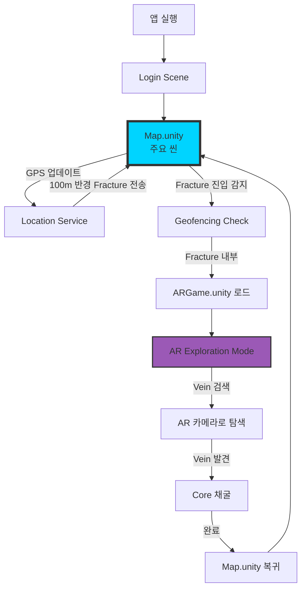
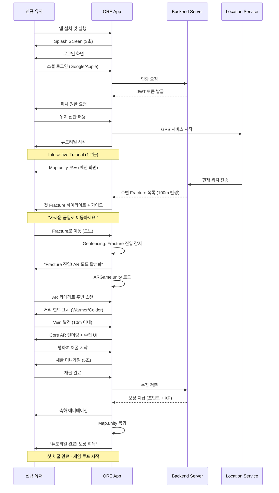
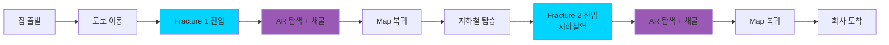
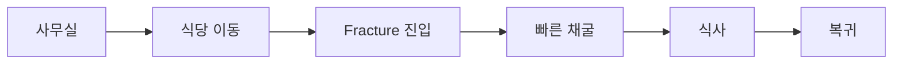
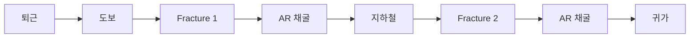

# ORE Platform - Player Journey Map

_Complete user flow from first launch to mastery_

## Overview

- **목적**: ORE Platform의 전체 플레이어 경험 흐름 정의
- **독자**: Product Managers, UX Designers, Unity Developers, QA Engineers
- **관련 문서**: game-play-spec.md, ux-guide.md, frontend-spec.md
- **최종 수정**: 2025-10-06
- **버전**: 1.0

---

## 1. Core Game Mechanic: Fracture → Vein → Core System

### 1.1 개념 정의

```yaml
Fracture (균열):
  정의: 현실에 생긴 디지털 균열, 광석이 존재하는 영역
  크기: 150m x 150m (MVP) → Dynamic sizing (Post-MVP)
  표시: Map.unity에서 균열 이펙트/하이라이트 영역으로 표시
  목적: 플레이어에게 대략적인 채굴 위치 제공
  생성: 서버 알고리즘 기반 (위치 기반 또는 플레이어 패턴 기반)

  Future (Post-MVP):
    - Urban/Dense: 100m x 100m
    - Suburban: 150m x 150m
    - Park/Open: 200m x 200m
    - Rarity-based sizing

Vein (광맥):
  정의: Fracture 내부의 정확한 광석 위치
  크기: 정확한 GPS 좌표 (위도/경도)
  표시: Fracture 진입 전까지 숨겨짐, AR 모드에서만 발견 가능
  목적: AR 탐색 게임플레이 제공
  수집 범위: 10m (일반 유저) / 3m (Genesis 1000)

Core (광석 코어):
  정의: 채굴 가능한 실제 광석 오브젝트
  표시: Vein 발견 시 AR 카메라에 3D 모델로 렌더링
  인터랙션: 탭하여 채굴 시작
  종류: Common/Rare/Epic/Legendary/Advertisement
```

**설계 의도:**
Pokémon GO의 단순 탭 수집과 차별화하여, 실제 AR 탐색 경험을 제공합니다. Fracture는 "어디로 가야 할지" 알려주고, Vein은 "AR로 찾아내는 보물찾기"를, Core는 "채굴하는 만족감"을 구현합니다. 명칭은 게임 세계관의 "Digital Crack Aesthetic"과 일치합니다.

### 1.2 Scene Architecture



---

## 2. First-Time User Journey (신규 유저)

### 2.1 Onboarding Flow



### 2.2 Tutorial Steps

| Step | Scene    | Duration | Content                         | Goal                     |
| ---- | -------- | -------- | ------------------------------- | ------------------------ |
| 1    | Login    | 30초     | 소셜 로그인, 권한 요청          | 유저 인증 및 권한 확보   |
| 2    | Map      | 20초     | Map UI 설명, Fracture 개념 소개 | Map 인터페이스 이해      |
| 3    | Map → AR | 10초     | Fracture 진입 시 자동 전환 설명 | Scene 전환 메커니즘 이해 |
| 4    | AR       | 30초     | AR 탐색, 거리 힌트, Vein 찾기   | AR 탐색 게임플레이 학습  |
| 5    | AR       | 10초     | 채굴 미니게임                   | 수집 메커니즘 학습       |
| 6    | AR → Map | 10초     | 자동 복귀, 보상 확인            | 완전한 루프 경험         |

**Total: ~2분** (모바일 튜토리얼 권장 시간)

---

## 3. Core Game Loop Journey (일반 플레이)

### 3.1 Daily Session Flow

```yaml
Session 시작 (앱 실행):
  1. Login Scene (자동 로그인 - JWT 토큰)
  2. Map.unity 로드
  3. GPS 위치 업데이트
  4. 서버에서 주변 Fracture 목록 수신 (100m 반경)
  5. Map에 Fracture 마커 표시

Map Mode (주요 화면):
  사용자 행동:
    - 실시간 GPS로 플레이어 위치 추적
    - Map에서 주변 Fracture 확인
    - Fracture로 이동 (도보/이동수단)

  시스템 동작:
    - 5초마다 GPS 업데이트
    - Geofencing: Fracture 경계 모니터링
    - 100m 반경 벗어나면 새로운 Fracture 요청

Fracture 진입 (Geofencing Trigger):
  자동 동작:
    - Geofencing 감지: 플레이어가 Fracture 경계 진입
    - 진동 + 사운드 피드백
    - "Fracture 진입! AR 모드 시작" 알림 (1초)
    - ARGame.unity Scene 로드 (2초)
    - Map.unity 데이터 전달:
      * Fracture 경계 정보 (150m x 150m)
      * Vein 좌표 (서버에서 전달)
      * Core 등급/타입

AR Exploration Mode (탐색):
  사용자 경험:
    - AR 카메라 활성화
    - 실제 환경 위에 AR 오버레이
    - Vein을 찾기 위해 주변 스캔

  시스템 피드백:
    - 거리 기반 힌트:
      * 50m+ : "아직 멀어요" (회색)
      * 20-50m: "따뜻해요" (파랑)
      * 10-20m: "뜨거워요!" (보라)
      * 10m 이내: Vein 시각화 (AR 렌더링)

    - 오디오 힌트:
      * 거리에 따른 비프음 주파수 변화
      * 가까울수록 빠른 비프

  Vein 발견 (10m 이내):
    - AR 카메라에 Core 3D 모델 렌더링
    - 글로우 효과 + 파티클
    - "탭하여 채굴" UI 표시

Mining Game (채굴):
  채굴 미니게임 (5초):
    - Common: 단순 탭 (1회)
    - Rare: 연속 탭 (3회)
    - Epic: 스와이프 패턴
    - Legendary: 타이밍 게임

  완료:
    - 수집 검증 (서버)
    - 보상 계산:
      * 기본 포인트
      * Genesis 보너스 (2x)
      * Time 보너스
      * Streak 보너스
    - 애니메이션 (3.14초 - π)

Return to Map:
  자동 복귀:
    - 채굴 완료 후 2초 대기
    - "보상 획득!" 팝업
    - ARGame.unity 언로드
    - Map.unity 복귀

  Map 업데이트:
    - 수집된 Vein 제거
    - 새로운 Fracture 요청 (현재 위치 기준)
    - 다음 타겟 제안

Loop 반복:
  - 다음 Fracture로 이동
  - 위 과정 반복
  - Session 종료 시 통계 표시
```

### 3.2 Session Types

#### Morning Commute (출근길)



**예상 플레이:**

- Duration: 15-20분
- Fractures: 3-5개
- Collections: 15-25개
- Points: 200-400

#### Lunch Break (점심시간)



**예상 플레이:**

- Duration: 5-10분
- Fractures: 1-2개
- Collections: 5-10개
- Points: 80-150

#### Evening Commute (퇴근길)



**예상 플레이:**

- Duration: 20-30분
- Fractures: 4-6개
- Collections: 20-35개
- Points: 300-600 (Evening 1.5x 보너스)

---

## 4. Scene Transition Details

### 4.1 Map → AR Transition

````yaml
Trigger Condition:
  - Geofencing: 플레이어가 Fracture 경계(150m) 진입
  - GPS 정확도 < 20m
  - 네트워크 연결 활성

Pre-Transition (Map.unity):
  Duration: 1초
  Actions:
    - 진동 피드백 (200ms)
    - 사운드: "Fracture 진입" 알림음
    - UI: "AR 모드 활성화 중..." 오버레이
    - 데이터 준비:
      * Fracture 경계 좌표 (GeoJSON)
      * Vein 좌표 (서버 응답)
      * Core 메타데이터 (grade, type, value)

Scene Load (Transition):
  Duration: 1-2초
  Actions:
    - Map.unity → Pause (백그라운드 유지)
    - ARGame.unity → Load (Additive)
    - 데이터 전달 (SceneTransitionData):
      ```csharp
      public class SceneTransitionData {
          public Vector2d fractureCenter;
          public float fractureRadius; // 150m
          public Vector2d veinLocation;
          public CoreData coreData;
      }
      ```
    - AR 카메라 초기화
    - Location Service 연결

Transition Animation:
  Duration: 1.618초 (황금비)
  Effect:
    - Digital Crack 애니메이션
    - Map 화면에서 균열(Crack) 발생
    - 균열 사이로 AR 카메라 뷰 표시
    - Map 페이드 아웃 (0.5초)
    - AR 페이드 인 (1.118초)

Post-Transition (ARGame.unity):
  Duration: 0.5초
  Actions:
    - AR 카메라 활성화
    - ARManager 초기화
    - GPS 추적 시작 (1초 간격으로 고빈도)
    - 거리 계산 시작
    - UI 표시:
      * 거리 힌트 UI (상단)
      * "Vein을 찾으세요" 가이드 (중앙)
      * 뒤로가기 버튼 (좌측 상단)
````

### 4.2 AR → Map Transition

```yaml
Trigger Condition:
  Option 1: 채굴 완료 (자동)
  Option 2: 뒤로가기 버튼 (수동)
  Option 3: Fracture 이탈 (Geofencing)

Pre-Transition (ARGame.unity):
  채굴 완료 시:
    - 보상 애니메이션 (3.14초 - π)
    - "축하합니다!" 팝업
    - 획득 포인트/XP 표시
    - 2초 대기 (유저가 보상 확인)

  수동 이탈 시:
    - "정말 나가시겠습니까?" 확인
    - Yes → 진행
    - No → AR 모드 유지

Scene Unload:
  Duration: 1초
  Actions:
    - AR 카메라 비활성화
    - ARGame.unity 언로드
    - Map.unity Resume (포그라운드 전환)
    - 수집 데이터 전달:
      * 수집 성공/실패
      * 획득 보상
      * 업데이트된 플레이어 stats

Transition Animation:
  Duration: 1.618초
  Effect:
    - AR 뷰에서 Digital Ripple 효과
    - Reality Crack 역재생 (균열 닫힘)
    - AR 페이드 아웃 (0.5초)
    - Map 페이드 인 (1.118초)

Post-Transition (Map.unity):
  Duration: 0.5초
  Actions:
    - Map 업데이트:
      * 수집된 Vein 마커 제거
      * 새로운 Fracture 요청 (현재 위치 기준)
      * 플레이어 stats 업데이트
    - UI 피드백:
      * 간단한 토스트: "+150 포인트"
      * 레벨업 시 애니메이션
    - GPS 업데이트 주기 복구 (5초 간격)
```

---

## 5. Edge Cases & Error Handling

### 5.1 Fracture Exit During AR

```yaml
Scenario: 유저가 AR 모드 중 Fracture를 벗어남

Detection:
  - Geofencing: 플레이어가 150m Fracture 경계 이탈
  - GPS 업데이트마다 체크 (1초 간격)

Handling:
  Warning Phase (Fracture 경계 135m):
    - UI: "Fracture를 벗어나고 있습니다" 경고
    - 화면 가장자리에 빨간 테두리
    - 10초 유예 시간

  Grace Period (10초):
    - 카운트다운 표시: "10... 9... 8..."
    - 다시 Fracture 안으로 들어오면 취소

  Exit (Fracture 완전 이탈):
    - AR 모드 자동 종료
    - "Fracture를 벗어났습니다" 메시지
    - Map으로 강제 복귀
    - 진행 중이던 채굴 취소
    - 부분 보상:
      * 채굴 50% 이상 완료 시: 50% 보상
      * 채굴 50% 미만 시: 보상 없음
```

### 5.2 Network Disconnection

```yaml
Scenario: AR 모드 중 네트워크 끊김

Detection:
  - API 호출 실패
  - WebSocket 연결 끊김
  - Timeout (5초)

Handling:
  Offline Mode (제한적):
    - 로컬 캐시된 Vein 데이터로 계속 진행 가능
    - UI: "오프라인 모드" 표시 (상단)
    - 채굴 가능하나 보상은 캐싱

  Collection:
    - 채굴 완료 데이터 로컬 저장
    - 큐에 보관

  Reconnection:
    - 네트워크 복구 감지
    - 큐의 수집 데이터 일괄 서버 전송
    - 서버 검증 후 보상 지급
    - "동기화 완료" 메시지

  Complete Offline:
    - 5분 이상 오프라인 시
    - "네트워크 연결 필요" 안내
    - Map으로 복귀 옵션 제공
    - 채굴 데이터는 보존
```

### 5.3 GPS Accuracy Issues

```yaml
Scenario: GPS 정확도가 낮음 (>50m)

Detection:
  - Location.accuracy 값 체크
  - 3회 연속 부정확한 데이터

Handling:
  Warning:
    - UI: "GPS 정확도 개선 필요" 알림
    - 제안:
      * "하늘이 보이는 곳으로 이동하세요"
      * "건물 밖으로 나가세요"
      * "WiFi를 켜세요"

  Degraded Mode:
    - Vein 탐지 범위 확대: 10m → 20m
    - 거리 힌트 정확도 감소
    - "대략적 위치" 표시

  Timeout:
    - 30초 이상 개선 안 되면
    - "지금은 플레이하기 어려운 위치입니다" 안내
    - Map으로 복귀 옵션
```

### 5.4 Core Already Collected

```yaml
Scenario: 유저가 Fracture 진입했으나 이미 다른 유저가 수집함

Detection:
  - ARGame.unity 로드 시 서버 조회
  - Vein 상태 체크

Handling:
  Immediate Feedback:
    - AR 모드 진입 전 감지 시:
      * Fracture 진입 알림 후 즉시 취소
      * "이미 수집된 Core입니다" 토스트
      * Map 유지 (AR 전환 안 함)

    - AR 모드 진입 후 감지 시:
      * AR 로드 완료
      * "아쉽게도 다른 유저가 먼저 수집했습니다" 메시지
      * 2초 후 Map 자동 복귀

  Compensation:
    - 소량 보상 제공:
      * +10 포인트 (위로 보상)
      * "근처에 다른 Fracture가 있습니다" 안내
      * 가장 가까운 Fracture 하이라이트
```

---

## 6. Performance Metrics

### 6.1 Journey Success Metrics

```yaml
Onboarding Success:
  - Tutorial 완료율: > 80%
  - 첫 채굴까지 시간: < 5분
  - 첫 날 리텐션: > 70%
  - 첫 주 리텐션: > 50%

Core Loop Efficiency:
  - Fracture 진입 → 채굴 완료: < 3분 (평균)
  - Scene 전환 시간: < 2초
  - AR Vein 발견 시간: < 60초
  - 채굴 성공률: > 95%

Session Quality:
  - 평균 세션 시간: 15-20분
  - Fracture per Session: 3-5개
  - Collection per Session: 20-30개
  - 크래시율: < 0.1%
```

### 6.2 Technical Performance

```yaml
Scene Transition:
  - Map → AR: < 2초 (P95)
  - AR → Map: < 1.5초 (P95)
  - 메모리 증가: < 100MB
  - CPU 사용: < 30% (AR 모드)

AR Performance:
  - Frame Rate: 30 FPS (최소), 60 FPS (목표)
  - GPS 업데이트: 1초 간격 (AR 모드)
  - 거리 계산 지연: < 100ms
  - Core 렌더링: < 500ms

Network:
  - Fracture 데이터 로드: < 500ms
  - Vein 데이터 수신: < 300ms
  - 수집 검증: < 200ms
  - Offline → Online 동기화: < 2초
```

---

## 7. Future Enhancements

### 7.1 Advanced AR Features

```yaml
Phase 2 (Post-MVP):
  Multi-Vein Fractures:
    - Fracture 당 2-3개 Vein
    - 연속 채굴 보너스
    - "Vein 체인" 시스템

  Collaborative Discovery:
    - 친구와 함께 Fracture 탐색
    - 공동 채굴 보너스
    - 실시간 위치 공유 (AR)

  Dynamic Fracture Events:
    - 시간 제한 Fracture (10분)
    - 레어 광석 Fracture
    - 특별 이벤트 Fracture (광고주 협찬)

Phase 3 (6개월+):
  Advanced AR:
    - Occlusion (사물 뒤 숨김)
    - Environmental Understanding
    - Multiplayer AR (공유 경험)

  Game Modes:
    - PvP Fracture 경쟁
    - Guild Fracture 점령
    - Season Pass Fracture
```

---

## Version History

- **v1.1** (2025-10-06): Updated terminology to Fracture/Vein/Core system
  - Aligned with "Digital Crack Aesthetic" worldview
  - Updated all Zone → Fracture references
  - Updated all Spot → Vein references
  - Updated all Coin → Core references
  - Adjusted Fracture size from 200m to 150m (MVP)
  - Added dynamic sizing plan for Post-MVP
- **v1.0** (2025-10-06): Initial creation with Zone/Spot mechanic
  - Core journey flows defined
  - Scene transition details
  - Edge case handling
  - Performance metrics

---

**Related Documents:**

- [Game Play Spec](./game-play-spec.md) - Core game mechanics
- [UX Guide](./ux-guide.md) - UI/UX design principles
- [Frontend Spec](../technical/frontend-spec.md) - Unity implementation
- [MVP Definition](../business/mvp-definition.md) - MVP requirements
